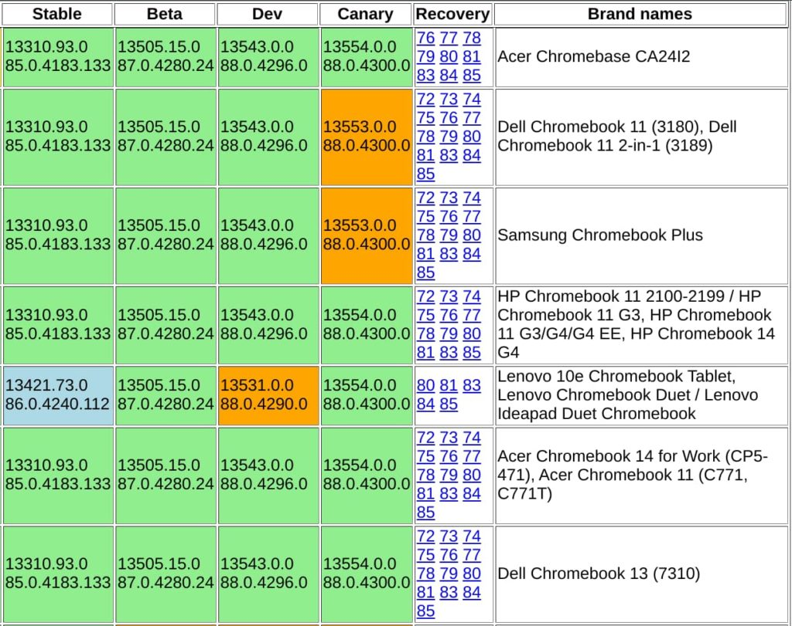
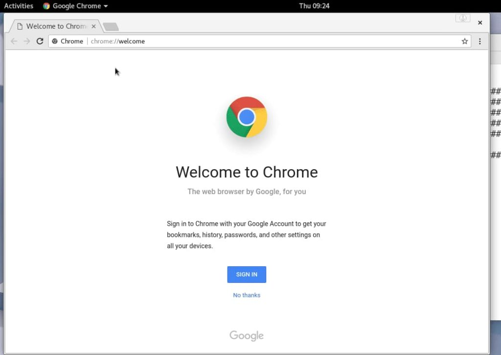

About two weeks ago, [Google announced the Stable Channel update for Chrome OS 86](https://www.aboutchromebooks.com/news/chrome-os-86-stable-channel-arrives-on-chromebooks-what-you-need-to-know/). While many Chromebooks and Chromeboxes received the update, I didn't at the time. I still can't get it on the [Acer Chromebook Spin 713 review unit](https://www.aboutchromebooks.com/news/acer-chromebook-spin-713-review/). It turns out, neither can most other devices anymore.

Indeed, the majority of supported devices now show Chrome OS 85 as the [most recent Stable Channel version available on the official Chrome OS release matrix site](https://cros-updates-serving.appspot.com/). Here's a sample showing the current state of some devices:

I know that many of the Chromebooks on the update matrix site did actually show Chrome OS 86 as the most recent Stable Channel version over the past few weeks. If it was available for your device and you upgraded, you still have Chrome OS 86. Folks that didn't though? They can't update currently.

Google's Chrome OS Releases blog doesn't have any information explaining the situation; at least not at the moment. But it's clear that Chrome OS 86 has been pulled for many devices. Indeed, the blue shading in the above image showing Chrome OS 86 for the Lenovo Duet Chromebook means that its software version is "newer than most", per the bottom of the release matrix site.

Without any official indication of what's going on, I'm wondering if this pullback has to do with [the Chrome zero-day exploit reported earlier this week](https://www.zdnet.com/article/google-releases-chrome-security-update-to-patch-actively-exploited-zero-day/). Apparently, the issue was resolved with an update to both Chrome and Chrome OS as part of version 86. I say apparently, mainly because I don't have Chrome OS 86. So who knows?

If nothing else, this actually highlights why it makes sense for Google to decouple Chrome and Chrome OS updates, which it has begun to do with [the LaCrOS effort](https://www.aboutchromebooks.com/news/what-is-lacros-for-chromebooks-and-why-does-it-matter/).

That work-in-progress project uses the Chrome browser for Linux separately but integrated with Chrome OS. This way if there's a high priority Chrome issue, Google can fix it and push the update out to Chrome without having to work it into a Chrome OS software update.

I'd be curious if anyone who has installed the Chrome OS 86 Stable Channel update on their device now sees that the _**prior**_ version is the most recent on the [Chrome OS release matrix](https://cros-updates-serving.appspot.com/). Let me know!
