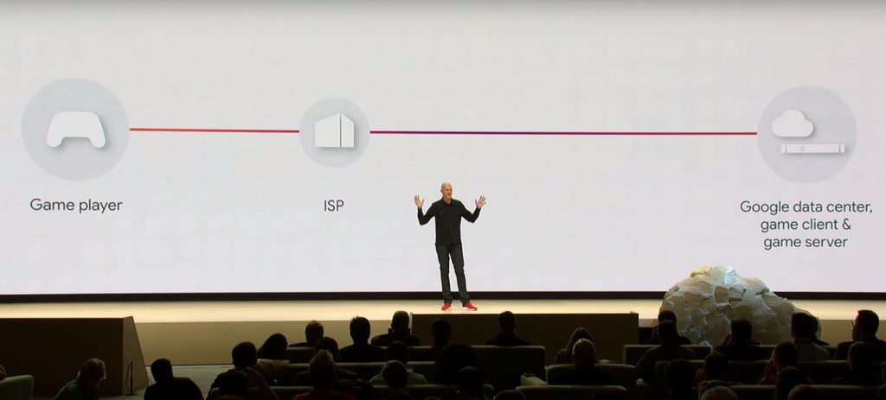
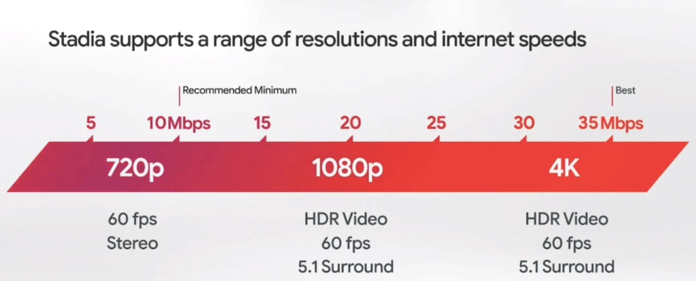

Google on Thursday livestreamed a Stadia press event, detailing the costs, bandwidth requirements, game titles and pricing for its videogame streaming service. [Stadia is the service that Google showed in March that will bring PC-gaming titles to desktops, laptops,](https://www.aboutchromebooks.com/news/google-stadia-turns-every-chromebook-into-a-pc-gaming-rig/) and phones, but more importantly to me, also to any Chrome OS device, regardless of its graphical capabilities.

That's because all of the game play actually takes place on custom Google servers and a network dedicated to stream the games with as little latency as possible.

Aside from showing off some of the early titles - Baldur's Gate 3, Ghost Recon: Breakout, Destiny 2 and a few others - Google announced pricing. Monthly costs for the Stadia Pro subscription is $9.99 a month, which provides 4K HDR streaming at up to 60fps. A free version is planned for next year, which will be limited to 1080p streaming.

Of course, you'll also need a minimum bandwidth to stream games at various resolutions and frame rates:

The monthly subscription price will include a few games -- Destiny 2 was specifically mentioned - but you'll have to pay for additional titles on top of the monthly subscription fee. Stadia Pro members will get exclusive free titles from time to time as well as discounts on game purchases.

Essentially with Stadia, you're "renting" a virtual console with the Stadia service but there is a huge benefit: The ability to play your games on nearly any device as long as you have an internet connection. Google's Pixel 3 will be the first phone supported by Stadia, with others to follow.

Gamers like my son that have custom PC rigs specifically for this purpose won't likely take Google up on this service. Folks that want the ability to play anywhere on various devices though? There's an audience for that.

In particular, I'd say the Chromebook crowd since we're generally limited to Android titles with the exception of Linux games, provided your [Chrome OS device has GPU acceleration support](https://www.aboutchromebooks.com/news/video-pixel-slate-portal-steam-with-gpu-acceleration-chrome-os-76-chromebook/). And trust me: Without that, the gaming experience is pitiful as I show playing Portal on Steam both with and without GPU support.

https://youtu.be/0uEjo-jzPHg

Google began taking pre-orders today for the Stadia Founders Edition package. $129 gets you a Stadia controller -- additional ones are $69.99 -- a Chromecast Ultra, and first dibs on choosing your Stadia gamer name when the service launches "later this year."

I actually ordered the package and found out that "later" means November at the earliest because that's when the Founders Edition ships.

I'm not thrilled with having to pay for both a monthly fee and game titles but I've done this before: I used to subscribe to Nvidia's similar service for the Nvidia Shield Android TV.

However, Stadia opens up far more opportunity for gaming. I can play on any screen in my home or on any device that has a Chrome browser, for example. My Chromebook is included and so will any future Chromebooks I buy. I don't have to drop hundreds of dollars up front for game console that limits me to playing in a single location, although that monthly fee will add up over time.

How about it: Who's interested in Stadia, particularly to bring high-resolution, fast frame rate gaming to their Chromebook or Chrome OS tablet?
