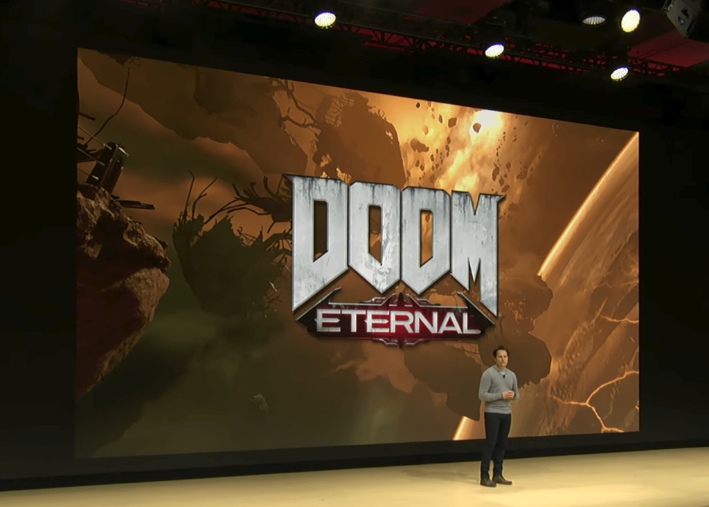
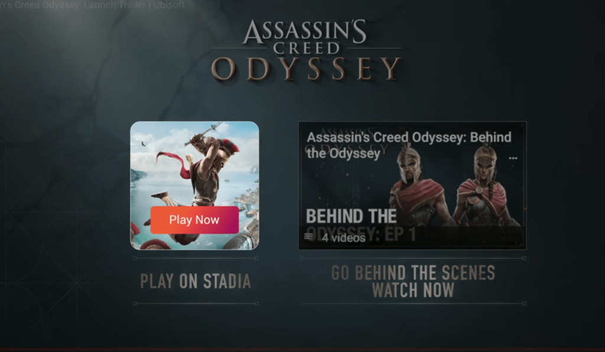
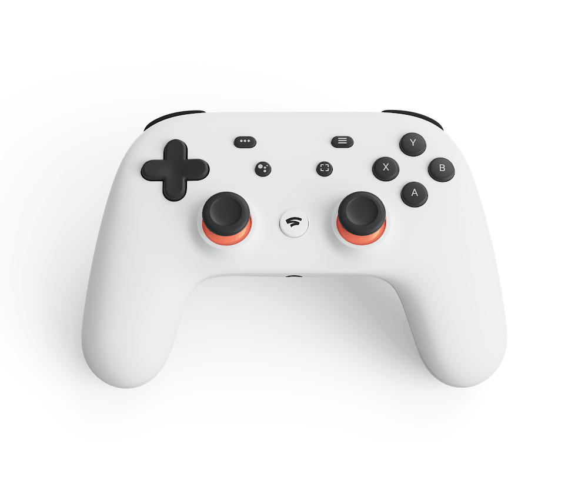

Remember that beta test of [streaming Assassin's Creed: Odyssey I showed off last year using a Pixelbook](https://www.aboutchromebooks.com/reviews/first-look-video-project-stream-beta-of-assassins-creed-odyssey-on-the-pixelbook/)? That was [Project Stream](https://www.aboutchromebooks.com/news/assassins-creed-odyssey-play-chromebook-in-1080p-project-stream/) and it wasn't just a technical test for Google; it's the basis of Stadia, a new gaming platform for players and YouTubers. And because it's completely cloud-based, it allows high-end PC gaming on Chromebooks, regardless of their price or specifications.

[Google announced Stadia today at the 2019 Game Developers Conference](https://blog.google/products/stadia/stadia-a-new-way-to-play/) and will have more to say this summer about it. Stadia gaming is expected this year in the US, Canada and most of Europe, so don't get rid of that PC gaming rig just yet.

When it does arrive, however, here's what it will bring. Using custom hardware and Google's private Cloud infrastructure connectivity, games will start up in as few as five seconds. And with that hardware, Google is promising better performance than the 1080p, 60fps I saw in the beta test: At launch, games will be streamed at up to 4K resolution at 60fps in HDR and with surround sound.

Doom Eternal will be on Stadia

Granted, there's only a [single 4K Chromebook on the market with Lenovo's Yoga Chromebook 15](https://www.aboutchromebooks.com/news/lenovo-yoga-chromebook-c630-with-4k-screen-debuts-at-899-99/). But this means that no matter _what_ Chromebook you have, whether its an inexpensive one with a 720p display or a more expensive model like the 3000 x 2000 resolution Pixels Slate, you'll get the best possible gaming experience with Stadia. At this point, I almost don't mind if [GPU acceleration ever comes to Crostini on Chromebooks](https://www.aboutchromebooks.com/news/gpu-acceleration-chromebook-linux-project-crostini/), although trying to play Portal on Steam this past weekend got me all of one frame per second.

Of course, Stadia isn't _just_ for Chromebooks: It will work on **any** screen via the Chrome browser or a Chromecast. Even better, you can start gaming on one device, say your Chromebook, and then pick up exactly where you left off on a Pixel phone or a computer with the Chrome browser. The demo of this was super impressive. Don't take my word for it though. Have a look:

https://youtu.be/nUih5C5rOrA?t=2010

Although many Chromebook users will likely be happy that their devices will become streaming game consoles, there's so much more involved.

Gamers who stream their play through YouTube can allow anyone to join in the session, for example. And if you watch a game stream on YouTube and want to get the game, there will be a link to do so: In just a few seconds, you'll have streaming access to the game title.

Additionally, players can press a button on a Stadia controller to instantly start streaming or hit the Google Assistant button -- yes, it has one -- and ask for in-game help. The Assistant can pull up a YouTube video showing how to beat a boss or tackle some other "impossible" challenge.

There are also a bunch of developers features that could expand the game experience with Stadia such as State Shares, which are a capture of a game at a specific point in time. Developers or YouTubers could offer those as playable challenges. Game creators can also take advantage of a zero- to low-latency multiplayer session on a single screen. One demo showed camera viewpoints from all players in a team game on one screen so a team leader could see what the team sees.

All that sounds nice, but again, I'm stoked to see Chromebooks as part of the Stadia gaming platform. There are still questions to be answered, such as the required connection speed, which developers support Stadia, will games still cost the same or will Google consider some type of subscription service, but the biggest technical hurdles for gaming on a Chromebook appear to be solved.
