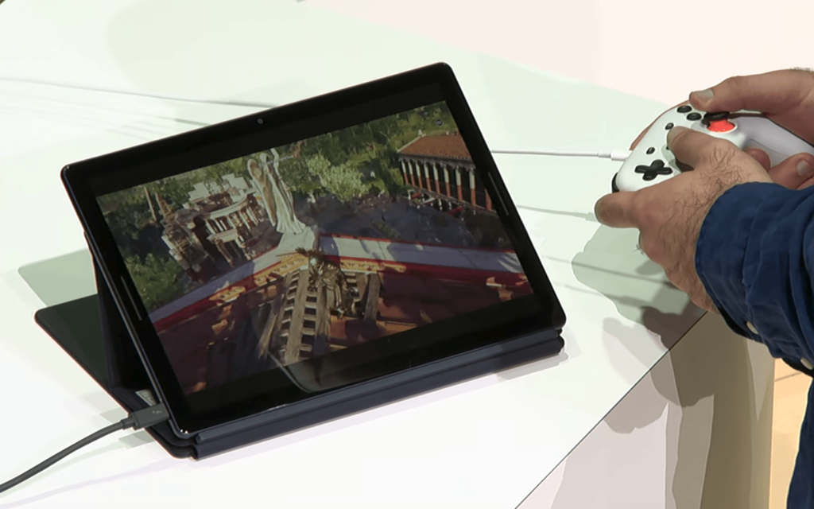
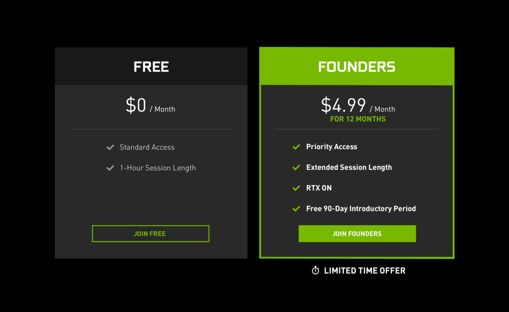

[Nvidia officially launched its GeForce NOW cloud streaming game service](https://blogs.nvidia.com/blog/2020/02/04/geforce-now-pc-gaming/) this week after roughly four years of tinkering and tweaking in beta status. I was one of those beta testers about two years ago and was very impressed by Nvidia's ability to stream PC games to my Nvidia Shield Android TV box.

These days, [I play games on Google Stadia](https://www.aboutchromebooks.com/news/pixelbook-go-launch-stadia-chromebook/) for several reasons, but the main one is that I can use a Chromebook for my gaming sessions. Turns out that you'll be able to do the same thing later this year according to Nvidia's press release.

That brings an interesting question, assuming Nvidia's 15 data centers can handle the load.

That aspect is concerning to me because unlike Stadia where you can play as long as you'd like, game sessions are limited by time with GeForce Now.

The free option provides one hour sessions while the currently discounted $5 monthly Founders subscription lets you play for up to 6 hours each session. And Founders get priority access to game servers if there's a queue; [Nvidia says it has one million people on a waiting list for GeForce NOW](https://venturebeat.com/2020/02/04/nvidia-launches-beta-of-geforce-now-as-a-5-per-month-cloud-gaming-service/).

That aside, there are a few benefits that could sway Chromebook owners away from Stadia over to GeForce NOW.

First is the selection of games. The Stadia team has said that 120 new titles will come to Google's platform this year, which will be a great addition to the relatively limited selection currently available. GeForce NOW is launching with 50 instant games and "1,000 single session install" titles.

And its platform may grow faster than Stadia's:

> ...we’re working with _**existing PC game stores**_ and publishers. With GeForce NOW, you can keep playing the games you already own and continue building libraries from the same stores you already use every day. That’s what it means to be an open platform. (emphasis mine)

[Nvidia GeForce NOW already supports those game stores such as Steam, UPlay, and Epic Games](https://www.theverge.com/2020/2/4/21121996/nvidia-geforce-now-2-0-out-of-beta-rtx), for example. That's a huge differentiator for people who have game libraries through these services.

Secondly, although GeForce NOW doesn't support game resolutions above 1080p/60fps -- some game sequences will hit up to 120 fps -- as compared to Stadia's 4K/60fps, ray-tracing is available to founding subscribers thanks to the Nvidia GTX GPUs used for NOW. To me, this is a minor win as compared to a larger game library but it's worth the mention.

Nvidia hasn't announced exactly when Chromebook support will arrive this year. Once it does, however, I may consider moving over from Stadia as I do have some PC game purchases just languishing away. I'll wait and see how the early reviews are for GeForce NOW given the much likely larger audience putting a strain on Nvidia's data centers. But I'm sure I won't be the only one.
