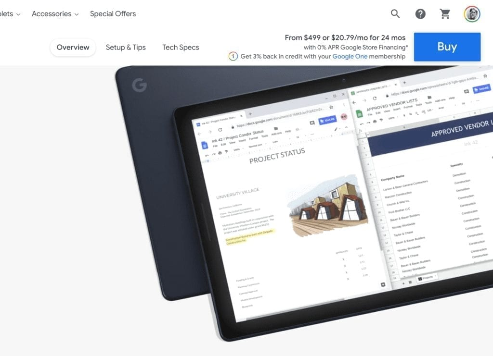

Several readers reached out to me over the weekend to point out that the [Google Store has discounted all Pixel Slate models by at least $300](https://store.google.com/product/pixel_slate) and is again including a $99 Pixelbook Pen and choice of $159 to $199 keyboard. That brings the Core M3 base model package price down to $499, although I think the better value is the Core i5 model for just $100 more.

Google has discounted the Pixel Slate several times in the past year, which makes sense: The company [announced back in June that it wouldn't have a successor tablet](https://www.aboutchromebooks.com/news/made-by-google-exit-tablet-business-pixel-slate-chrome-os-chromebooks/). Obviously, it's still supporting the Pixel Slate, which will have Chrome OS software updates through June 2026.

There's a subtle difference with this discount though, [as noted by 9to5 Google](https://9to5google.com/2020/02/29/pixel-slate-price-cut/). Can you spot it in this image of the Google Store from this morning?

This is the first time I've seen the "from $499" price without showing the original, crossed out price next to it. 9to5 suspects this could be a permanent price cut as a result, and I'm learning towards the same conclusion. This could be the last stock that Google has of its Chrome OS tablet, although other retailers may still have inventory.

Adding to this thought is just how much the discount is, because it depends on the model:

<table class="has-fixed-layout"><tbody><tr><td class="has-text-align-center" data-align="center"><strong>Model</strong></td><td class="has-text-align-center" data-align="center"><strong>Original Price</strong></td><td class="has-text-align-center" data-align="center"><strong>Discounted Price</strong></td><td class="has-text-align-center" data-align="center"><strong>Savings</strong></td></tr><tr><td class="has-text-align-center" data-align="center">Core m3</td><td class="has-text-align-center" data-align="center">$799</td><td class="has-text-align-center" data-align="center">$499</td><td class="has-text-align-center" data-align="center">$300</td></tr><tr><td class="has-text-align-center" data-align="center">Core i5</td><td class="has-text-align-center" data-align="center">$999</td><td class="has-text-align-center" data-align="center">$599</td><td class="has-text-align-center" data-align="center">$400</td></tr><tr><td class="has-text-align-center" data-align="center">Core i7</td><td class="has-text-align-center" data-align="center">$1,599</td><td class="has-text-align-center" data-align="center">$899</td><td class="has-text-align-center" data-align="center">$700</td></tr></tbody></table>

These are quite aggressive discounts, particularly as you move up through the configurations.

## Should you buy a Pixel Slate?

Well, if you have no need or interest in a Chrome OS tablet, I'd probably pass. You can purchase a solid 2-in-1 Chromebook with similar hardware internals for not much more; less even if you find a good sale.

However, if you wanted a Pixel Slate and the price tag was a key holdup, I can't think of a reason not to pull the trigger on this deal: Here's my [recommendation on which Pixel Slate model to get based on your specific needs](https://www.aboutchromebooks.com/opinion/which-google-pixel-slate-to-buy-guide/).

Although early reviews of the Pixel Slate were harsh, and for good reason [based on software issues and an anemic Celeron model](https://www.aboutchromebooks.com/news/celeron-pixel-slate-review-video/) , Chrome OS [updates have made the Pixel Slate a very enjoyable device](https://www.aboutchromebooks.com/news/with-chrome-os-improvements-and-a-200-discount-the-pixel-slate-is-worth-a-second-look/). I still use mine for everyday browsing and writing, video content consumption (it excels at this) and occasional light coding.
