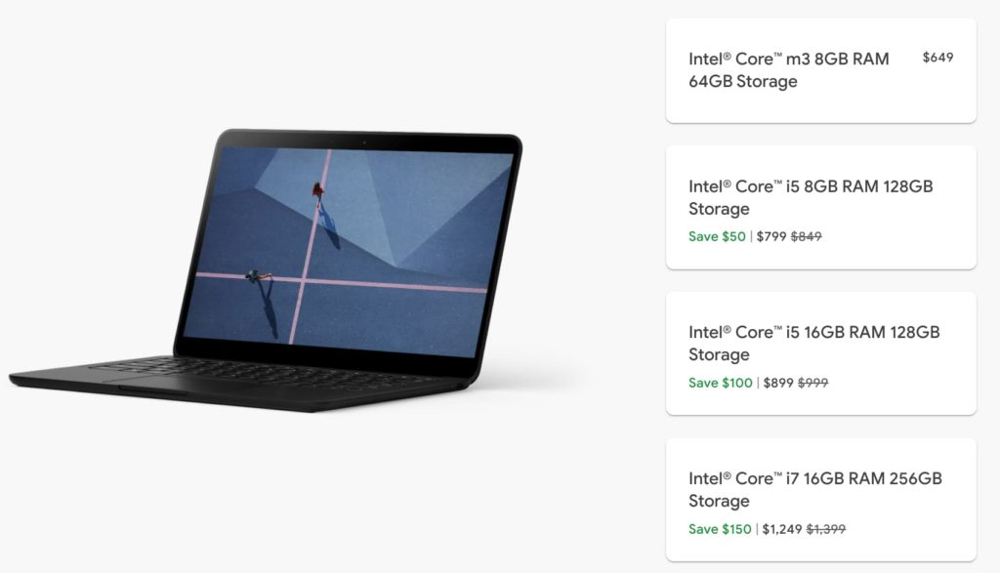

I'm not sure if this is in conjunction with [the 10th anniversary of Chromebooks](https://www.aboutchromebooks.com/news/10-years-of-chromebooks-my-how-far-theyve-come/ "10 years of Chromebooks: My how far they’ve come!") or it's just a happy coincidence but if you're looking for a new Chromebook, you're in luck. The [Google Store is discounting Pixelbook Go Chromebooks by $50 to $150](https://store.google.com/config/pixelbook_go?hl=en-US), depending on the model you choose.

The base model with an Intel m3 processor isn't part of this sale, but that's OK. I'd recommend starting with [the next configuration up with a Core i5, which is what I reviewed](https://www.aboutchromebooks.com/news/pixelbook-go-review-a-premium-price-validated-by-a-premium-device/ "Pixelbook Go review: Premium price for a premium device"). Normally priced at $849, you'll pay $799. Move up to a doubling of memory and that $999 model currently costs $899. For the power-users who want it all with a Core i7, the $1,399 configuration is reduced to $1,249.

While there are plenty of newer Chromebook options available today, I still think the Pixelbook Go is a great choice. Unless you have very specific needs the Go doesn't meet, I don't think you can go wrong by choosing it.

When [I re-reviewed the Pixelbook Go four months after my initial deep dive](https://www.aboutchromebooks.com/news/pixelbook-go-review-2020/ "https://www.aboutchromebooks.com/news/pixelbook-go-review-2020/"), that's the feeling I had:

> ...any average Chromebook user would likely be very happy with the Pixelbook Go — even the base model — provided they don’t want a 2-in-1 device, are fine with a widescreen display and they’re not routinely programming apps on a daily basis.

Here are the full specs for the discounted $799 model that I would recommend for most people:

<table><tbody><tr><td>CPU</td><td>Dual-core, four-thread Intel Core i5-8200Y (fanless) at 1.3 GHz, 3.9GHz in boost mode</td></tr><tr><td>GPU</td><td>Intel UHD Graphics 615</td></tr><tr><td>Display</td><td>13.3-inch glossy 1920 x 1080 LCD touchscreen, 16:9 aspect ratio, 72% NTSC</td></tr><tr><td>Memory</td><td>8 GB, LPDDR3-1866</td></tr><tr><td>Storage</td><td>128 GB, eMMC 5.1</td></tr><tr><td>Connectivity</td><td>802.11ac Wi-Fi 2x2 MIMO, Bluetooth 4.2</td></tr><tr><td>Ports</td><td>Two USB Type-C ports, 3.5mm headphone jack</td></tr><tr><td>Audio</td><td>Dual speakers, 2 microphones for echo cancellation</td></tr><tr><td>Webcam</td><td>2 megapixel, ƒ/2.0 aperture, 1080p 60fps video</td></tr><tr><td>Keyboard</td><td>Backlit, island hush-keys, 19mm pitch, dedicated Google Assistant key</td></tr><tr><td>Trackpad</td><td>Etched glass, multi-gesture support</td></tr><tr><td>Battery</td><td>47 WHr with claimed 12-hour run-time, quick-charge of 2 added hours in 20 minutes</td></tr><tr><td>Chrome OS updates</td><td>Support through June 2026</td></tr></tbody></table>

The build quality and display are fantastic, there's enough performance power to do just about anything you could want to and battery life is in the 10-plus hour mark.

Having said that, I still believe the regular prices are a bit high. And that could keep the otherwise excellent Pixelbook Go out of mainstream hands. I think those people are missing out on a great Chromebook experience, which is why it's easy to recommend considering the Pixelbook Go at discounted prices.
