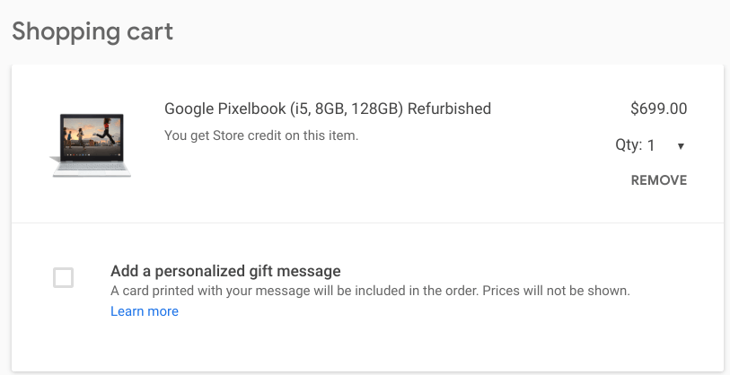

There appear to be a few Pixelbook Go reviews suggesting that either a less expensive Chromebook or a discounted Pixelbook is the better option. I don't necessarily agree, but I'll share those reasons in my full review, which is nearly complete.

However, if you're in that camp and would rather get a Google Pixelbook, check out the refurbished section of the Google Store: [The $999 model is available as a refurb for $699](https://store.google.com/us/config/google_pixelbook_refurbished).

Obviously, you're getting a high-end Chromebook from 2017 with this deal, but the original Pixelbook is plenty powerful enough for most people while also offering solid battery life, a pleasing industrial design, 2-in-1 capabilities, and optional Pixelbook Pen support.

Inside is the 7th-gen Intel Core i5 Y-Series processor, 8 GB of memory, and 128 GB of eMMC storage. You also get a pair of USB Type-C ports, one on each side, and one of the best keyboard/trackpad combos on any Chromebook. I'd assume that these refurbished Pixelbooks also come with a fresh battery, so you don't have to worry about the power pack having a reduced charge capacity.

Keep in mind that [the comparable Pixelbook Go](https://store.google.com/us/config/pixelbook_go), with a slightly newer Core i5 Y-Series processor retails for $849, so in terms of value, this is a pretty good deal.

And in terms of the Chrome OS automatic update expiration date, Google has committed to providing software updates through June 2024. Based on [a conversation I had last week with a Google hardware product manager](https://www.aboutchromebooks.com/news/why-pixelbook-go-isnt-the-pixelbook-2-according-to-google/), it's even possible that date _could_ yet be extended.
