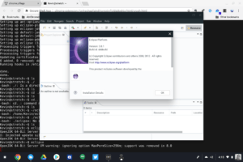

Wow. That's all I can say. Wow.

Having worked for a Google Chrome Marketing team over an 18 month period, I never saw a project that aggressively goes after Windows and Mac computers like the one that was published today. It's only a minute long, so give a look before I share some additional thoughts:

\[embed\]https://youtu.be/2xryaZF1Z4w\[/embed\]

As someone who has used (and often still does use) other platforms, I can't really disagree with the point of this video. For too long, computer users have had to deal with cryptic errors, updates that can take hours to install and the dreaded blue screen of death / spinning beach ball.

Granted, some of my personal experience with those issues was when I was in corporate IT for 15 years; that career ended for me (by choice) back in 2007. And clearly, _**all**_ desktop / laptop platforms have improved since then.

Even so, Google is highlighting the modern approach of Chromebooks with this short video and that's an important point. Chrome OS was designed from the ground up to be simple, secure and speedy; I don't think you can say that about any other operating system, although I'm willing to listen with an open mind to someone making their case to the contrary.

Google is also focusing on the wide range of Android apps that can use with a Chromebook; something that debuted in 2016 but has only more recently been a solid experience, although there's still work to be done.

What's not featured is [Project Crostini](https://www.aboutchromebooks.com/tag/project-crostini), which allow you to run Linux apps on a Chromebook. That makes sense because Crostini is still a beta feature and only on the Dev Channel. It should [arrive on the Beta Channel this week](https://www.aboutchromebooks.com/news/project-crostini-linux-apps-chrome-os-beta-release-date/) though. Once Crostini migrates up to Stable, it's probably a fair statement to say that Chromebooks can run more apps than any other platform right out of the box.

This video seems like a turning point for Chromebooks; at least from a marketing perspective. It's not really like Google to call out competitors, and even when it does, the approach is usually done with a light touch.

But there's no light touch here. And you know what? I say, it's about time!
