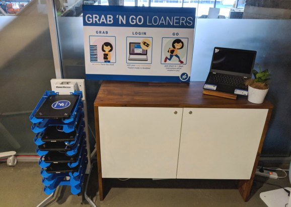

One of the best experiences I had when working at Google was when I had a rare Chromebook hardware issue. Seriously. That's because the company designed a smart solution: Grab and Go carts in various office locations where you literally just grab an already charged Chromebook and go right back to work. Now, [Google is extending Grab and Go to businesses](https://blog.google/products/chrome-enterprise/extending-googles-grab-and-go-program-to-businesses/) who want to save time and money when it comes to laptop tech support.

Google says that internally, around 30 percent of all support requests were for device swaps. Typically, that can adds downtime to employees while also pulling tech support resources from resolving other issues. The time for device swaps adds up quickly. IHS estimates that large [businesses spend about $60 million a year in time and costs for IT downtime](http://news.ihsmarkit.com/press-release/technology/businesses-losing-700-billion-year-it-downtime-says-ihs). Any solution to reduce that downtime then, can result in large time and productivity savings.

Chromebooks are ideally suited for Grab and Go because there's minimal setup and configuration time. An employee simply logs in to the device and any enterprise policies are immediately applied. Additionally, user data and configuration settings from the old device are quickly synchronized to the new device; typically in under a minute.

The only downtime I experienced when my old Chromebook hiccuped was the time I spent walking to a nearby Grab and Go cart to swap devices -- Google places them near their TechStop support areas --  walking back to my desk and logging in. All in all, the process was under five minutes.

While this program may appeal to businesses looking to reduce employee downtime, it may also benefit Google in another way: Showing a key benefit of Chromebooks for companies that don't fully understand how the simplicity, security and speed of Chrome OS is an asset. That may expand Chromebook use in enterprises, although the likely use case for Grab and Go is a company that has already deployed at least _some_ Chromebooks.
