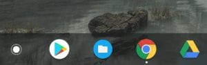

Although Toshiba is out of the Chromebook business, many folks do still have a Toshiba Chromebook 2. And some of them reportedly have access to the Google Play Store as of a few days ago, which means Android app support.

ChromeUnboxed reports that [the 2015 edition of the Toshiba Chromebook 2 works with Android apps on Chrome OS Stable v.66](https://chromeunboxed.com/news/toshiba-chromebook-2-2015-gets-android-apps-chrome-os-66) , so you'll want to make sure you have the latest Chrome OS version if you own one of these devices. Keep in mind too that Toshiba made two versions of the Chromebook 2, confusing as that may sound. This news only applies to the 2015 model, not the prior one.

Not sure which you have? Type _chrome://version_ in your Chromebook browser to see the device code name. If the results show "gandof", you have the 2015 model. The prior edition is called "swanky" and that's still showing as a "planned" device to get Android app support.

I no longer have my 2015 Toshiba Chromebook 2, so I can't verify if the Google Play Store now appears on the device. If you have one, check it out and let me know! I wouldn't be surprised if this feature finally made it to the Chromebook 2 as it's been in the Beta Channel for several months -- getting it available on the Stable Channel is almost overdue in light of that.

Note that [the official page showing support for Android apps based on Chromebook models](https://www.chromium.org/chromium-os/chrome-os-systems-supporting-android-apps) currently doesn't show the 2015 Toshiba Chromebook 2 as being supported on the Stable Channel. I suspect the site hasn't been updated yet, but should be soon if the reports of Android app support are accurate.
