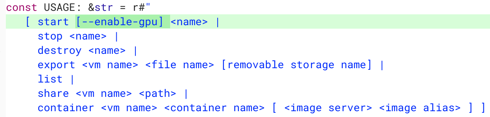

One of the key missing components when running Linux on a Chromebook is support for GPU hardware acceleration. That's why many high-framerate games and the Android emulator in Android Studio don't yet work, or if they do, they don't work well. [9to5Google spotted a code commit](https://9to5google.com/2018/12/26/chrome-os-linux-apps-gpu-support/) that will allow you to [test GPU acceleration support](https://chromium-review.googlesource.com/c/chromiumos/platform2/+/1387842), likely soon in the Canary, Dev and Beta channels of Chrome OS.

You can see in the code snippet above how this will work for testing purposes. Rather than click the Terminal application to start the Linux container, you'll manually start the container from the crosh app (ctrl + alt + T) using an _lxc_ the _vmc start_ command; similar to the way we [started Linux in the early days of Project Crostini](https://www.aboutchromebooks.com/news/cant-open-your-project-crostini-container-terminal-heres-how-to-get-access/). Using a new _\--enable-gpu_ parameter with the manual startup command will implement the hardware acceleration for graphics.

Obviously, there's far more involved than to type this parameter to get GPU hardware acceleration working. But the Chromium team has been [working on those bits of plumbing quite a bit over the past few weeks](https://chromium-review.googlesource.com/c/chromiumos/platform/crosvm/+/1182793).

As of now, I don't see a target release for GPU support in Project Crostini. However, it does show as Priority 2 initiative, which Priority 1 being the highest priority, on the [Crostini Platform Hotlist](https://bugs.chromium.org/p/chromium/issues/list?can=2&q=label:Hotlist-Crostini-Platform&sort=-modified&colspec=ID%20Pri%20M%20Stars%20ReleaseBlock%20Component%20Status%20Owner%20Summary%20OS%20Modified).

Additionally, back in November, Google said [full Android Studio support would be coming to Crostini in early 2019](https://www.aboutchromebooks.com/news/project-crostini-linux-chromebooks-gpu-acceleration-date/), leading me to think that's the target date for GPU acceleration support on Linux for Chromebooks. I could be wrong, but I'd think that's the main reason Google wants to get this working. Sure, GPU support Linux games will be welcome too; I just don't think that's the impetus for adding the feature.

More to follow when the new _\--enable-gpu_ parameter starts working since I tested it on the Chrome OS 72 Dev Channel without any success. I'm sure it will arrive in the Canary Channel first, but I generally stick with the Dev Channel for my testing and usage.
