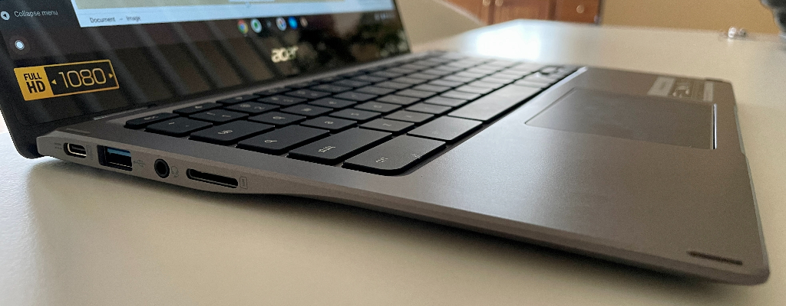

Now that my [full review of the Lenovo IdeaPad 5i Chromebook is complete](https://www.aboutchromebooks.com/news/lenovo-ideapad-5i-chromebook-review-a-potent-pentium-powered-laptop/), it's time to turn my attention to a similar device. I have the [Acer Chromebook Spin 513 LTE](https://www.acer.com/ac/en/US/content/professional-model/NX.AA6AA.001) in hand and have some first impressions to share. The Lenovo and Acer have many similarities when it comes to their size, display, and base model starting price. There are three key differences though: This Acer is a convertible Chromebook, has a Qualcomm Snapdragon 7c processor, and is LTE-capable.

The addition of that LTE radio adds to the price. Instead of the $349 cost for a base configuration, the Acer Chromebook Spin 513 LTE model I have is priced at $699.

That premium includes the LTE modem inside as well as 8 GB of memory over the standard 4 GB. Additionally, storage capacity is bumped up from the base model's 64 GB to 128 GB. Because this is technically an enterprise model, the Chrome Enterprise Upgrade license is also included.

I can't speak to the value proposition yet on the price difference because I really need to use this device as my daily driver for a bit. Still, on paper, it's a steep premium to pay. Particularly, if you're a consumer and don't need the Chrome Enterprise Upgrade license you're paying for. Note that [consumer models of this device](https://www.acer.com/ac/en/US/content/models/laptops/acerchromebookspin513) don't offer an LTE option. [$699 is currently the lowest price you can pay for LTE support in this Chromebook](https://www.aboutchromebooks.com/news/want-acer-chromebook-spin-513-with-lte-the-current-minimum-cost-is-699/).

As a refresher, here are the full specifications of the model I was loaned:

<table class=""><tbody><tr><td>CPU</td><td>Qualcomm Snapdragon 7c, Qualcomm Kryo 468 Octa-core 2.40 GHz</td></tr><tr><td>GPU</td><td>Qualcomm Adreno 618 shared memory</td></tr><tr><td>Display</td><td>13.3-inch 16:9 1920 x 1080 IPS touchscreen</td></tr><tr><td>Memory</td><td>8 GB DDR4x</td></tr><tr><td>Storage</td><td>128 GB eMMC 5.1</td></tr><tr><td>Connectivity</td><td>WiFi 5 (802.11ac), Bluetooth 5.0</td></tr><tr><td>Input</td><td>Backlit keyboard, multitouch trackpad, microphone, 720p webcam</td></tr><tr><td>Ports</td><td>2 USB Type-C (3.2) with DP and PD, 1 USB Type-A (3.2), combination microphone / headphone jack</td></tr><tr><td>Battery</td><td>45 WHr, claimed run-time of 14 hours</td></tr><tr><td>Weight</td><td>2.65 pounds</td></tr><tr><td>Software</td><td>Chrome OS automatic update expiration date: June 2029</td></tr></tbody></table>

## Acer Chromebook Spin 513 LTE design

If you've seen one Acer Chromebook Spin 513, you've seen them all. What I mean by that is that every model has a SIM card slot but only the LTE-equipped configurations make use of it. Externally, the LTE version is no different than the WiFi model.

That's not a bad thing though. I liked the design of this device ever since [I looked at a pre-production model back in October](https://www.aboutchromebooks.com/news/hello-acer-chromebook-spin-513-the-first-with-a-qualcomm-snapdragon-7c/).

The device is thin and light, for example, and well built. It's even thinner than the pre-production model thanks to some tweaks.

Even though the device is mostly plastic, it has a decent amount of rigidity. The 13.3-inch, 1920 x 1080 IPS touch screen has good viewing angles, above-average brightness of 300 nits, and uses Corning Gorilla Glass. I also like the design choice of thinning out the chassis in the closest first half; it adds to the nice, svelte design.

So far the keyboard, which is backlit, is perfectly fine for my typing. It's not what I'd call excellent but it's not bad either. And it's backlit, which is appreciated. I find the trackpad a little small but I haven't enountered any issues with it.

The included pair of USB Type-C ports are split on the left and right, which is my preference. The left side also includes a USB Type-A port and the combination headphone/microphone jack. The dual speakers are under the chassis, which is not ideal. However, the sound levels are louder than I expected. I could watch a movie with these, even when the Chromebook is on my lap.

All in all, the Acer Chromebook Spin 513 LTE (or even the non-LTE model) is a well designed, super lightweight (2.65 pound) laptop.

## First thoughts on performance

Since I was asked not to run performance tests on the pre-production model last year, the Qualcomm Snapdragon 7c was the biggest question mark in my head. And while I need several days of usage to fully test it, I can already see that expectations of average at best performance for the price were well founded.

The Acer Chromebook Spin 513 LTE is **_certainly usable for everyday tasks_**. But we're talking about an ARM processor that was announced in 2019 and is already somewhat outdated. I'm expecting basic entry-level performance based on what I've seen so far, including the writing of this post using the device.

I'll provide a full performance analysis in my upcoming review, but a simple Octane benchmark test in Guest Mode after a reboot earned a score of just under 23,000.

That same testing setup on the non-LTE [Lenovo IdeaPad 5i Chromebook with an 11th-generation Intel Pentium Gold processor returned more than double that score](https://www.aboutchromebooks.com/news/lenovo-ideapad-5i-chromebook-review-a-potent-pentium-powered-laptop/). And the base model price for that is $439, although you can currently find the 2-in-1 equivilent, [the Lenovo Flex 5i Chromebook for $399](https://www.newegg.com/lenovo-82m70010ux/p/2S3-0005-00231?item=9SIAHRCFF14931). And that's with an 11th-generation Intel Core i3, which should provide even more performance than the Pentium model.

Again, so far this is certainly a usable Chromebook. But we're talking entry level performance expectations from what I can see.

## LTE setup, speed test, and usage

Given that I haven't used an LTE Chromebook since the original Google Chromebook Pixel in 2013, I wasn't sure what to expect when it came to setting up the LTE. I can happily report that in my case, it was simple.

I popped in my SIM card and within 10 seconds, the Chromebook self-configured itself for my carrier, which is T-Mobile. Here are some of the settings you can modify in Chrome OS for LTE, but I didn't need to adjust anything.

Although I haven't left home with the Acer Chromebook Spin 513 LTE, I did disable the WiFi radio and used mobile broadband with it. And it works no differently than if I was on WiFi, albeit slower. For reference, I have a WiFi 6 router and 1 Gbps internet connection at my home. So there's no way I'd experience a quicker mobile broadband connection with the LTE modem.

Speeds and coverage vary by carrier and location, of course. So I set my iPhone to use 4G LTE only (in lieu of 5G) and ran a baseline speedtest with it, getting a download speed of 104 Mbps with 36 milleseconds of latency.

Using the same network on the Acer Chromebook Spin 513 LTE, these are the results. A smidge more latency and about half of the download throughput.

This didn't surprise me because the Snapdragon 7c uses an LTE Cat12 modem, which maxes out at 600 Mbps on the download. My iPhone has a much faster modem that supports 1 Gbps LTE connectivity. Again, the age of the Snapdragon 7c is showing here.

Even so, I could easily be productive using a mobile broadband connection that's half of what the Acer Chromebook Spin 513 LTE is providing me. So I don't think this a problem by any means. Most online browsing and productivity doesn't need super-fast connectivity. It's when you start consuming high resolution content, attend video conferences or stream games that you want the fastest wireless pipe you can find.

I'll be sure to test those scenarios using LTE as spend the next several days using this Chromebook, so stay tuned!
