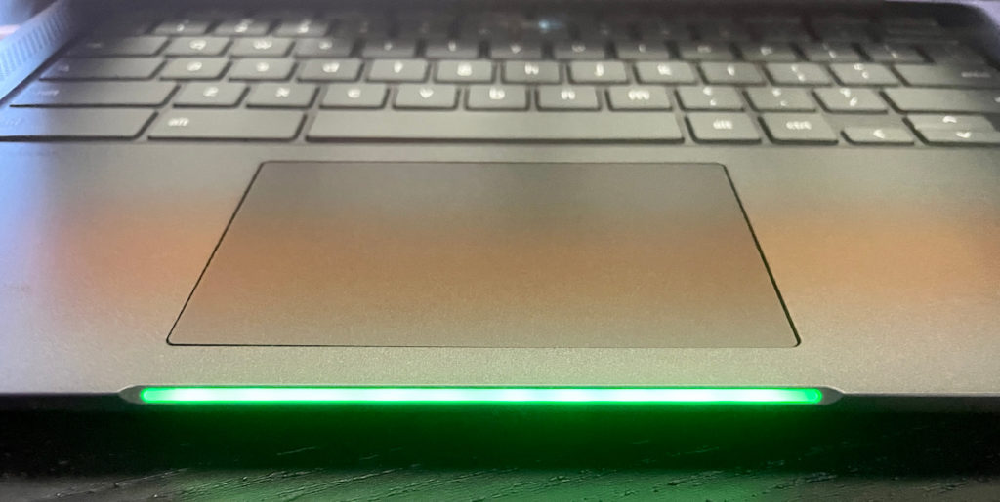

Over the weekend a package arrived and I just got around to opening it. It's the [14-inch Lenovo IdeaPad 5i Chromebook](https://www.lenovo.com/us/en/laptops/lenovo/student-chromebooks/5i-Chromebook-Gen-6-14-Intel/p/WMD00000481), which is this year's successor to the [popular 5-series Chromebooks from 2020](https://www.aboutchromebooks.com/news/lenovo-flex-5-chromebook-hands-on-and-first-impressions/). This isn't a "Flex" model, so it doesn't have a 360-degree hinge nor a touch display. And although I'm not the target audience for it, I'm glad Lenovo loaned me the base $439 model as I want to see how the 11th-gen Intel Pentium Gold 7505 processor performs.

Since I have to update the device to Chrome OS 92 and wait a few minutes, here's a rundown on the specs:

<table><tbody><tr><td>CPU</td><td>Dual-core (four-threads) <a href="https://ark.intel.com/content/www/us/en/ark/products/208667/intel-pentium-gold-7505-processor-4m-cache-up-to-3-50-ghz-with-ipu.html" target="_blank" rel="noreferrer noopener">Intel Pentium Gold 7505</a> (2.0 GHz / 3.5 GHz)</td></tr><tr><td>GPU</td><td>Intel Integrated UHD Graphics</td></tr><tr><td>Display</td><td>14-inch IPS 1920 x 1080 display, matte finish, 16:9 aspect ratio, 300 nits brightness</td></tr><tr><td>Memory</td><td>4 GB DDR4x-3733 MHz memory</td></tr><tr><td>Storage</td><td>128GB SSD M.2 PCIe 3.0x4 NVMe, microSD card slot for expansion</td></tr><tr><td>Connectivity</td><td>802.11ax (2x2) WiFi 6, Bluetooth 5.1</td></tr><tr><td>Input</td><td>Spill-resistant keyboard, Mylar trackpad 720p webcam with physical privacy shutter</td></tr><tr><td>Ports</td><td>1 USB Type-A 3.2 (Gen 1), 2 USB Type-C 3.2 (Gen 1) supporting PD 3.0, data and DisplayPort 1.4, headphone/microphone combo jack</td></tr><tr><td>Battery</td><td>51 WHr, expected run-time up to 10 hours</td></tr><tr><td>Weight</td><td>3.1 pounds</td></tr><tr><td>Software</td><td>Chrome OS automatic updates through June 2029</td></tr></tbody></table>

These specs are interesting for a few reasons. This is considered to be one of Lenovo's student Chromebooks and yet it has some nice features you wouldn't find on competing devices for that audience.

And yet, it's "less" of hardware package than last year's Flex 5 that started at $409, or $30 less. That model has an Intel Core i3, for example, and the keyboard is backlit. No such luck on this keyboard, although the contrast between the white labeling and the Storm Gray keys is good.

## Lenovo IdeaPad 5i Chromebook design

If you're familiar with last year's slightly smaller model, you'll see many familiar features. In fact, this isn't a radical redesign although moving up from a 13.3-inch display to a 14-inch panel does give a little more room in the chassis.

This time around there are larger speaker ports alongside the keyboard, for example. These house 2W speakers tuned with Waves MaxxAudio. The sound quality isn't bad and the loudness is high for a laptop of this size and price.

Also, the hinge mechanism is much sturdier as it runs most of the width of the chassis. This is key because some owners of last year's Flex 5 Chromebooks reported that one of the two hinges broke on their device. Well, goodbye dual hinges. Hello, long single hinge. It reduces the possibility of breakage and makes the display far more stable.

In fact, the whole chassis feels sturdier to me. That could be due to a change in materials. The two-tone display backing is made of anodized aluminum, while the chassis is a blend of [polycarbonate and ABS plastic](https://www.fastradius.com/resources/know-your-materials-polycarbonate-acrylonitrile-butadiene-styrene-pc-abs/).

That might sound "cheap" but it actually makes for a nice feeling device and helps with heat mitigation. (I did not know that!) There is a little more chassis flex than I'd like to see but that's only when trying to flex it. I don't feel it in general usage.

Overall, while the design isn't groundbreaking, it's thoughtful.

The right side has one of the two USB-C ports, while all other ports are on the left. So you can charge the Lenovo IdeaPad 5i Chromebook from either side with the included 45W charger. Lenovo says the tested runtime is around 10 hours, but I'll check that this week as I use this as my primary Chromebook.

If I can get 7-8 hours, I'd say that's about right. Any more would be a bonus. There are no power or volume buttons on either the left or the right: You use the Chromebook keyboard to adjust these.

Oh before I forget, this model has an integrated light bar on the front of the chassis. When you open the Chromebook, the lightbar tells you how much juice is in the battery, based on the color.

This model also has some of the practical features of last year's device with a privacy shutter for the 720p webcam. And although there's no touch support on the display, this 14-inch IPS panel is quite good.

As previously mentioned, it has a 1920 x 1080 resolution and the brightness is a solid 300 nits. That's above-average brightness for a device in this segment. Viewing angles are decent and colors look good to my four eyes.

## First thoughts on performance

Using the device for a short time to do my basic web browsing tasks has been surprisingly snappy. Like, "I have a raised eyebrow in wonder" kind of snappy.

Web pages open quickly, interacting with sites is pretty seamless so far and switching video playback to full screen and back is quick too.

So, I did a quick Octane benchmark test, just out of curiosity. And regular readers know that I don't look at benchmarks are the "end all, be all" to me. I use them as general indications of performance.

Even so, I was stunned to see a score of _**nearly 47,000**_.

That's well above my Acer Chromebook Spin 13 with its 8th-generation Intel Core i5 processor. So far, the new 11th-gen Tiger Lake chips are impressing me.

Of course, when you're using a Chromebook with 4 GB of memory, a fast processor won't help you keep dozens of tabs open at the same time. You'll still see background tabs reload when you return to them on this device.

That said, my first impressions from a general performance standpoint are quite good. The target audience should be pleased here but I'll do more extensive testing in a full review.

Stay tuned and don't hesitate to drop questions in the comments below; I'll try to answer as many as I can in the review.
