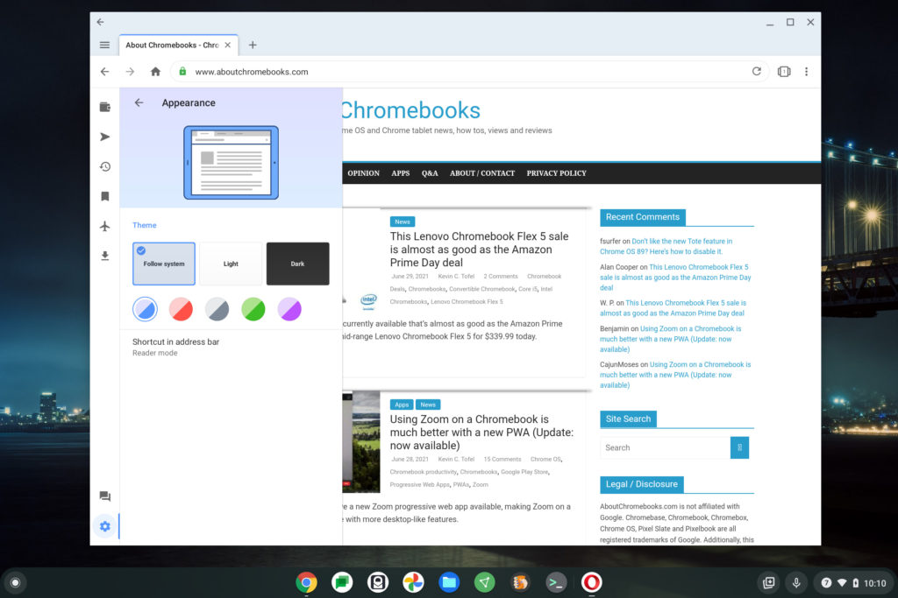
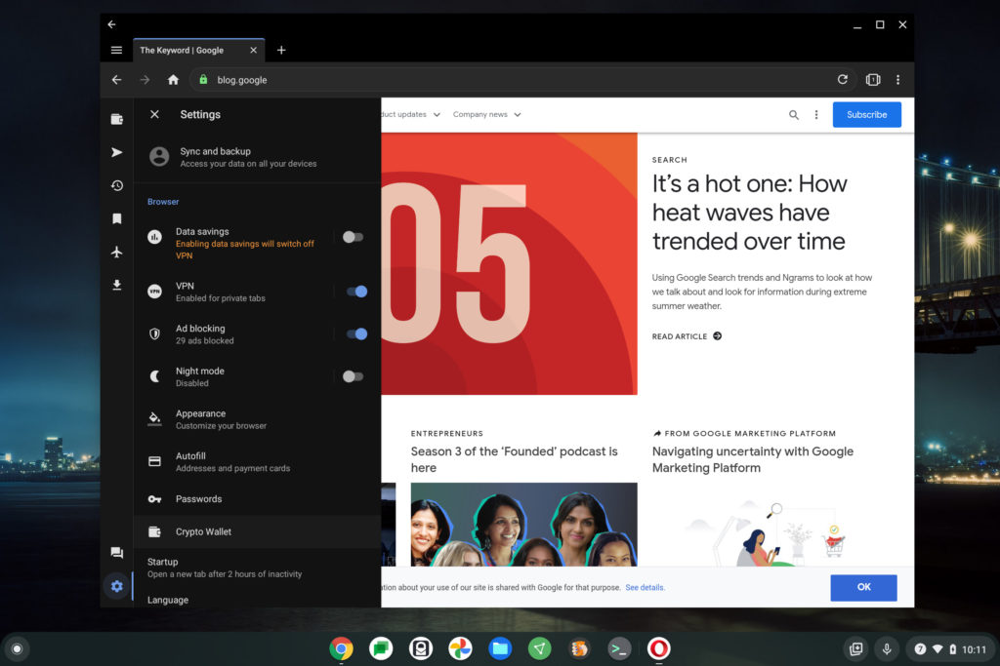
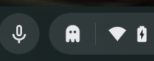
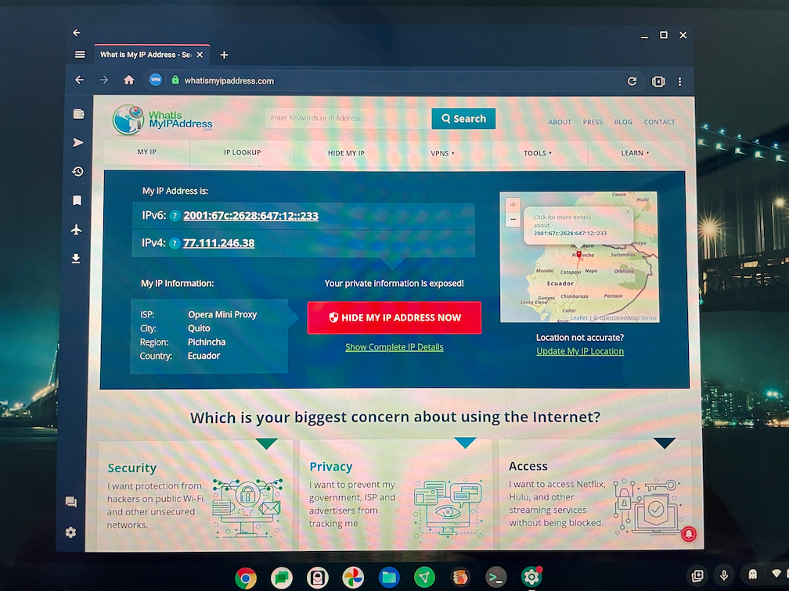
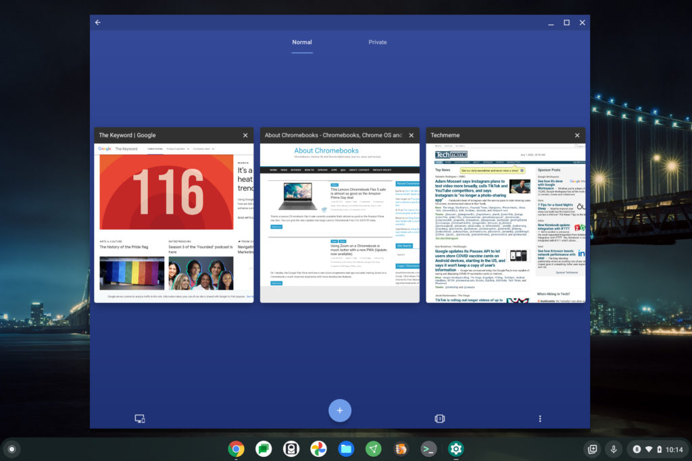
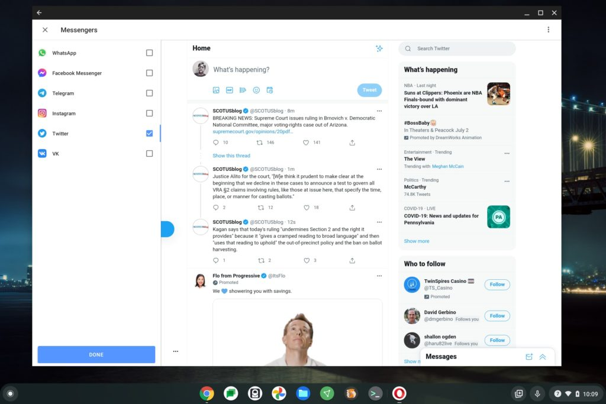

Chromebook users generally accept using the Chrome browser on their devices. After all, it's the default option for Chrome OS. But there _are_ other options available, either by installing an Android or Linux browser. One of my long-time favorite options is Opera. If you're interested in another browser choice, read my hands-on now that [the optimized Opera for Chromebooks is available](https://press.opera.com/2021/07/01/opera-for-chromebooks/).

Before I explain the features, optimizations, and my experience, I should note up front that this is still the Opera app for Android. So there's no "Opera for Chromebooks" version of the browser. You [install Opera from the Google Play Store](https://operabrowservpn.onelink.me/6T8S/Chromebook), just as you would for any Android app.

That's an important clarification because even if you add Opera to your Chromebook, your default desktop browser is still Chrome.

Having said that, another browser choice is always a good thing; especially when it's packed with great features. And the new features that Opera optimized for Chromebooks are in that category. There's a free, no-limit VPN service, for example, integrated messengers and social apps, color themes, plus an ad and cookie dialog blocker. An included Night Mode option reduces blue light in the application as well, although I have that feature natively scheduled on my Chromebook.

After my installation of Opera, I visited a few of my regular sites to test the overall speed and usability of the browser. I did this in full screen mode but I was also able to resize the browser any way I wanted to.

## Fast, resizable and a little customizable

The experience was super speedy on my Acer Chromebook Spin 13. So much so that if I didn't know any better, I'd say this was a native desktop browser, not an Android app. The [hardware in my Chromebook](https://www.aboutchromebooks.com/news/acer-chromebook-spin-13-with-16-gb-ram-should-you-buy-one/) may have something to do with that, so I'd be interested to hear from folks with less powerful laptops.

You can see the various themes available as well, above.

I started out with the default but quickly moved to dark mode. (Don't judge me). No, you don't get too many choices here. In fact, there are more in Chrome OS. However, there's probably something for everyone who wants a slightly different look.

## Plenty of settings and features

There are plenty of options available in the Settings menu. If you're not familiar with Opera, you can sign in with an account for synchronizing browser data and passwords between devices. That's helpful if you use Opera on a phone or tablet, of course.

Additional options include the VPN and ad-blocking service I mentioned prior, as well as some basic browser settings for auto-filling certain input fields, password storage, and if you want, a linked cryptocurrency wallet. And when using a Chromebook on a metered connection or hotspot, it might make sense to use the Data Savings function to limit your data throughput.

The VPN service intrigued me because [I already use a VPN on my devices](https://www.aboutchromebooks.com/news/vpn-by-google-one-for-chromebooks-chrome-os/), including my Chromebook. I pay a monthly fee for mine and Opera is advertising this one as a free option.

## About that VPN in Opera for Chromebooks...

Indeed, when testing it, I didn't have to log in to a VPN service, nor did I have to provide any payment information. So that's good. However, unless I'm missing something, it appears to only work when viewing private tabs; not for regular browsing.

And the VPN protection only applies to your private Opera browsing session. No other apps or Chromebook activities are protected by that VPN. I do like the one-click icon that will close all of your private tabs, by the way. It reminds me of the ghosts from PacMan!

Oh, one other neat aspect of the private tabs is that screenshots are disabled. Opera can do that because Android natively allows developers to block screenshots of their apps. I often see that behavior in financial apps, for example.

So instead of showing you the blank browser screen I tried to capture when using a private tab, I'll show you a picture I took when checking my Chromebook's IP address. This was to verify that my browsing session was going over a VPN.

Yup, I was browsing the web "from" Ecuador if anyone was watching. ;)

I didn't see any major delays when browsing over the VPN; sure it's generally a slower experience as your web traffic is routed around the world. But it's certainly usable and you can't beat the price. Just remember which Chromebook activities it protects and which it doesn't.

## Overview mode and tab switching

I have to say, this is where I can instantly see where the company optimized Opera for Chromebooks. Seeing all of your open web pages in an overview mode isn't that much different from doing the same on Chrome OS with the browser and apps. The experience is smooth on my Chromebook, although again, your mileage may vary based on the hardware you have.

Best of all are hardware shortcuts that were added specifically to this version of Opera. Tap `Ctrl +T` on your Chromebook keyboard to open a new tab for example, or `Ctrl + L` to bring the focus back to the address bar. This is another instance where Opera feels more like a traditional desktop browser for Chrome OS rather than an "upscaled" Android app.

## Multiple messenger integrations

Truth be told, I'm probably atypical when it comes to messaging apps. I generally use SMS, Apple Messages and Twitter DMs for direct conversations. So there's no WhatsApp, Facebook Messenger or Instagram in my life.

But many of you probably do use one or more of these platforms, Telegram or VK. If so, Opera might be ideal for you with a dedicated integration.

I set up Twitter, which was just the standard sign in process. I thought I would only see the Direct Messages tab, but it's the entire Twitter client. And that's fine with me; I can keep focused on other things and hit the separate instance of Twitter whenever I want. No need to take up or managed another browser tab, I say.

I can't speak to the other messenger experiences simply because I don't use them and didn't set them up.

## Should you try the optimized Opera for Chromebooks?

Opera has been a favorite browser of many, even before the days of the smartphone. Over the years, the company has continued to innovate and improve the mobile browsing experience as times have changed. If you've ever used Opera in the past, you know what I mean.

For those not familiar with Opera, I say give it a go. Download it to your Chromebook and try it. And I mean **_really_** try it; don't browse around for 10 minutes and make a snap judgment.

Instead, why not run it side-by-side with the Chrome browser from time to time and see what you like and what you don't. It may not have every feature found in a traditional desktop browser but it really feels like a desktop browser.

Who knows: Maybe you'll even switch from Chrome to Opera on your Android phone (if you have one) and feel like you've got a better browsing experience. And that experience will even sync between your devices.
