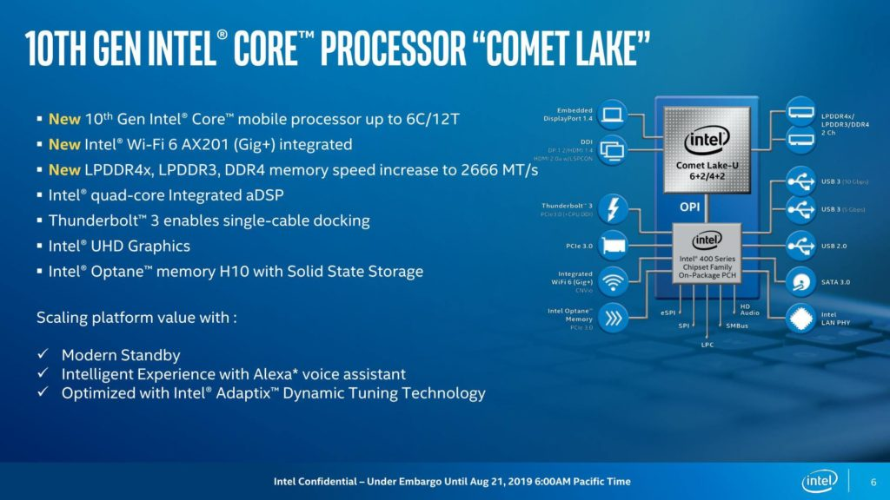
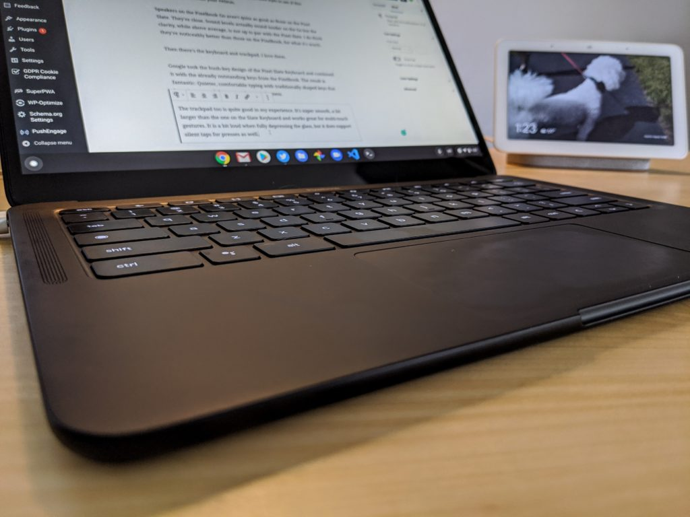

Back in July, [Chrome Unboxed uncovered a new board for Chromebooks dubbed "Hatch"](https://chromeunboxed.com/chromebooks-hatch-kindred-helios-kohaku-intel-powerful-fast-comet-lake/). Since then, bits and pieces of what to expect have trickled out and while it was widely expected that Chromebooks built on this board would have 10-th generation Intel chips, Geekbench results are essentially confirming it.

The latest Geekbench test result for Google Hatch device, [as spotted by Morning Tick](https://morningtick.com/2019/12/08/hatch-chromebook-geekbench/), was the last one I was looking for: [A powerful Core i7 processor from Intel's Comet Lake chip family, paired with 16 GB of memory](https://browser.geekbench.com/v5/cpu/718985).

I'd expect such a Chromebook to be priced similarly to the [$999 Acer Chromebook Spin 13 with 16 GB of memory I recently purchased](https://www.aboutchromebooks.com/news/acer-chromebook-spin-13-with-16-gb-ram-should-you-buy-one/). Then again, that device uses a Core i5 processor, so an additional premium for a Core i7 wouldn't be surprising.

Clearly such a configuration is far more power than most Chromebook users need. For an everyday browsing machine, you can spend $250 to $350 and have a machine that easily meets your requirements. In fact, I'd recommend that unless your a developer, this particular upcoming Hatch model, or models, isn't for you.

And that's OK since Geekbench results for testing other Hatch configurations have been appearing for a few months [with both Core i3 and Core i5 chips](https://browser.geekbench.com/v5/cpu/search?q=hatch), also from Intel's Comet Lake family.

Note that all of these processors are U-Series chips, meaning they will use a fan for cooling. Fanless Chromebooks typically use the lower-powered Y-Series processors, if not a Celeron or Pentium chip. That saves on cost since the chips are cheaper and will make folks that prefer a fanless device happy.

Performance is the factor you're giving up when using a Y-Series chip, at least _relatively_ speaking. There are plenty of great, mid-range Chromebooks using Y-Series processors, [the latest being the Pixelbook Go, which I found to be snappy enough for traditional Chromebook usage in my testing](https://www.aboutchromebooks.com/news/pixelbook-go-review-a-premium-price-validated-by-a-premium-device/).

Pixelbook Go

Still, as someone [who codes on a Chromebook](https://www.aboutchromebooks.com/news/how-to-code-on-a-chromebook-crostini-pixel-slate/) and looks for every ounce of performance, I'm getting excited about devices built on the Hatch baseboard. Look for the usual suspects to build their Chromebooks around it, such as Acer, Dell, and Lenovo. It seems like this trio is trying to offer high-end Chromebooks while Asus, Google, and Samsung are aiming more for the mid-range category.
