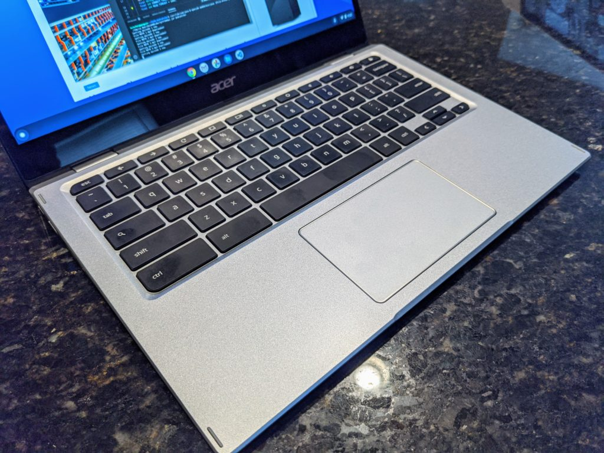

Acer today announced the first Chromebook with the [Snapdragon 7c compute platform](https://www.qualcomm.com/products/snapdragon-7c-compute-platform). The [Acer Chromebook Spin 513 is that device](https://news.acer.com/acers-first-chromebook-with-the-qualcomm-snapdragon-7c-compute-platform-is-ultraportable-4g-lte-equipped) and pricing will start at $399. That price won't get you integrated LTE support but it, as well as more memory can be added in higher priced configurations.

By going with the Snapdragon 7c, Acer says that 14 hours of battery life is possible in this small, slim convertible Chromebook that weighs just 2.65 pounds. The Chromebook Spin has a 13.3-inch 1920 x 1080 IPS touchscreen display with a widescreen aspect ratio and 78 percent screen-to-body ratio.

https://youtu.be/ZMpq10oO45g

The base model includes WiFi 5 and Bluetooth support but again, integrated LTE is an available option as there's a SIM card tray on the left side of the chassis. 4 GB of memory is standard while some configurations will offer 8 GB. Local storage can be configured up to 128 GB of eMMC storage. Note that the Snapdragon 7c doesn't support faster NVMe storage, so it's not an option here. The display and trackpad are covered with Gorilla Glass for durability.

You also get a pair of USB Type-C ports with the Acer Chromebook Spin 513, one on each side, as well as a USB Type-A port. Atop the display that has relatively small bezels is a webcam for video calls, as well as a pair of microphones. Keyboard backlighting is an available option within the metal chassis. This Chromebook is a "Flip" model, so the display can fold a full 360-degrees.

Clearly, Acer is both taking a chance on and leading the way by using Qualcomm's Snapdragon 7c here. Unlike other ARM-based Chromebooks using chips traditionally reserved for smartphones, this is a slightly tweaked processor for computers. Microsoft's Surface Pro X lineup uses a similar processor family that the company has customized. But it's difficult to gauge the performance we can expect from the Acer Chromebook Spin 513 because it uses a slightly different chip and, of course, uses a different software platform.

However, I actually have a pre-production unit of the Acer Chromebook Spin 513 with 8GB of RAM and integrated LTE. I actually used it to write this post, played some Stadia games on it last night, and even installed some Linux apps.

While I'm restricted from running benchmarks, battery tests, and a few other things, I can say that my limited experience of day-to-day work suggests better performance than currently available ARM-based Chromebooks. I'll have more to say about those experiences and the device in a dedicated post, so stay tuned.

Obviously, with a starting price of $399, you shouldn't expect this convertible to compete against a Core i7 Chromebook that costs north of $1,000. But I don't think that's the intent for this device at all.

Instead, this is targeting mainstream web work, content consumption, and everyday browsing. And while that audience may not need LTE, it is an option for those on the go. Plus, if the battery life claims pan out, the Acer Chromebook Spin 513 can easily get through a day on a single charge.

When you add all that up and can get a base model for $399, there's a lot to like here. You'll have to wait for it though: Acer says to expect availability in the first quarter of 2021.
