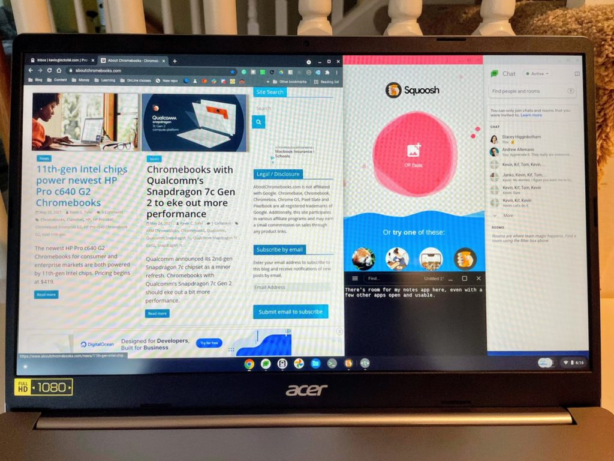
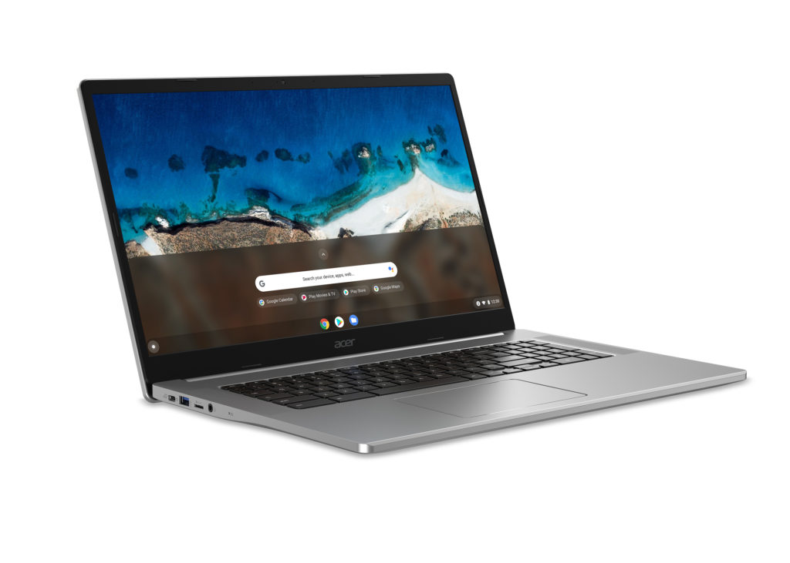

[Acer debuted the industry's first 17.3-inch Chromebook back in May](https://www.aboutchromebooks.com/news/4-new-acer-chromebooks-11th-gen-intel-chips-and-one-with-thunderbolt-4-0/) and it's [now available for $499](https://www.bestbuy.com/site/acer-chromebook-317-17-3-hd-ips-touch-display-intel-pentium-silver-n6000-processor-8gb-lpddr4x-64gb-emmc-wifi6/6470349.p?skuId=6470349). I took [an early look at the 17.3" Acer Chromebook 317](https://www.aboutchromebooks.com/news/early-look-at-the-17-3-inch-acer-chromebook-317/) a few weeks after the device's introduction and there's something to be said for so much screen space. Granted, the large 16:9 panel has a 1920 x 1080 resolution so unless you scale the display, it's not going to show any more information than most other 13- or 15-inch Chromebooks.

The currently available 17.3" Acer Chromebook 317 model sees a new quad-core [Intel Pentium Silver N6000 CPU](https://ark.intel.com/content/www/us/en/ark/products/212330/intel-pentium-silver-n6000-processor-4m-cache-up-to-3-30-ghz.html), which may not quite hang with the [Pentium Gold 7505 that I found to have admirable performance](https://www.aboutchromebooks.com/news/lenovo-ideapad-5i-chromebook-review-a-potent-pentium-powered-laptop/).

Still, given how much of a boost Intel's latest processors are showing over the prior generation, this should be plenty for every Chromebook task. Couple that CPU with the 8GB of memory and you'll be able to have more browser tabs and apps open than on most entry-level models.

It's worth noting that this configuration is what Acer said would be a higher-end option. The company has [a model with Intel Celeron N4500 and 4 GB of memory that sells for $369.99.](https://www.acer.com/ac/en/US/content/models/laptops/acerchromebook317) So if you can get buy with an older CPU and half the memory, you can save some money.

Coming along for the ride is 64 GB of eMMC storage and a microSD card slot for expansion, a pair of both USB Type-A and Type-C ports evenly distributed on the right and left, a backlit keyboard with a dedicated number pad, WiFi 6, and Bluetooth 5.0, and a 3-cell battery with claimed 10-hour runtime.

Obviously, you really want to have a large-screened Chromebook if you're going to choose this one. And you'll want to make sure you're in shape too: To lug this around you'll be carrying five pounds worth of Chrome OS!

