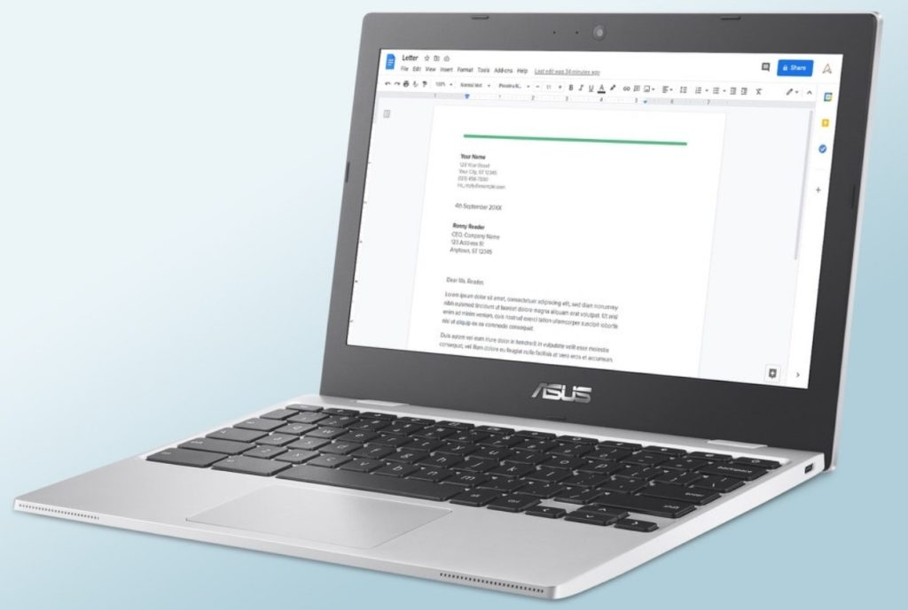
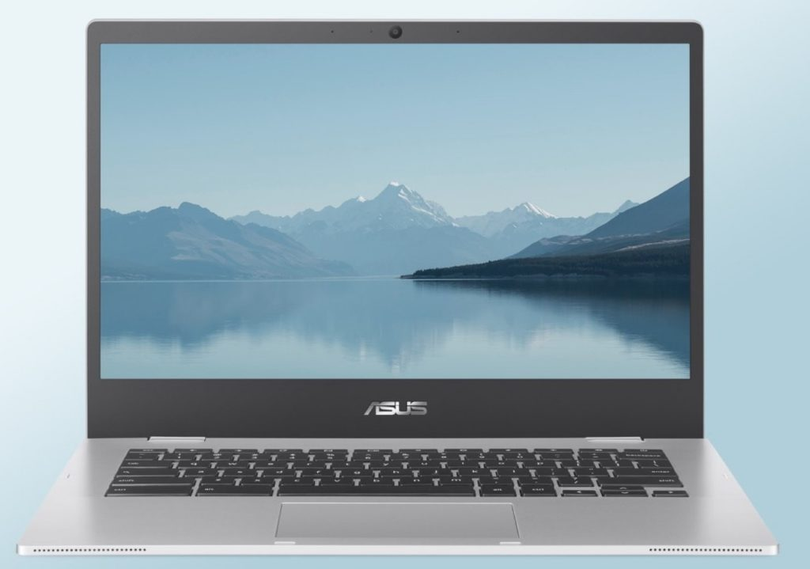

I'm always on the lookout for new Chromebooks and this morning I found one. Technically, I found two, but they're basically the same hardware in different sizes. I'm talking about the [new 11.6-inch Asus Chromebook CX1](https://www.asus.com/us/Laptops/For-Home/Chromebook/ASUS-Chromebook-CX1-CX1100/techspec/) and similar [14-inch models](https://www.asus.com/us/Laptops/For-Home/Chromebook/ASUS-Chromebook-CX1-CX1400/techspec/), which haven't been announced but appear on the Asus US site. And they're [already available overseas](https://www.guru3d.com/news-story/asus-presents-new-chromebooks-cx1cx9-and-cm5.html).

Looking at the two Asus Chromebook CX1 models, they appear to be basic, entry-level devices.

That, I can understand as there's a big, or bigger, market for affordable Chromebooks. No, I don't yet know the prices but I figure around $200 to $300 is your basic entry-level price range. Of course, the hardware used can also help determine the price point, so I looked at the Asus Chromebook CX1 specifications.

And I'm utterly confused.

Not by the 11.6-or 14-inch display options, which range from the expected 1366 x 768 resolution up to 1920 x 1080. Nor by the local eMMC storage choices of either 32 or 64 GB.

It's when I saw the processor used in the Asus Chromebook CX1 that I basically said, "Uh.... what?"

Both of these devices are powered by a dual-core [Intel Celeron N3350 CPU](https://ark.intel.com/content/www/us/en/ark/products/95598/intel-celeron-processor-n3350-2m-cache-up-to-2-4-ghz.html) and Intel HD Graphics 500 integrated GPU.

If that processor and graphics silicon sound familiar, that's because it launched in the third quarter of 2016! We've had at least two, if not three, iterations of the Celeron since then.

Put another way: In my [Chromebook buyers guide](https://www.aboutchromebooks.com/news/getting-your-first-chromebook-buyers-guide-2021/), I recommend an entry-level option to have a much more modern Celeron processor:

> "Intel Celeron processor, preferably the newer N5000 although an N4020 or N4010 should suffice OR an ARM processor such as the MediaTek Helio P60T, MediaTek MT8173C."

I'm not suggesting there's anything wrong with the older Celerons. They still get the job done as you well know if you have a Chromebook from 2017 or so. But why buy a new Chromebook with such an old processor would be my question?

There's another important aspect to the Asus Chromebook CX1 as well: Chrome OS software support.

Typically, it now runs out [8 years after the first Chromebooks with a specific chipset are launched](https://www.aboutchromebooks.com/news/google-announces-8-years-of-chrome-os-software-updates-aue-for-new-chromebooks/). That's why if you buy one of the [new Acer Chromebooks with the most current, 11th-generation Intel processors](https://www.aboutchromebooks.com/news/4-new-acer-chromebooks-11th-gen-intel-chips-and-one-with-thunderbolt-4-0/), you'll get software support through June 2029.

But the Asus Chromebook CX1? You can only expect Chrome OS software updates through June 2024, unless Google changes its automatic update policy between now and then.

Sure, that's "only" $100 a year of cost (assuming a $300 price point) for the Chromebook CX1 spread out over those three years, but still. I'd rather drop the same amount of money on a device that is guaranteed to get another 5 years of software updates. Even if I don't think I'll use the device for that long.

The only other spec that jumps out on me for the Asus Chromebook CX1, and in a positive way, is that some models will have up to 8 GB of memory. More RAM on a Chromebook is always a good thing, in my opinion. You'll be able to have more active tabs and apps open with more memory.

Regardless of that, I simply don't understand the purpose of these Chromebooks.

Maybe Asus wanted to flesh out their entry-level lineup but due to chip shortages is reverting to a Celeron from 2016. Even if that is the reason, I can't see why there wouldn't be slightly newer Celeron chips available, even during a silicon shortage.
