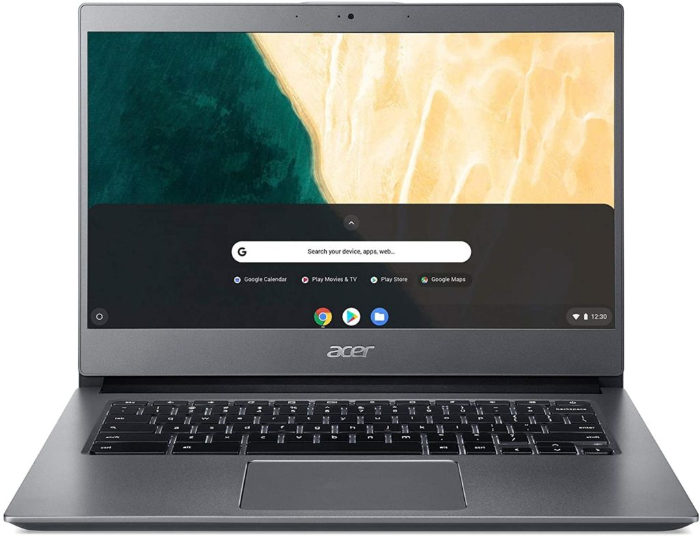
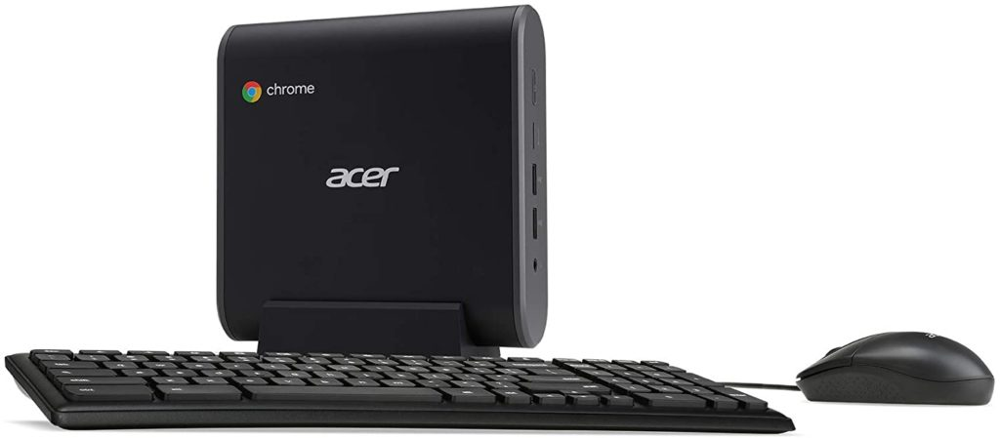

Get ready for a crazy 48 hours of online shopping deals: Amazon's Prime Day, or "days", is here. Given that Chromebooks are in high demand and short supply due to the current pandemic, I don't expect to see too much availability. However, I was pleasantly surprised to see some Chromebooks, and even a Chromebox, in stock and discounted earlier today.

I'll keep this post as a running list as Amazon adds or removes the Chromebook deals, so feel free to check back from time to time.

Here are the deals I've seen so far, that are still currently active at time of writing. Tap the images or product names above them to get the deals.

## [Acer Chromebook 714: $509.99, normally $599.99](https://amzn.to/2GWCmDM)

The Acer Chromebook 714 has a 14-inch 1080p touchscreen, Intel Core i3-8130U processor, 8 GB of memory. Even with an 8th-generation Intel chipset, this Chromebook should handle daily tasks for most users and students.

## [Google Pixelbook Go: $1,199, normally $1,399](https://amzn.to/2GYqelG)

This is the top-end configuration of Google's latest Pixelbook laptop. It has an 8th-generation Core i7 processor, 16 GB of memory, and 256 GB of storage as well as a 4K touchscreen display. I chose a lower-priced configuration of the Pixelbook Go as my [Chromebook of the year](https://www.aboutchromebooks.com/news/my-pick-for-2019-chromebook-of-the-year/) in 2019. [Here's my review of that model](https://www.aboutchromebooks.com/news/pixelbook-go-review-2020/).

## [Acer Chromebox CXI3: $229.99, normally $269.99](https://amzn.to/3jTOjbS)

This Chromebox has entry-level specifications that are good for daily browsing as long as you don't keep too many tabs open at once. You'll also need to provide your own monitor. Inside is an Intel Celeron 3867U Processor, 4GB of memory and 128 GB of local storage.
