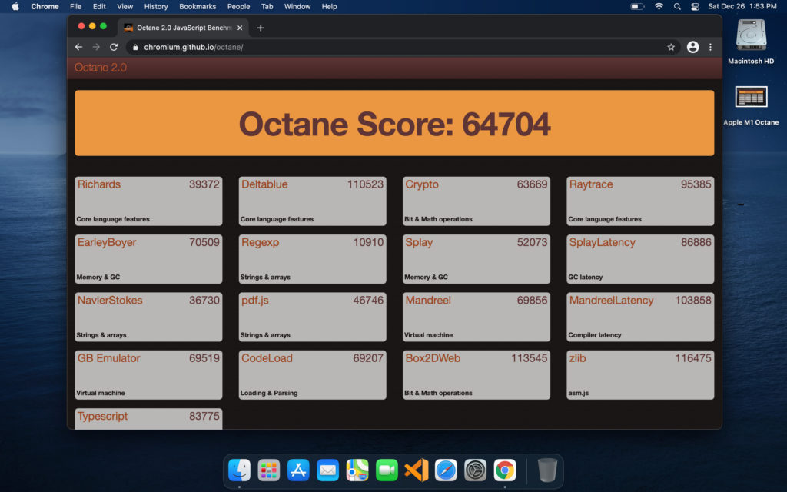
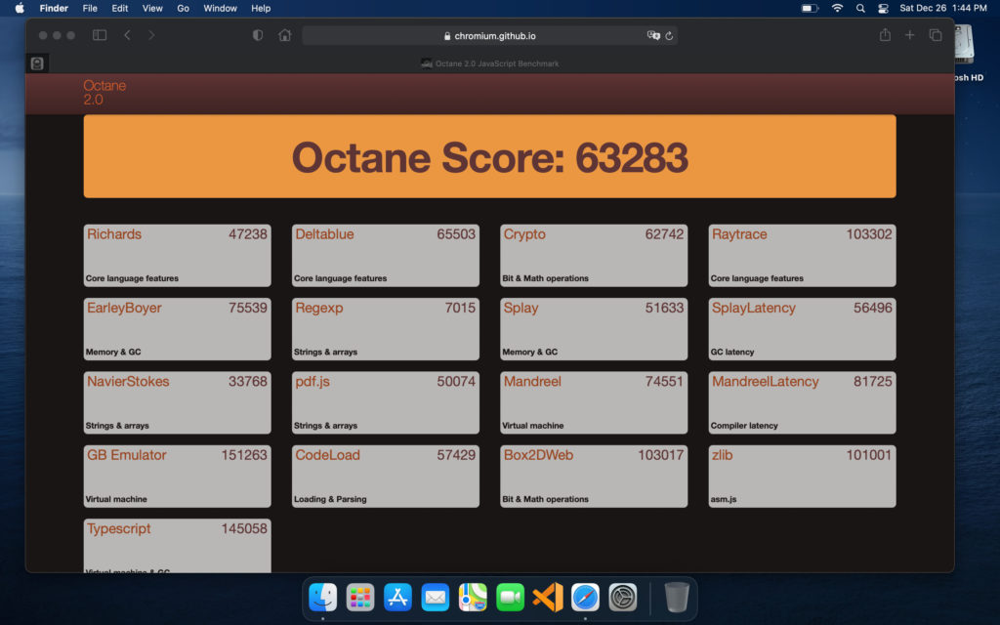
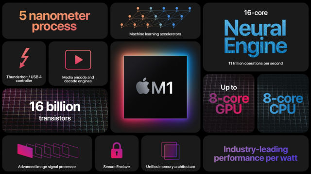
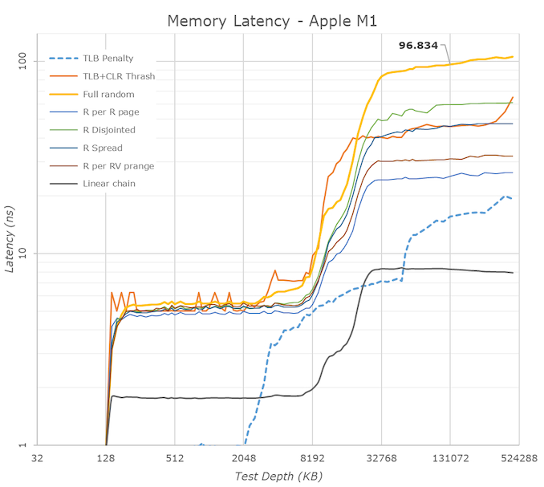

A few weeks ago, I sold an old 2016 MacBook Pro that I wasn't using much. I replaced it with a MacBook Air powered by Apple's M1 processor that I bought for $899 after a student discount. Although I mainly use a Chromebook, I use various devices and operating systems to keep some perspective on the overall market. And after using the M1 MacBook Air, I'm more convinced than ever that [Google should design a custom ARM processor for Chromebooks](https://www.aboutchromebooks.com/news/apples-own-chips-inside-arm-powered-macs-show-why-google-needs-to-make-custom-silicon-for-chromebooks/).

Let me elaborate on two key points as to why I think that.

## The M1 blows away Intel-powered devices in browser benchmarks

First, is the overall responsiveness the M1 provides. While I can't compare apples to apples between devices running Chrome OS and macOS, I can share a few key performance measures.

Take a look at this Octane benchmark, for example, using the ARM version of the Chrome browser on the MacBook Air:

I've run this benchmark on dozens of Chromebooks through the years and about the highest score I've ever seen is around 45,000 points. And that was on a then-recent Intel Core i5 processor. Granted a Core i7 Chromebook would likely offer an even larger number but likely around another few thousand points. It wouldn't be a 20,000 point jump, in other words.

By the way, I should note that Google quickly did a nice job in optimizing Chrome for macOS to run natively on the Apple M1-powered laptops. The company quickly offered a build that boosted performance over the existing x86 build for Intel-powered Macs. And for the morbidly curious, Apple's own Safari browser on the MacBook Air scored nearly as high as Chrome did:

## Why does Octane (or any other browser benchmark) matter?

Obviously, there's more than just browsing capabilities on any modern computing device. And the M1 handles all of the ones I need equally as fast.

For Chromebook users though, browser performance is the key factor. Why? Because the entire user experience is built around the browser. Sure there are other use-cases such as Android apps and the Linux experience. But for all but some edge case users, a Chromebook is typically used for web browsing and web apps.

I can't comment on how well a chip similar to the Apple M1 would handle Android or Linux. I can say that it performs extremely well with iOS and iPadOS apps, but while similar to Android apps, its an entirely different framework and coding approach. I'd take an educated guess that a custom ARM processor built like the M1 would do well, however.

## What's different about the M1 and current ARM options for Chromebooks

This is the second part of my reasoning, which will require a little deeper dive into the M1 chip itself. That's because it's unlike any ARM chip designed by MediaTek, Qualcomm, Samsung and others who might (or have) put their silicon into a Chromebook.

Simply put, Apple has found a way to [scale up the performance of the M1 processor cores far beyond that of any competitor](https://www.anandtech.com/show/16252/mac-mini-apple-m1-tested).

Image courtesy Apple

There are four "big" cores and four "little" cores, which is similar to how other chip designers today architect their products. But none of those designers are hitting the clock speeds of the M1 in a power-efficient way. Note that I'm making that observation based on the clock speeds and power requirements of currently available chips. But even if you look at a sampling of recently announced or upcoming ARM chips, you can see how Apple outclasses the field when it comes to raw performance potential.

Here's an overview to illustrate:

<table><tbody><tr><td></td><td>Apple M1</td><td>MediaTek Helio G95</td><td>Snapdragon 888</td><td>Exynos 990</td></tr><tr><td>Big cores</td><td>4 x 3.2GHz</td><td>2 x 2.05GHz</td><td>1 x 2.84GHz, 3 x 2.42 GHz</td><td>2 x 2.7GHz, 2 x 2.5GHz</td></tr><tr><td>Little cores</td><td>4 x 2GHz</td><td>6 x 2GHz</td><td>4 x 1.8 GHz</td><td>4 x 2GHz</td></tr><tr><td>Big core TDP</td><td>13.8W</td><td>TBD</td><td>TBD</td><td><a href="https://nanoreview.net/en/soc/samsung-exynos-990" target="_blank" rel="noreferrer noopener">Reported 9W</a></td></tr><tr><td>Little core TDP</td><td>1.3W</td><td>TBD</td><td>TBD</td><td>TBD</td></tr></tbody></table>

Keep in mind also that [a 10th-generation Intel Core i5](https://ark.intel.com/content/www/us/en/ark/products/195436/intel-core-i5-10210u-processor-6m-cache-up-to-4-20-ghz.html), like the one found in the [Acer Chromebook Spin 713](https://www.aboutchromebooks.com/news/acer-chromebook-spin-713-review/) only has four cores. These can scale up from 1.6 GHz to a 4.2 GHz boost level, but not for long. At that point, the TDP is up to 15W and the chipset starts to throttle. I have yet to see the M1 throttle to lower speeds due to heat when testing over the past few weeks.

There's another factor at play here as well: The system memory.

Today, whether you have a Chromebook with an ARM or x86 (Intel/AMD) processor, you have system memory somewhere away from the chip itself. That means the memory usage for reads and writes passes through some system bus. The M1 has either 8 or 16 GB of memory directly in the chipset. That's far more efficient, meaning more memory throughput.

Continuing on the Intel Core i5 example, Intel claims the maximum memory bandwidth is 45.8 GB/s. That's fast! But when compared to the M1 chipset? It's not as impressive: The closer RAM means [the M1 can read memory at 68.25 GB/s](https://www.anandtech.com/show/16252/mac-mini-apple-m1-tested#:~:text=Across%208x%2016%2Dbit%20memory,68.25GB%2Fs%20memory%20bandwidth.).

Image courtesy AnandTech

Essentially, a chipset designed similar to the M1 in a Chromebook can offer better performance than one with a current Core i5, if not Core i7.

## Wait, I don't need a faster Chromebook

When I've raised the question and the benefits of a custom Chromebook chip similar to Apple's M1, I've seen a common response. "For most users, current Chromebooks are fast enough" is the general vibe. And I understand that sentiment.

But it's not all about speed, although a faster browser surely leads to a better Chromebook experience. By boosting speeds in a more power efficient way, a solution like this could also bring more battery life. And that's without increasing the size of a battery.

The MacBook Air I bought has a 49.9 WHr battery, for example. The Acer Chromebook Spin 713 has slightly less capacity at 48 WHrs. The screen sizes are nearly the same on both. I can get around 8 hours of runtime on a charge with the Chromebook with brightness around 50%. The same scenario for the MacBook Air with M1? Sixteen hours of usage on a charge is the **_lowest_** I've seen. I typically go for nearly 18 hours before needing to plug in.

There's also the cost factor, although we don't know how much a similar custom ARM chip for Chromebooks would be priced. However, as you move up the Intel Core lineup to the i5 and i7 range, you're starting to see the chipset boost the device cost by $200 to $400 at a minimum. And you're still not getting the battery life or the performance of a chipset like the M1 if you could design a Chromebook around it.

So I get the "we don't need more speed" mantra. That doesn't mean we should discount the other benefits.

All in all, anything that can improve the Chromebook experience -- whether its performance, battery life, or even lower priced high-end devices -- is a win in my book.
