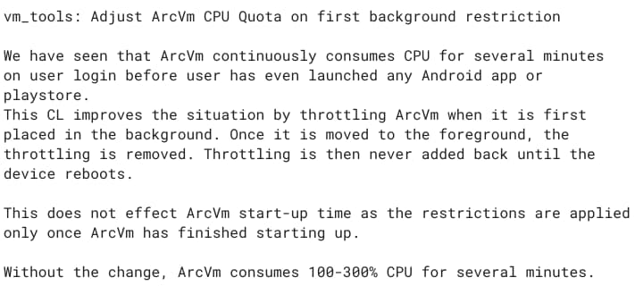

Have you noticed that your Chromebook isn't very responsive until a minute or so after startup? [Depending on your hardware](https://www.aboutchromebooks.com/news/acer-chromebook-spin-13-with-16-gb-ram-should-you-buy-one/), you may not have as higher performing components could mask this. But Google has. And it has a solution to improve initial Chromebook performance in an upcoming Chrome OS update.

The issue is laid out in a [description in this code commit](https://chromium-review.googlesource.com/c/chromiumos/platform2/+/3276952). ARCVM "continuously consumes CPU for several minutes on user login before user has even launched any Android app or playstore."

If you're not familiar with the term, ARCVM is the virtual machine used to run Android apps on a Chromebook. Based on the description, this virtual machine launches when you boot your Chromebook. This occurs even if you don't immediately open an Android app or the Google Play Store. And that causes the CPU in your Chromebook to spend most, if not all, of its resources firing up ARCVM.

Even when you may not need it at first. Or at all!

This situation is often referred to as the CPU "being pegged." If the CPU is mainly focused on completing a single task, the rest of the system is sluggish and laggy.

Ever seen slow response times when you navigate on your Chromebook's interface? It's likely the CPU is pegged, although having a limited amount of free memory could also be at play.

So how is Google going to speed up initial Chromebook responsiveness?

A Chrome OS update will restrict the CPU's availability to fire up ARCVM upon startup. Currently, the code limits this to 25 percent of the CPU, although that figure change based on internal testing. By limiting the ARCVM startup process to only use up to a certain percentage of the CPU, initial Chrome OS performance should improve.

Of course, you might be wondering what happens if you immediately want to use an Android app or the Google Play Store after your Chromebook boots. This solution, as it stands now, has you covered.

This CPU limit for ARCVM **_only_** takes place when your Chromebook starts up:

> This CL improves the situation by throttling ArcVm when it is first placed in the background. Once it is moved to the foreground, the throttling is removed. Throttling is then never added back until the device reboots.

As I read it, if you actively open an Android app or the Play Store, the CPU throttling limitation is immediately removed. That will allow ARCVM to spin up faster, which makes sense. When you want to run an Android app, you'll get the same experience as you do today. When you start up and just want to use Chrome OS, CPU resources won't be wasted on creating the virtual machine for Android apps.

There's no indication of which Chrome OS update version this feature will arrive, so I can't hazard a guess. And I don't see any indication (yet) that this will be implemented with a user-facing experimental flag, although that may change.
