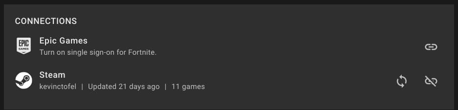
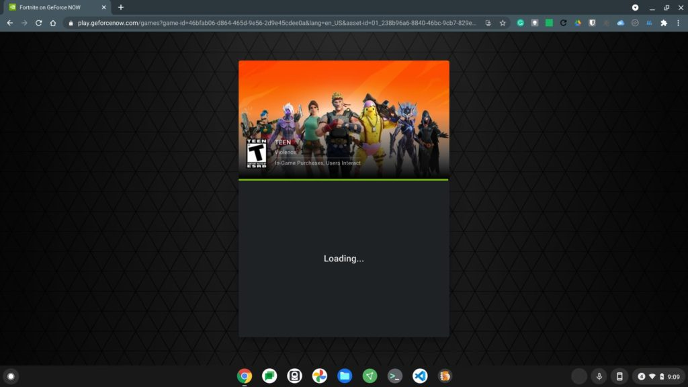

When it comes to gaming, Chromebooks aren't the first, or maybe even third, devices that come to mind. That's changed a little with game streaming support for both [Stadia](https://www.aboutchromebooks.com/tag/stadia/) and [GeForce Now](https://www.aboutchromebooks.com/tag/nvidia-geforce-now/). Both services keep improving and the latest update adds a quicker in-game experience a popular title. Here's how [Nvidia's GeForce Now speeds up Fortnite on Chromebooks](https://nvidia.custhelp.com/app/answers/detail/a_id/5176/kw/epic).

To be clear, gameplay _itself_ isn't any faster. Instead, the super long time to get playing Fortnite from the time you actually hit the "Play" button is reduced in two ways.

First, Nvidia has worked out a deal with Epic Games to link your Epic and GeForce Now accounts.

This is only for Fortnite at the moment, although I'm hoping some other game titles come along for the ride in the future. (Star Wars Jedi Fallen Order, I'm looking at you!).

Just like I did [for my Steam account months ago](https://www.aboutchromebooks.com/news/steam-game-sync-on-geforce-now-for-chromebooks-may-make-it-a-better-option-than-stadia/), I was able to link my Epic account with no issues.

By linking your Epic Games account, you won't have to sign in with your Epic credentials each time you run Fortnite on a Chromebook with GeForce Now.

The real time savings is in a beta test of Nvidia "pre-loading" some of the game in the background. Nvidia says without this new feature, game loads could take up to a minute before you could get in the action.

I've never experienced that long of a load time in the past, but then again, I'm not what you'd call a "skilled" first-person shooter guy. I don't play Fortnite that much and when I do, I'm destroyed quicker than it took to load the game. No, I'm not salty about that. Really.

Anyway, after a few quick tests of GeForce Now on my Chromebook this morning, I did notice the average load time was around 15 seconds. It's that much quicker before I get sniped, yay!

For now, Nvidia says the pre-loading feature is only being tested for Priority and Founders members, so if you use the free, limited plan for game streaming, you'll still have typical wait times.
