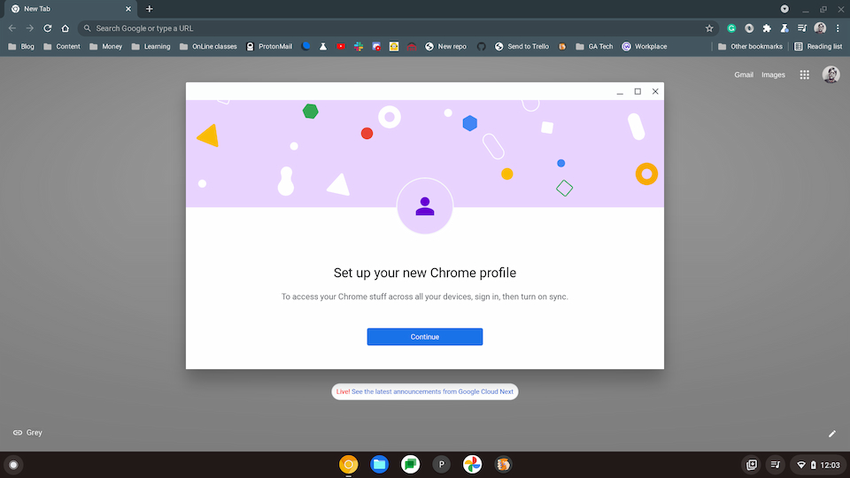
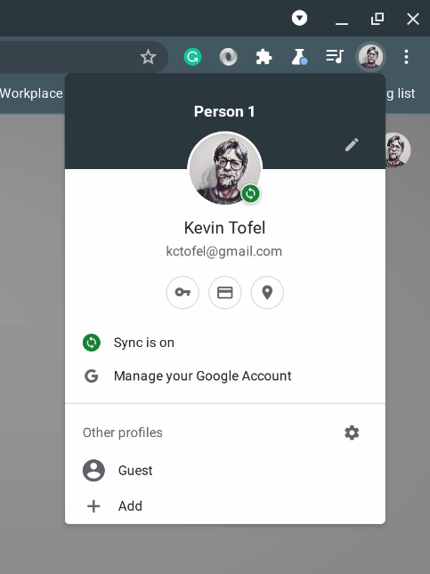

As we get ready for Chrome OS 94 and skip version 95 for Chrome OS 96, expect some big changes. The largest could be a switch from the [standard Chrome browser to Lacros](https://www.aboutchromebooks.com/news/lacros-vs-chrome-and-chrome-os-on-chromebooks/). Don't be worried though: This change to the Lacros browser will bring a number of benefits including one that will improve profile switching on Chromebooks.

If you're not familiar with the Lacros browser, [here's a quick refresher](https://www.aboutchromebooks.com/news/what-is-lacros-for-chromebooks-and-why-does-it-matter/). It's essentially a Linux-based version of the Chrome browser but it's not as tightly integrated with Chrome OS. It has the same features as the standard Chrome browser.

The reason Google is [decoupling the Chrome browser from the Chrome OS system](https://chromium.googlesource.com/chromium/src.git/+/master/docs/lacros.md) is to make it easier to manage changes across Chrome for all systems. This means the browser on a Chromebook can be updated separately from Chrome OS on a Chromebook.

Here's a perfect example of how this helps you.

Today, Chrome users on Linux, macOS, and Windows have an easy way to switch user accounts or profiles in the browser. This has long been a pain point for the rest of us because profile switching on Chromebooks isn't as robust. I have two Google accounts, for example. One for personal use and one with my local community college. It's difficult to switch between the two in Chrome OS.

That changes with Lacros.

I realized this when using both a Windows PC and a Linux machine over the past few days because the Chrome browser on both platforms supports different Google account profiles. I was easily able to add both personal and school accounts to those machines and then switch back and forth between the two.

Since this is a browser feature for Chrome, it appears in Lacros as well. That makes sense since Lacros is really just a fancy name for the project to separate the Chrome browser from Chrome OS. Lacros **_is_** the Chrome browser.

I upgraded a Chromebook to the Chrome OS 94 Beta Channel as that's what the next Stable Channel update will eventually be running. I opened the Lacros browser and noticed the same user profile switching feature I saw in Chrome on my other computers. And I was able to add my second account to support profile switching on Chromebooks.

Essentially, I can manage or access all of my Google information, apps, and emails for both Google accounts with this profile switching on Chromebooks feature. And that's a huge benefit, at least for those who use multiple Google accounts in Chrome OS.

I'd love to see the Lacros browser and the benefits it brings arrive sooner than later to Chromebooks, but for now, it's still an experimental feature. Having used it in both the Chrome OS 94 Beta Channel and the Chrome OS 96 Dev Channel, I can see there's still some work to be done.

My guess is that it could become stable enough for a general release as early as Chrome OS 96 but that depends on the development teams, of course. And they have less time to make that happen now that Chrome and Chrome OS have moved from 6-week to 4-week release cycles.

Regardless of when it arrives, I'm looking forward to the Lacros browser and benefits like this one.
