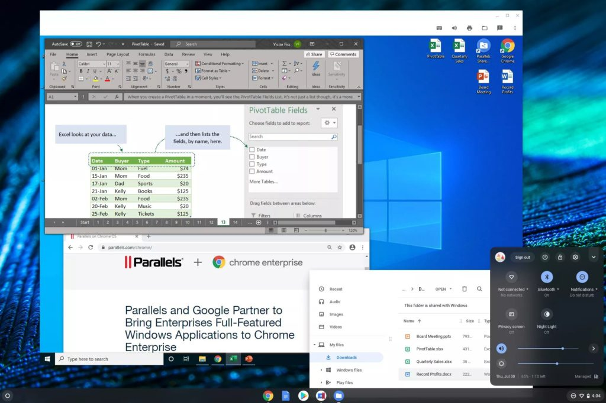

Earlier this month, [Google announced a partnership with Parallels that will bring a software solution for Windows apps on Chromebooks](https://www.aboutchromebooks.com/news/enterprise-chromebooks-windows-office-desktop-apps-parallels/). Details were sparse at the time but thanks to The Verge's interview with Cyrus Mistry, group product manager for Chrome OS, there's more information.

At first, Parallels Desktop will run inside Chrome OS with a full Windows 10 experience, and eventually, just the Windows apps you want or need could be available.

Image courtesy The Verge

This differs from how Linux apps run on Chromebooks, which run in a containers within a virtual machine created by Google for security purposes. There doesn't appear to be a container involved in the Parallels solution, just a pure VM. That could help performance by removing one of the two layers found in the Chrome OS Linux implementation, while also maintaining the security of Chrome OS.

Indeed, this approach doesn't compromise security, one of three pillars to Chrome OS (speed and simplicity are the other two), per Mistry:

> This should provide companies with the best of both worlds. It’s exactly what they’ve been wanting, a really easy to manage, secure endpoint.

As far as target audiences for Windows apps on Chromebooks, it doesn't appear that consumers are one of them; at least not initially.

Mistry told The Verge that Parallels Desktop can be bundled with Chrome Enterprise devices, for example. Resellers will be able to bundle Parallels Desktop with Chromebook Enterprise devices, and IT administrators will be able to easily enable access to Parallels for Chromebooks that are enrolled with the Chrome Enterprise Upgrade. That doesn't mean everyday consumers won't ever get the ability to run Windows apps if needed on a Chromebook but don't expect availability on day one.

And that might be a good thing, particularly for consumers with entry-level or even some mid-range devices. While no hardware requirements for the Parallels Desktop solution have been announced, Mistry says you need a Chromebook "for power usage”. I'd say Core i5, or perhaps an i3, in your Chromebook and at least 8 GB of memory.

There will be some hooks between Windows files in Chrome OS and Parallels Desktop from the sounds of it, similar to how you can download a Linux installation file in Chrome OS and then install it within the Linux container. If you download a Word document to the Chrome OS Files app, for example, double-clicking it may boot up Windows in the Parallels VM and open Word. The less friction here the better, in my opinion.

Lastly, this has me thinking of the Windows 10X talk from last week. I noted that [those saying it would be a true competitor to Chromebooks](https://www.aboutchromebooks.com/news/windows-10x-vs-chrome-os-chromebooks/) were missing a few points, the main one being if Windows 10X won't run desktop Windows apps at launch, why would anyone buy it instead of a proven platform like Chrome OS? Microsoft does plan to support Windows desktop or Win32, apps eventually on Windows X but that's not the plan when devices launch next year.

Chromebooks, however, will have Windows desktop app support this fall, even before Windows 10X devices launch with a hobbled app environment. So the Parallels partnership brings even more of a challenge to Microsoft's plan to combat Chromebooks, at least if both Google and Microsoft stick to their current timetables and plans.
