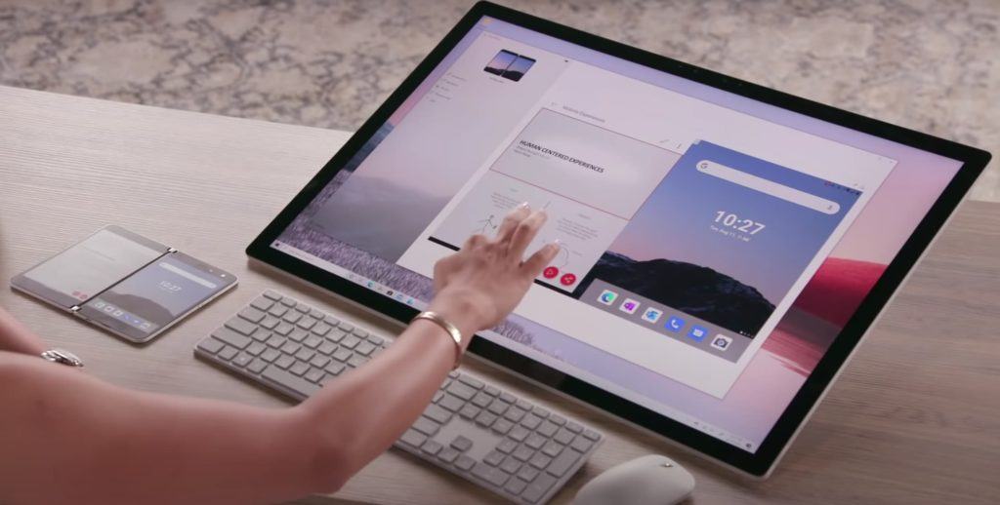

Two weeks ago, I was wondering if the anticipated [Phone Hub for Chromebooks would be anything like Microsoft's Your Phone app](https://www.aboutchromebooks.com/news/phone-hub-chromebooks-surface-duo-vs-your-phone/). That software lets you access data and apps on your Android phone from a Windows machine. I'm looking for similar functionality between an Android phone and a Chromebook. So far, it doesn't look like Phone Hub will do that, however, you can get an early glimpse of what it _will_ offer [from this Chrome Story video](https://www.chromestory.com/2020/09/phone-hub-and-bloom-icons/) showing it in the Chrome OS Canary channel:

https://youtu.be/kr9hXoYyePU

As you can see in the video, none of the actual icons work yet. But you can see where this is headed: At a minimum, Phone Hub will let you control some features of a connected Android phone.

Those currently range from enabling the phone's hotspot feature, silencing the phone, or locating it, either by ringing the phone or through the current [Find My Device](https://www.google.com/android/find) service. I can't see why Google would want to reinvent a backend phone location service.

Is that all the Phone Hub will do, though?

Obviously, at this early stage, nobody outside of Google can say. If the Phone Hub is limited to such remote control features though, I'll personally be disappointed because there's so much more potential here. Accessing locally stored data on a phone that isn't up in the cloud from a Chromebook would be useful, for example. Interacting with Android apps on the phone from a Chromebook could be interesting as well.

Perhaps I'm spoiled by what I've seen Windows users doing with Android phones and the Microsoft Your Phone app, something the company touted in its Surface Duo press event. Bringing a more cohesive experience between two devices as if they were one sounds appealing to me.

As progress is made on the code behind Phone Hub, we'll know more of course. This is one feature I'm watching very closely.
