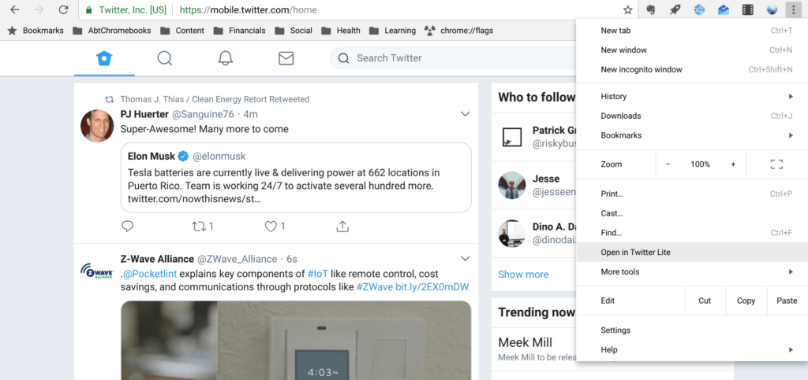
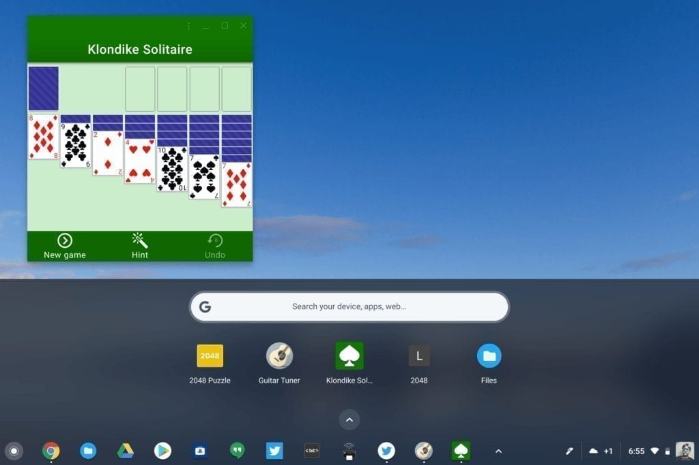
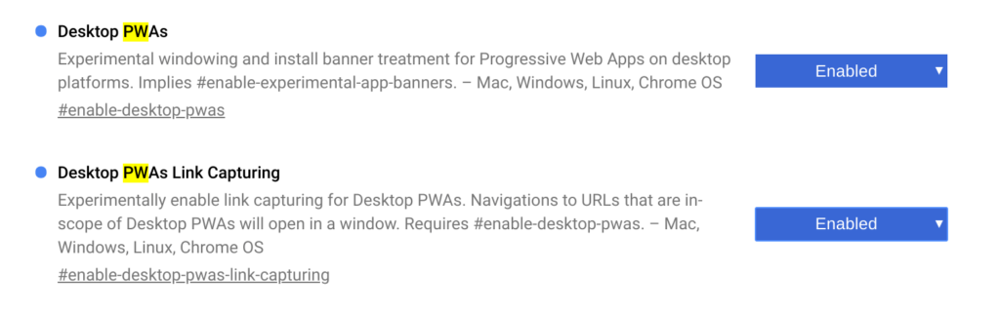
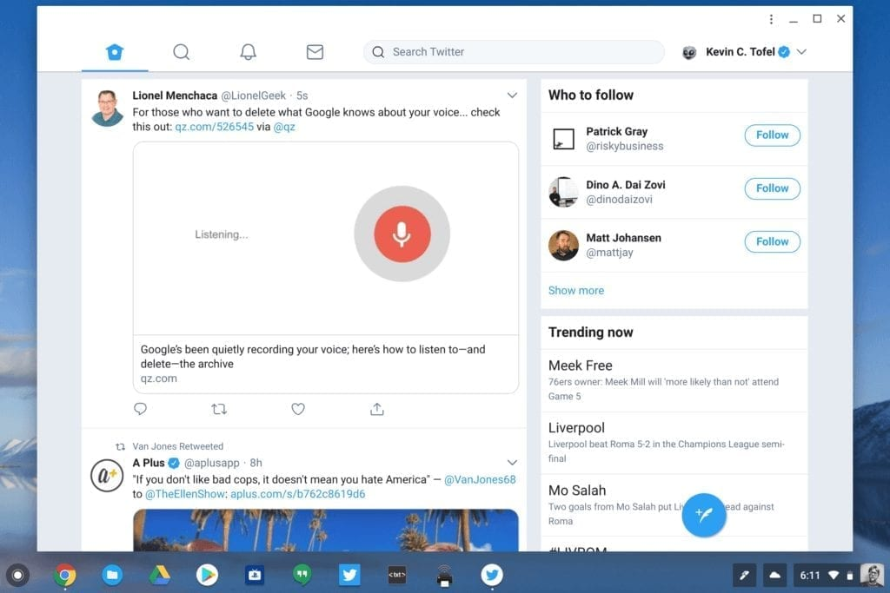

Progressive Web Apps, or PWAs, are starting to gather steam. Microsoft recently announced [support for PWAs in the Windows Store](https://blogs.windows.com/msedgedev/2018/02/06/welcoming-progressive-web-apps-edge-windows-10/), for example, and if you're on the Canary or Dev Channel of Chrome OS, you can experience them for yourself.

Since I recently flipped from Stable to Dev [to test Linux apps on my Pixelbook](https://www.aboutchromebooks.com/news/first-look-running-full-linux-apps-on-a-chromebook-with-project-crostini/), I decided to install a few PWAs and generally, I'm impressed by the speed and the native look & feel of these. Granted, there aren't a ton of PWAs to choose from, so I don't think anyone should rush out and expect to migrate their apps from native (or Android) to PWAs. Still, it's worth the look to understand the initiative.

You'll know if a website offers a "lite" or PWA version of an app by checking the menu options once you've browsed to a site. If it does, there will be either an "Install" or "Add to shelf" option. And once the PWA is installed that option will change: After installing the Twitter PWA, for example, my menu option now says "Open in Twitter Lite":

What's intriguing about PWAs is that they look like desktop apps, i.e.: They have their own resizable window outside of the Chrome browser. You still have the option to open them in the browser if you want. They also support push notifications, like a native app, and [open very quickly](https://developers.google.com/web/progressive-web-apps/).

These aren't just "app wrappers" around a web site, like we first saw in the early days of Chrome OS. A Progressive Web App can store data offline and access device hardware such as sensors, cameras and GPS radios. On a Chromebook, PWA shortcuts are added to the launcher screen, just as they would be for any Chrome OS or Android app.

[This Medium post written by Kenneth Christiansen](https://medium.com/@kennethrohde/progressive-web-apps-coming-to-all-chrome-platforms-80e31272e2a8) sheds much more light on these "lite" apps but if you want to try them for yourself, it's easy to do. The Chrome OS Canary Channel automatically enables support for PWAs and if you're on the Dev Channel, just navigate to chrome://flags in your browser and enable these settings shown below. (Update: I received a report on G+ that this is working in the Beta Channel, v 66.0.3359.117 as well!)

Then head to [mobile.twitter.com](http://mobile.twitter.com), [app.starbucks.com](http://app.starbucks.com) or [Free Solitaire](https://freesolitaire.win/) to give them a try. Here's a look at Twitter Lite, which actually seems faster overall than both Twitter in the browser and the Twitter for Android app I have installed:

I'm not sure if Google will ever provide a directory of PWAs, so for now, they may be difficult to find. I suspect it will be up to websites to somehow alert users or advertise that they offer a PWA version of their web app, although [Microsoft says it is indexing PWAs in Bing](https://blogs.windows.com/msedgedev/2018/02/06/welcoming-progressive-web-apps-edge-windows-10/#6dsFePFAXlWvp1kW.97).
