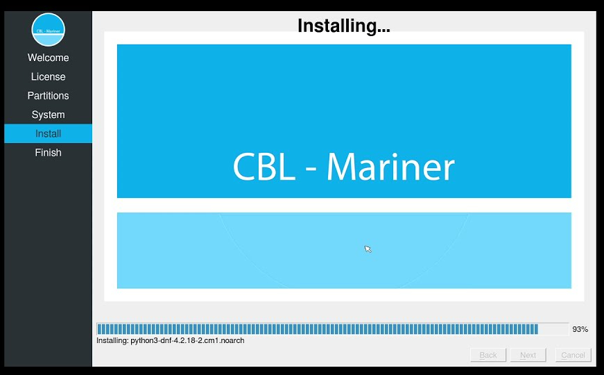
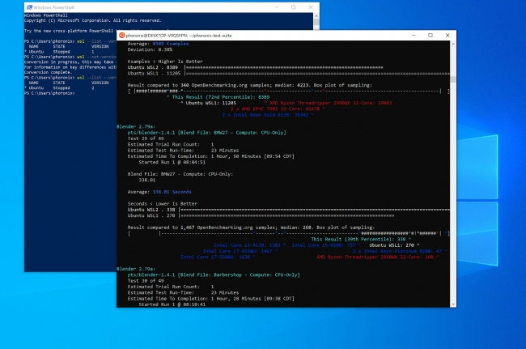
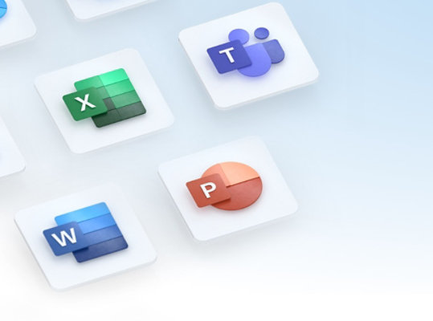
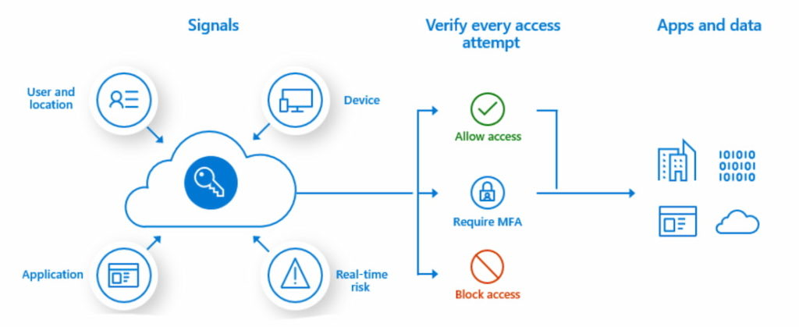

In a few short hours, [Microsoft is holding an education-focused event](https://news.microsoft.com/reimagine-education-2021/). It's likely that most of the announcements will be focused on Windows software and other services. However, there's an outside chance of some new hardware as well. Regardless of whether that happens or not, I can see a future where a Microsoft Surface Edgebook could challenge [Chromebooks in education](https://www.aboutchromebooks.com/news/can-you-learn-to-code-in-a-college-computer-science-program-with-a-chromebook/).

By "Microsoft Surface Edgebook", I mean a Microsoft Surface laptop that uses Microsoft's Edge browser as the main interface on top of a light operating system, similar to how Chromebooks use Google Chrome.

For Chromebooks, that operating system is Chrome OS, which is actually built on Linux. Microsoft has steadily embraced Linux, and open-source software for that matter, over the past several years. The company even has its own [custom](https://github.com/microsoft/CBL-Mariner) Linux distribution called CLB-Mariner. It's freely available for anyone to use although Microsoft uses it specifically for its Azure services.

Oh and about WSL, or the Windows Subsystem for Linux, which is similar to Crostini on Chromebooks. I've used WSL2, the latest version, on Windows 11 and the experience mirrors my Linux on Chromebook experience. In some ways, it's even better. It's much faster, for example.

Put Edge and either Microsoft's own Linux or another distro on a laptop and you have the basics of a Microsoft Surface Edgebook.

Of course, mobile apps would be nice. Progressive Web Apps are well supported on Edge, just like they are on Chrome and Chrome OS. That makes sense since both are built from the Chromium open-source browser. And [Microsoft has added support for Android apps on Windows 11](https://blogs.windows.com/windows-insider/2021/10/20/announcing-android-apps-on-windows-11-preview-for-windows-insiders-in-the-beta-channel/), using Amazon's Appstore as the central source of software. The titles are limited now, but the point is that Android app support on a theoretical Surface Edgebook is a possibility. The back-end for this already exists.

Speaking of apps, productivity suites are important in education. Google Docs is the likely most used service on classroom Chromebooks. If only Microsoft had something similar, it could compete.

OK, I'm being sarcastic because it's obvious that Microsoft Office is available through the web today. No, it doesn't have all of the desktop features. Yes, it has enough features for the classroom.

In terms of other features and services, you can draw direct lines of Microsoft's services to that of Google's: Google Drive to Microsoft OneDrive. Gmail to Outlook. Microsoft Teams to Google Meet. You get the idea

Schools also choose Chromebooks because they're easy to manage and deploy. Microsoft has years of experience in this too though. Windows Intune, now called [Microsoft Intune](https://docs.microsoft.com/en-us/mem/intune/fundamentals/what-is-intune), for mobile device management, was introduced in 2010.

Microsoft Intune archticture

But even before that, Windows devices could be managed through various services. Again, a Microsoft Surface Edgebook could challenge Chromebooks with a service that's attractive for schools to adopt Chrome OS.

Again, I don't know what Microsoft will or will not announce at its event today.

But I will be watching, mainly because all of the parts to create a viable Chromebook competitor are already in Microsoft's wheelhouse. And personally, I think this would be a better long-term strategy than trying to shoehorn Windows on ARM, which after several attempts, hasn't really been successful.

What do you think?

_**Update**: There was new hardware announced at the event: [A $249 Microsoft Surface SE laptop with Windows 11 SE as the operating system](https://www.theverge.com/2021/11/9/22771742/microsoft-windows-11-se-features-release-date?scrolla=5eb6d68b7fedc32c19ef33b4). Additional hardware partners will have [similar options available](https://www.microsoft.com/en-us/education/devices)._
