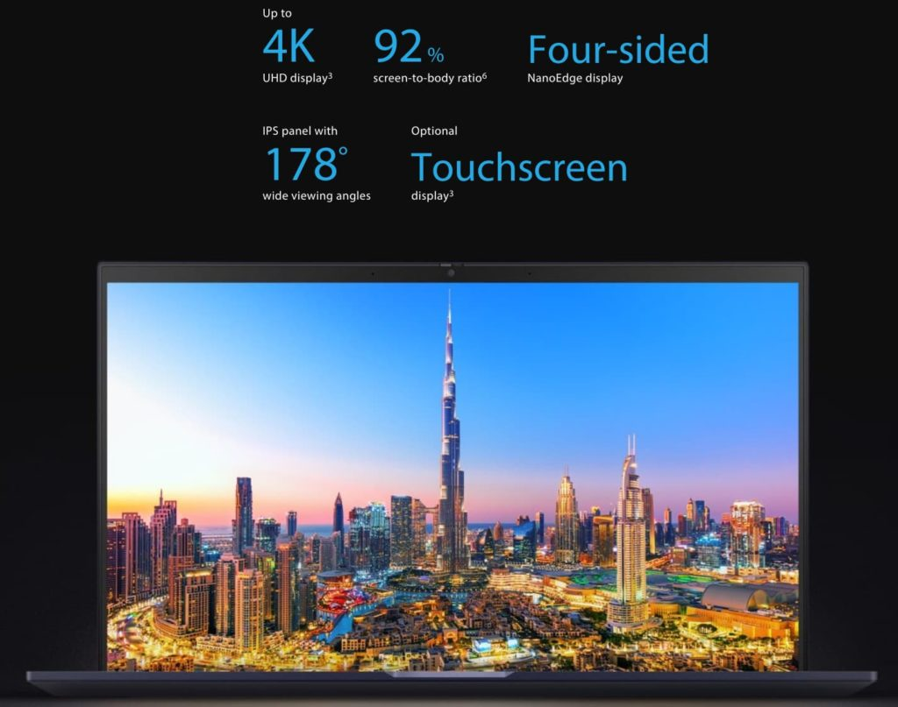

When you look at device specs and code all day, it's easy to overlook something important. And apparently, I did. When [Asus made some of its newest Chromebooks](https://www.aboutchromebooks.com/news/asus-chromebook-flip-cx5400-is-a-new-fanless-core-i7-convertible-for-1049-99/) official last month, I missed that there's [a 4K Asus Chromebook CX9 model](https://www.asus.com/Laptops/For-Work/Chromebook/ASUS-Chromebook-CX9-CX9400-11th-Gen-Intel/).

I only found it today because I noticed [the CX9400 model number on the Chromium Developer Information site](https://www.chromium.org/chromium-os/developer-information-for-chrome-os-devices) and it didn't sound familiar.

So this may not be news to everyone else, but hey: There's a 4K Asus Chromebook CX9 coming soon!

This is simply an iteration or different configuration of the [14-inch CX9 that we've known about since the Consumer Electronics Show](https://www.aboutchromebooks.com/news/asus-makes-the-biggest-ces-2021-splash-with-three-new-chromebooks-cm5-cx9-and-flip-c536/) in January.

Back then, Asus didn't mention it, but they have a whole product page for it now. And the highlight is that 4K display with a whopping 500 nits of brightness.

There are obviously 1080p display options for this model as well, and they're not quite as bright. You're "only" getting 400 nits of brightness, which is still enough for outdoor use. It's nice to see that Asus isn't skimping or sacrificing too much on the 1080p models here.

I can't quite tell if the 4K display will only be available with the top-end processor choice, which is an Intel Core i7-1165G7 or not. That wouldn't surprise me but we'll see. Other configurations are offered with 11th-gen Core i3 and i5 CPUs.

Memory is either 8 or 16 GB while all storage options are speedy NVMe SSD units in 128, 256, or 512 GB of capacity.

I don't see the 4K model in the Asus Store just yet but I can tell the high-end model will be pricey. The [Core i3 with a 1080p](https://store.asus.com/us/item/202107AM140000004/laptopschromebook-ASUS-Chromebook-CX9%2C-14%E2%80%9D-Full-HD-NanoEdge-Display%2C-Intel-Core-i3-1115G4-Processor%2C-128GB-PCIe-SSD%2C-8GB-RAM%2C-Backlit-Keyboard%2C-NumberPad%2C-Chrome-OS%2C-Magnesium-alloy%2C-Star-Black%2C-CX9400CEA-DS388) screen [i](https://store.asus.com/us/item/202107AM140000004/laptopschromebook-ASUS-Chromebook-CX9%2C-14%E2%80%9D-Full-HD-NanoEdge-Display%2C-Intel-Core-i3-1115G4-Processor%2C-128GB-PCIe-SSD%2C-8GB-RAM%2C-Backlit-Keyboard%2C-NumberPad%2C-Chrome-OS%2C-Magnesium-alloy%2C-Star-Black%2C-CX9400CEA-DS388)s $750, while the [Core i5 with the same display is $1,150](https://store.asus.com/us/item/202107AM140000008/laptopschromebook-ASUS-Chromebook-CX9%2C-14%E2%80%9D-Touchscreen-Full-HD-NanoEdge-Display%2C-Intel-Core-i7-1165G7-Processor%2C-512GB-PCIe-SSD%2C-16GB-RAM%2C-USI-Stylus-Support%2C-NumberPad%2C-Chrome-OS%2C-Magnesium-alloy%2C-CX9400CEA-DS762T). I'm guessing the 4K version will have a Core i7 and start around $1,400. If so, I'll wait for a sale before even considering it.

Still, the 14-inch display may be the current sweet spot for me these days.

I'm using a 13.5-inch display on my Acer Chromebook Spin 13, which is my daily driver. And it works. So too does my 13.3-inch M1 MacBook Air. But as I get older, I'm starting to appreciate slightly larger displays.

So the 4K Asus Chromebook CX9 just hit my wish list as a potential upgrade over my nearly 3-year-old Chromebook. I'm just not sure I can get used to that number pad on the trackpad. Then again, for me, that beats an offset keyboard on a larger 15-inch Chromebook with a dedicated number pad.
