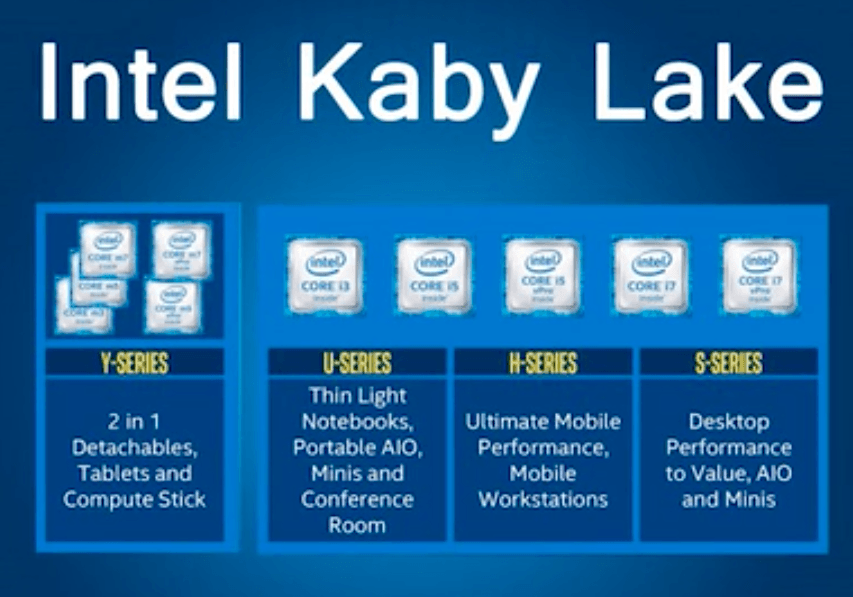
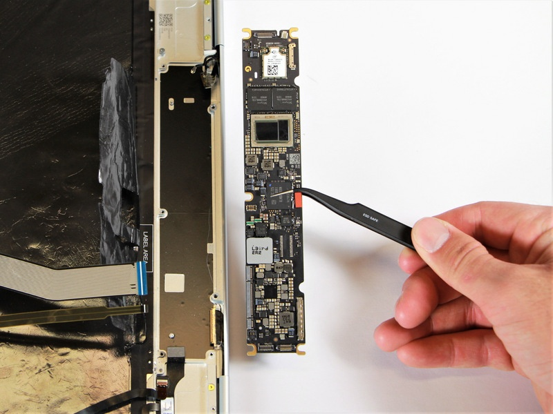

Over the weekend, I got an interesting question from Corvin and I'm sure other folks have wondered the same thing. Corvin asks:

> How does the i7 Pixelbook manage to be fanless? Do you happen to know how the Pixelbooks stay cool?

It's true that all three models of the Pixelbook are fanless; something that some people may not know. And it all has to do with the design process, particularly in the choice of Intel processor used inside the Pixelbook.

**Here's the short answer if you want to cut to the chase:** Intel designed the Y-series of Kaby Lake chips to be fanless so no need for any cooling mechanism to be added. You won't see any fan or passive cooling on the motherboard as a result.

**And now for the basic details and overview:** I'm not a chip guru so I'm sure someone smarter than me can provide a lower level explanation.

When Intel announced its Kaby Lake chips, it introduced a few different chip families, each of which are meant for different types of devices:

Hardware vendors choose the chips that best "fit" the use case of a device and its form factor -- as well as the planned run time on a single charge and the battery capacity.

So Google could have chose the U- or H-Series processors for even more Pixelbook performance. But every decision in mobile technology hardware is about compromise: Using a high-performance chip that eats up too much power will cause battery life to suffer, all things being equal.

Google decided that the fanless Kaby Lake Intel Y processors (the [Core i5-7Y57](https://ark.intel.com/products/97461/Intel-Core-i5-7Y57-Processor-4M-Cache-up-to-3_30-GHz) and [Core i7-7Y75](https://ark.intel.com/products/95441/Intel-Core-i7-7Y75-Processor-4M-Cache-up-to-3_60-GHz) specifically, depending on Pixelbook model) are a good balance between performance and power usage not to mention cost since the MSRP between the two chips is around $110. Choosing just to use the Core i7 for all Pixelbooks would have added to the bill of materials.

That's because they're designed to run with a Thermal Design Power (TDP) of 4.5W of power for most tasks and when needed, can boost clock speed and TDP up to 7W. TDP per Intel "\[R\]epresents the average power, in watts, the processor dissipates when operating at Base Frequency with all cores active under an Intel-defined, high-complexity workload.

Those bursts are managed by the chip firmware and software platform, so if the chip is getting hot enough where it would need to cool off, it drops down to the lower power usage to reduce heat. That's when you might notice some performance degradation as the chip throttles down power.

Because of this, the Y-line of processors in the Pixelbook (and other devices) will benchmark a little worse than the next chipset up, which is the Intel U-series and worse again than the desktop versions of these chips.

You can see from [this iFixit teardown](https://www.ifixit.com/Guide/Google+Pixelbook+Motherboard+Replacement/103312), the Pixelbook has an impressively small motherboard and no fan nor any passive cooling method.

As a result of the relatively lower power usage and heat generated by the Kaby Lake Y-Series -- the black components in the above picture about 2/3rds of the way up -- no cooling mechanism is needed in the Pixelbook save for throttling the power consumption as needed to regulate the chip temperature.

One last related note based on [Arm's public roadmap that the company released last week](https://www.aboutchromebooks.com/news/intel-vs-arm-chromebooks/). Arm chips have focused first on limiting power consumption and heat for years. The processor architecture is now scaling up performance to better compete with Intel's chips. They'll likely continue being fanless as they are today but offer solid device performance, which is why I expect we'll see more Arm-powered Chromebooks between now and the end of 2019, [with the first one powered by a Qualcomm chip, known as Cheza](https://www.aboutchromebooks.com/news/cheza-chromebook-with-qualcomm-snapdragon-845-will-have-speedy-ufs-storage/) this year.
