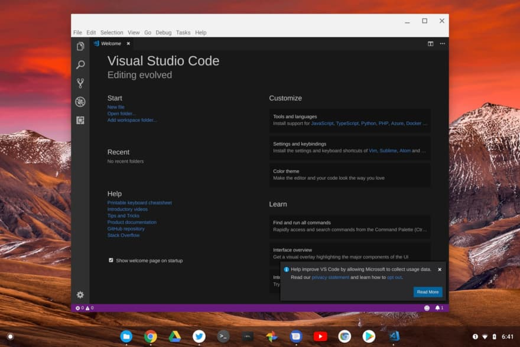
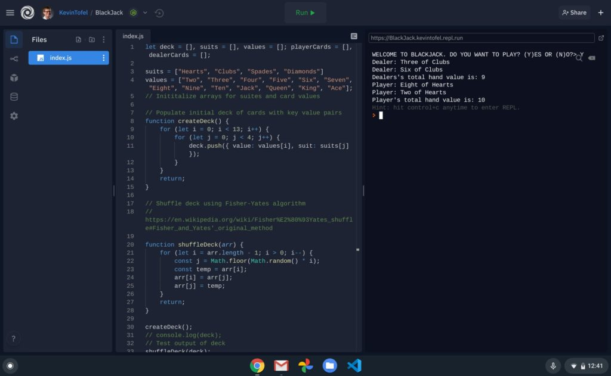
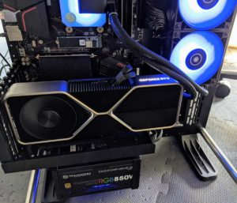

I've noted before that in many cases you can actually [use a Chromebook to get through a Computer Science degree](https://www.aboutchromebooks.com/news/can-you-learn-to-code-in-a-college-computer-science-program-with-a-chromebook/). That's mainly due to having full access to Linux where it's easy to install and use your programming tools of choice. For me, this semester was moved to all online coursework due to the pandemic but my Chromebook is getting me through Computer Science college classes.

This semester I have a Javascript course, which technically doesn't need any fancy programming tools.

However, I am still running Microsoft Visual Code in the Linux container, simply because it lets me focus on learning Javascript thanks to many helper tools and extensions. The ability to have custom text colors for reserved words, functions, or variables, for example, is very useful. As are automatic code completion suggestions. It just makes the experience easier so I can learn more about the important concepts.

By the way, [Microsoft recently added Visual Code support for ARM-based Linux devices](https://www.aboutchromebooks.com/news/microsoft-brings-official-visual-studio-code-to-arm-powered-chromebooks/), so if you have one of those and need a coding environment, you're good to go.

My biggest fear, however, was when I found out we'd be using Zoom for our weekly instruction. Earlier this year, my Zoom experience on a Chromebook was marginal at best. However, these days, I'm having no issues running Zoom in my Chromebook browser, so it's a non-issue. The integrated microphone and camera work just fine and I can use the chat features as well.

Many of our coding assignments for this class are done in a fantastic online tool that I had never hear of before.

It's called [Repl.it](https://www.repl.it) and allows me to write and run my code right in the browser. Additionally, I can share my code with anyone by sending them a link and even manage or track my code changes through GitHub.

This week's JS assignment: a basic BlackJack game

We do have a physical book for class but our professor also assigns YouTube instructional videos to watch as well as coding exercises from FreeCodeCamp and other sites. Obviously, these work in any browser, so the Chromebook handles them with ease.

Am I suggesting that a Chromebook is the best device for learning how to code or actually doing programming work?

**Not. At. All.**

A Linux desktop or laptop is ideal and a Windows machine would do the trick just as well. Indeed, [I built a powerful Windows gaming desktop with a new RTX 3080 GPU](https://www.kctofel.com/so-i-hit-the-nvidia-rtx-3080-lottery/), speedy processor, and super-fast NVMe storage that I _could_ use for coding.

However, you can use a Chromebook for these purposes. And if you only need a device to learn or code a part of the day, it's nice to have one that you just power up quickly, get online and go.

That's why time and again, I turn to my Chromebook for class.
