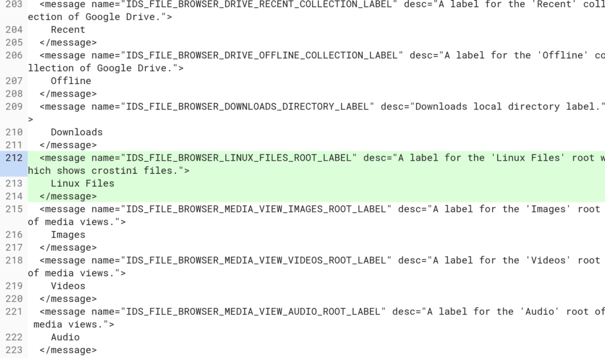

Google continues to work on Project Crostini, the method it is using to support full Linux app support on Chromebooks and Chromeboxes. The latest development I've found is extremely important: Support for your Linux files directly in the native Chrome OS Files app.

This feature isn't yet available -- at least on the Dev Channel, which is what I'm [running on the Pixelbook to use Linux apps currently](https://www.aboutchromebooks.com/news/first-look-running-full-linux-apps-on-a-chromebook-with-project-crostini/) -- but it's in the works currently, with developer activity logged earlier today. Here was my first clue on this upcoming feature: [A placeholder in the Files app called "Linux Files"](https://chromium-review.googlesource.com/c/chromium/src/+/1025545/16/chrome/app/chromeos_strings.grdp), that will appear directly below the current Downloads section of Files.

Note that the Linux section won't always appear in the Files app on Chrome OS; at least not the way the implementation is currently planned. Instead, Chrome OS will first check to see if Crostini is enabled -- here's the what the [setting to do that looks like in the Dev channel currently](https://www.aboutchromebooks.com/news/linux-apps-project-crostini-option-appears-in-chrome-os-settings-on-dev-channel/) -- and configured. Until that check returns a "true", the Files app show "Linux Apps" as a placeholder, unless you've previously mounted a drive from the container. In that case, the real name will be shown.

From a technical standpoint, one has to wonder how this will work since Linux apps run in a _protected_ container so that they can't negatively impact the security of Chrome OS. The solution is rather clever.

[Google is planning to use nassh](https://chromium-review.googlesource.com/c/apps/libapps/+/1014981), which is the [native Secure Shell app for Chrome OS](https://chrome.google.com/webstore/detail/secure-shell-app/pnhechapfaindjhompbnflcldabbghjo?hl=en) currently available: I use it to securely [connect to a remote Raspberry Pi for my Python programming](https://www.aboutchromebooks.com/how-to/how-to-code-on-a-chromebook-using-python-and-a-raspberry-pi/) hobby.

Since Secure Shell supports SFTP, or secure FTP, drive mounting, Crostini will use that behind the scenes to securely connect the Linux container files with the Chrome OS Files app. Even better: The Chrome OS click handler will open this connection, meaning if you click on a Linux container file in the Files app, the container should open within Chrome OS.

While Project Crostini is aimed primarily for the developer audience so they can code on a Chromebook, it's clear to me that Google is trying to make it as user friendly for everyone who might want to run a full Linux app on their Chrome OS device.
