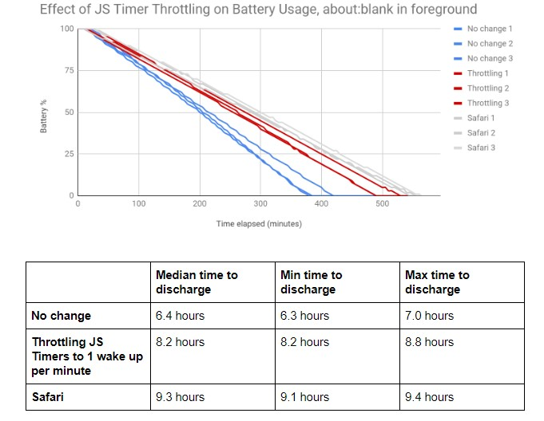

I've long wondered why laptop browsing battery tests for Chrome have been relatively poor when compared to other browsers. Now I have an idea of why that is, and more importantly, what Google is planning to do about it. One very small change to Chrome OS in the near future could [boost the battery life of when browsing on a Chromebook by 28 percent based on internal testing by Google](https://news.thewindowsclub.com/google-chrome-ships-a-new-feature-to-increase-the-battery-life-101417/).

The Windows Club caught word of the change over the weekend but didn't share any links to the change nor the research. Some digging around in the Chromium code repository provided me with the details of the change, entitled "[Throttle Javascript timers to 1 wake up per minute in background.](https://bugs.chromium.org/p/chromium/issues/detail?id=1075553&q=timer&can=1&sort=-modified)"

The title itself gives you an idea of the code improvement, although to fully understand it you'd need to know that today, Chrome OS lets background Javascript timers run one time per second. Changing this timer to once per minute reduces timer wakes and calls from 60 per minute to just a single one on background web pages and tabs.

Here are the results from some early internal testing using 36 different tabs and sites to represent a beefy browsing experience using Chrome on a Mac.

You can see that in this particular case, battery life via Chrome is much closer to that of Safari.

This change will first be an experimental feature hidden behind a flag that appears to be called "_expensive-background-timer-throttling_" at the moment. Since this code is still being worked on, that could change by the time implementation rolls around. And since Google likes to provide Chrome Admins with controls in the enterprise, the current plan is to create a new, but temporary, policy to allow administrative control:

> An enterprise policy will allow system administrators to disable the intervention. The goal is to provide an escape hatch to prevent breakages when this intervention ships to stable. The enterprise policy will be retired 1 year after the feature ships to stable, as it is expected that Web apps will be updated to not rely on frequent wake ups from Javascript timers in background.

If you're a web developer or simply interested in more of the testing and code details, Google has a [publicly available document on its thought process, testing methodology, and implementation plans here](https://docs.google.com/document/d/1sd9EVERCtRWKvnJXnP3iZ83fM3FLwDbjiyfMkaKWEYk/edit#).
