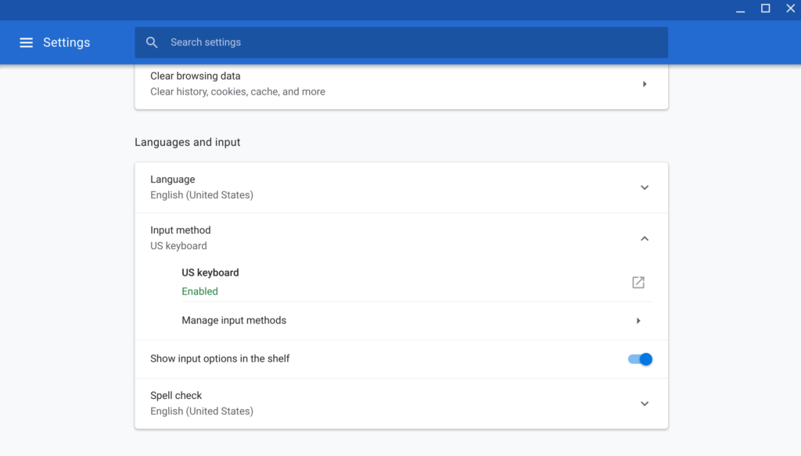
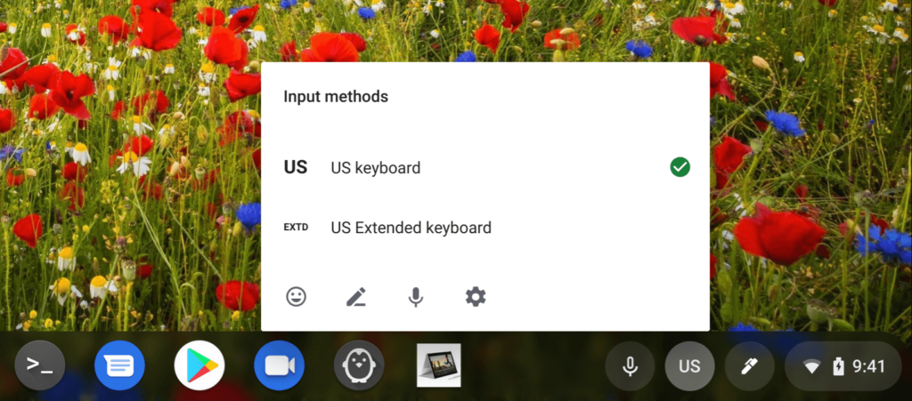

One of my long-time friends and fellow Chromebook user [Hector](https://www.youtube.com/user/MrHG78) reached out to me recently with a question about his new Pixel Slate. He said he couldn't find keys such as CTRL and ALT on the software keyboard of his Chrome tablet.

That's because they aren't there! Well, at least they're not there by default; you can add them to the on-screen Chrome OS keyboard if you know where to look.

To address this, go into the "Input method" options within Chrome OS. It's easy to just search for input method within the Settings, as shown:

From here, click the down arrow to the right of Input method and you'll see several options in a drop-down menu.

Choose the "Manage Input Methods" option to see a range of keyboard choices for various world regions:

You'll notice that I have the US Extended keyboard option chosen. It's not on by default, which is why Hector doesn't see those "missing" keys in the software keyboard. If it's not checked for you, simply check the box. There's no restart or any further steps: At this point, you should see a full onscreen keyboard for Chrome OS.

Here's what it looks like, where you can see the CTRL and ALT keys for example:

US Extended keyboard in Chrome OS

You'll also note the EXTD button to the left of the space bar. This key will now let you select between the standard and extended keyboard at will.

Additionally, you might have noticed that I have the "Show input options on the shelf" menu item selected in the second step screenshot above. You don't need to enable this, but if you do, you'll see either a US or an EX button appearing on your system tray. This is also a keyboard selector for quickly changing between the two options:

I think Google should consider making the US Extended keyboard enabled by default for any true Chrome OS tablet: Without the optional hardware keyboard, device owners may think they don't have a CTRL or ALT key since it isn't there out of the box. Regardless, it's easy to modify the keyboard settings to make these keys available if you need to.
