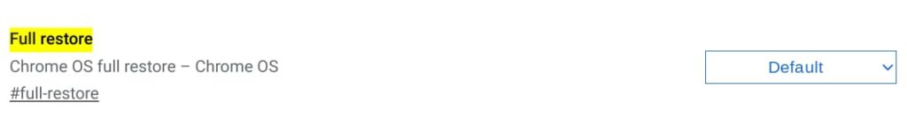
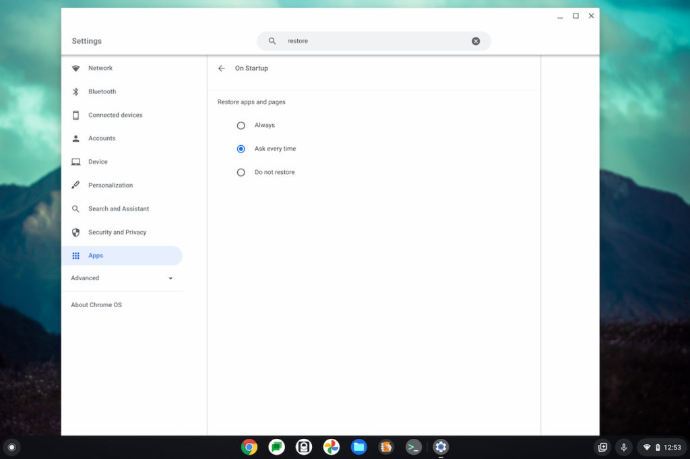
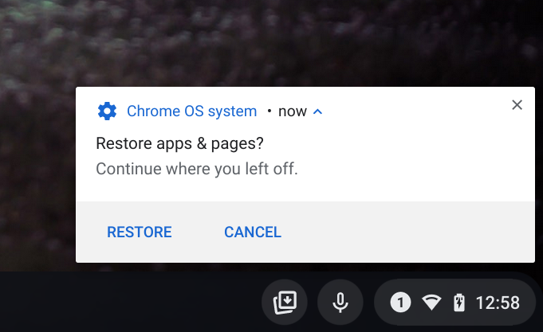
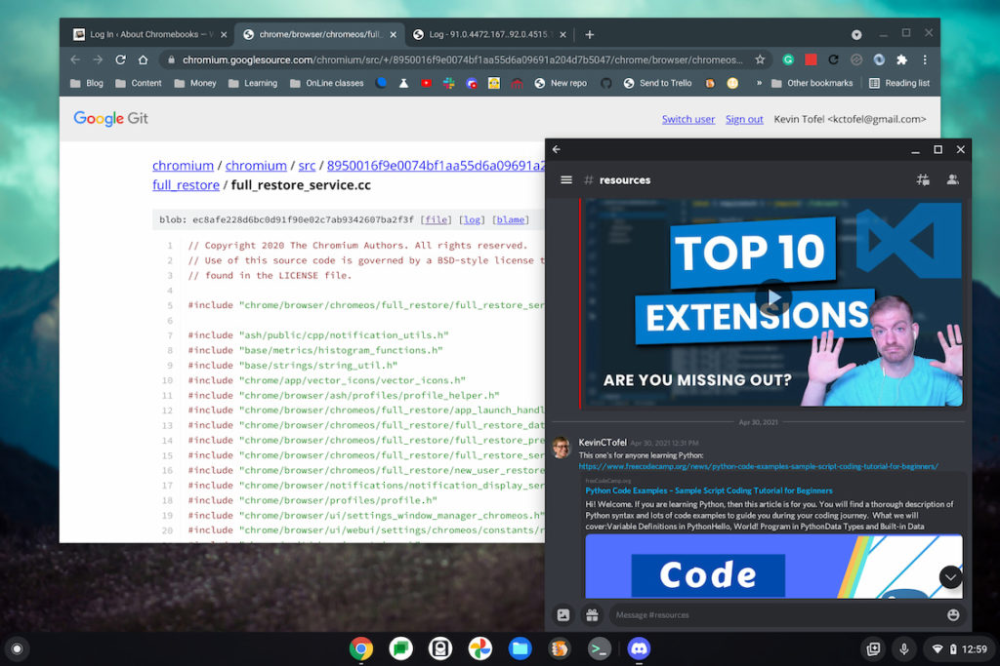

I've been digging through the full changelog of Chrome OS 92 for nearly a week, [adding "hidden features" to my overall list](https://www.aboutchromebooks.com/news/chrome-os-92-stable-update-arrives-heres-what-you-need-to-know/). But some of them are worth having the spotlight of their very own post. For example, if you want to add a full restore on a Chromebook to the previous Chrome OS session to reopen all apps you can do so.

You'll want to navigate to `chrome://flags#full-restore` in Chrome OS 92 and enable the feature. Then click the Restart option which will close and reopen your browser.

Here's what the experimental flag should look like for enabling.

Once your browser restarts you can work as you normally would.

But you'll also want to go to your Chrome OS settings and search for "restore". There you'll see options to never restore, ask to restore or always restore, which you can choose based on your preference.

If your Chromebook crashes, unexpectedly reboots or you perform a reboot, your Chromebook will now attempt to restore all of the apps and tabs from your last Chrome OS session. That's provided you chose "always" in the Settings. Or you'll be asked if you want to restore if you chose the "ask every time" setting.

Since that's the setting I chose, after a reboot and login, I was greeted by this message:

I clicked the Restore option and sure enough, the same browser tabs I had open previously were restored.

So too was the Discord Android app, although it didn't pick up in mid-thread where I was. Instead, it put focus at the end of the thread, which isn't perfect, but still useful.

Missing, in this case, was my Terminal and I'll have to test more to see if Linux apps themselves are restored. I don't have any currently installed on this Chromebook due to some other testing I'm involved with.

This has been a rather large effort on the part of the Chromium development team to add a full restore to Chrome OS 92. I found _dozens_ of different code changes [related to the restore service](https://chromium.googlesource.com/chromium/src/+/8950016f9e0074bf1aa55d6a09691a204d7b5047/chrome/browser/chromeos/full_restore/full_restore_service.cc). And there is bound to be some flakiness if you had snapped windows, Android, or Linux apps running.

But, this is major progress for people who tend to work with the same apps on a Chromebook day in and day out.

I can't count the number of times I shut down when I probably should have just put my Chromebook to sleep. When starting up the device again, I had to restart all of the tabs and apps I was working in previously, which can be time-consuming.

So for people like me, and I'm sure you're out there, the full restore feature is a productivity boon!
