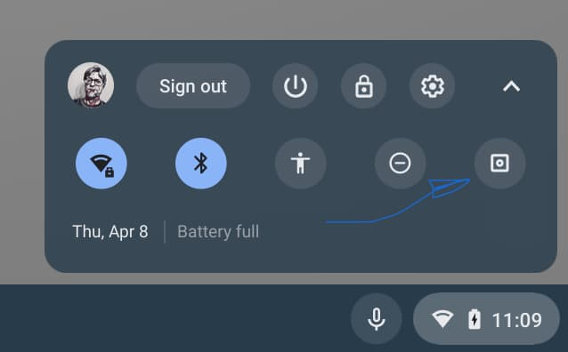
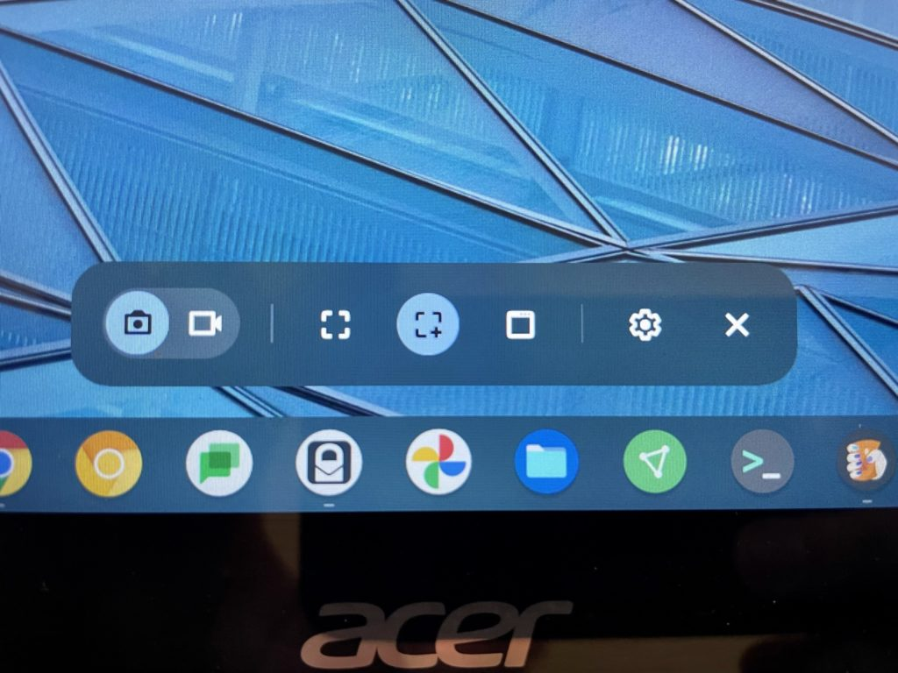
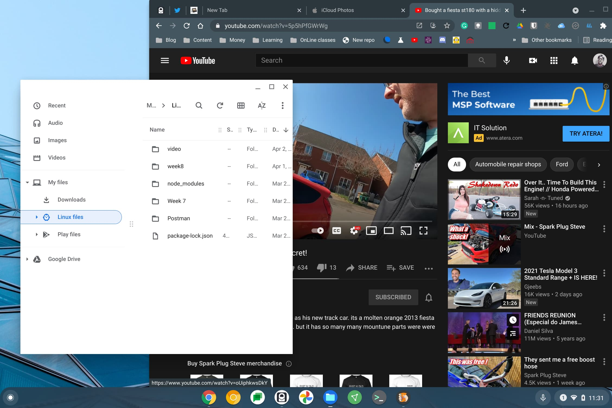
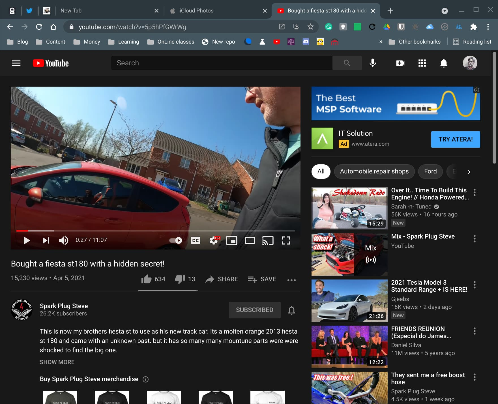
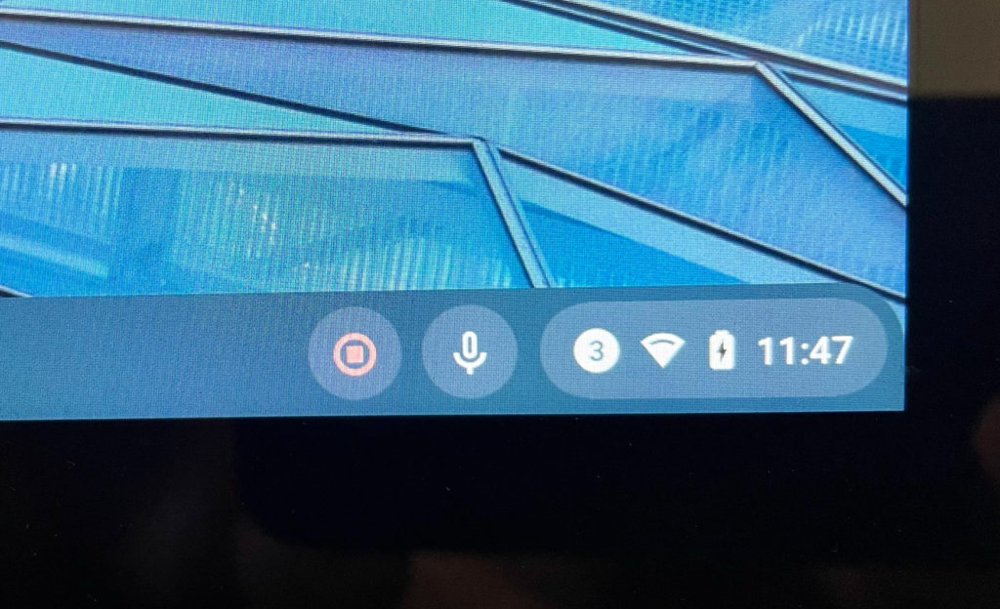
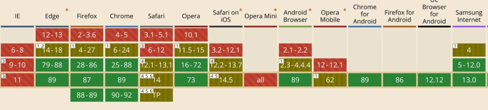

With [Chrome OS 89 widely available](https://www.aboutchromebooks.com/news/chrome-os-89-adds-android-phone-hub-to-chromebooks-no-experimental-flag-needed/ "Chrome OS 89 adds Android Phone Hub to Chromebooks, no experimental flag needed"), just about every supported Chromebook should have the new features this update brings. One of the most useful is the new screen capture method, which brings along a video recording function too. Here's how to capture or video record a Chromebook screen.

## Starting a screen or video capture on your Chromebook

You can still use the old native key combination to start the process, but there's also a new one-tap Screen Capture icon in the Quick Settings. Click the icons on the rightmost side of your system tray (or the bottom if you use a vertical tray) and you'll see the new Screen Capture button.

Once you do, you'll see the new Screen Capture toolset appear on your Chromebook:

In order from left to right, here are the functions of each:

The leftmost two icons are an either/or function. Click the camera button to capture a still image of something on your Chromebook display. Choose the videocamera icon to record a video of your display.

The next three icons let you select what you want to capture: The full screen, a select part of the display of your choosing or a specific window. These options appear for both still image captures and video recordings.

The last option is for Settings, although currently, there's only a single option here. With it you can record your own voice and sounds using the Chromebook microphone or disable the microphone. Note that the current implementation will not record audio from any on-screen content directly; the best you can do is use the microphone to capture audio output. The "X" button closes the toolbar.

## Capturing an image from your Chromebook display

For still images, choose the camera icon in the Screen Capture menu. Next, choose what you want to capture.

To get the full screen, just use the first of the three options in the toolbar as described above. You'll see a message stating to click anywhere on the display to capture the full screen. Do that and you'll have a full screen image.

For a specific portion of the screen, choose the second option. You'll see a capture region appear and you can resize or drag it anywhere on the display. Once satisfied that you have the screen portion you want, just click inside the capture region for a partial screen image.

Lastly, you can select the third option to get an image of a specific window such as your browser, a progressive web app, the Files app or any other windowed application. You should see one of your on-screen windowed apps stand out from the others but you can click on any windowed app to select it.

Note that even if some of the window is behind another one, Chrome OS will capture the full window, which is slick!

I chose the browser window when my Files app was covering part of it and I still got the full YouTube window, for example.

When using the Screen Capture tool on a Chromebook, output files are in the PNG format. Since I prefer smaller files I convert most of mine to JPG and [use Google's Squoosh app](https://squoosh.app "https://squoosh.app"), which is an installable PWA.

## Capturing video content from your Chromebook

From a usability standpoint, capturing video from your Chromebook display with the Screen Capture tool, works much the same way. That's a good thing.

The main difference is to select the videocamera icon in the Screen Capture menu. After that, the three selection options -- full screen, partial screen, and window -- are all the same. The only other thing to remember is the microphone option, which is handy for voice over videos. To start recording, just click on your capture area for a 3... 2... 1.... countdown.

Once your screen recording starts you'll see a red recording icon in your system tray. That tells you the tool is actively recording. When you're ready to stop recording, just click the red icon and your video file will be saved.

Note that the video output is saved locally as a WEBM file, which is relatively new and not supported in every browser just yet.

Here's a current browser compatibility chart for WEBM:

All in all, the new Screen Capture tool is very useful but slightly different in how its used. That's mainly due to the addition of screen recording. Regardless, the approach looks more modern and is simple to use once you know how.
