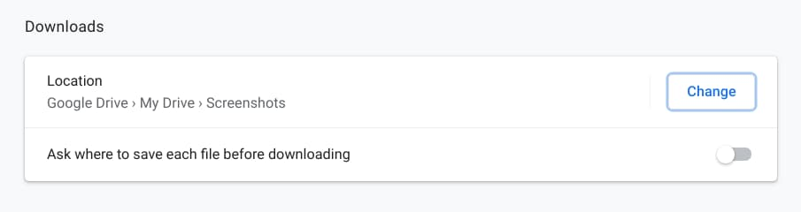

I got an interesting email question from a reader this weekend having to do with changing the default location where files are downloaded on a Chromebook. In the past, you could [modify this in the Chrome OS settings](https://cloud.google.com/blog/products/chrome-enterprise/how-to-set-up-a-new-chromebook). However, as [Google continues to break apart Chrome OS and the Chrome browser](https://www.aboutchromebooks.com/news/lacros-vs-chrome-and-chrome-os-on-chromebooks/ "Lacros vs Chrome and Chrome OS on Chromebooks"), that method no longer works. Here's how to change the Downloads folder to Google Drive or another location on a Chromebook.

The specific issue this reader was having is that when using the Screen Capture tool in Chrome OS, his screenshots and videos are being saved to his Downloads folder. Previously, he had them stored automatically in Google Drive and with the Chrome OS 90 Beta Channel he's using, that's no longer happening.

I believe at some point last year the user-customizable setting for the default download location was moved out of the Chrome OS settings. They're now in the Chrome browser settings. I verified this in both the Chrome OS 89 Stable Channel and Chrome OS 91 Dev Channel on different devices.

To modify the location of your downloads now, just open the Chrome browser on your Chromebook. Then click the 3-dot button at the top right of the browser and select Settings from the drop-down menu that appears. (An alternative method is simply to type [chrome://settings](//settings) in your browser.)

Scroll down to the Advanced options on the left and then look for the Downloads settings as shown above. Next, click the Change button. Here you can create a new folder or choose an existing one to store all of your downloads.

Yes, you can choose your Google Drive account as well; I created a Screenshots folder on my Drive just to test this feature. Note that I wouldn't recommend following my lead: You probably don't want ALL of your downloaded files in a Screenshots folder, whether you're using Drive or not.

That's it! Now, when downloading any files on your Chromebook, they'll be stored in the folder or location of your choice.

I personally find this approach a little non-intuitive but I can understand why Google made this change on Chromebooks. The same approach is used on the Chrome browser for Linux, macOS and Windows, so this brings continuity throughout the Chrome user experience.
