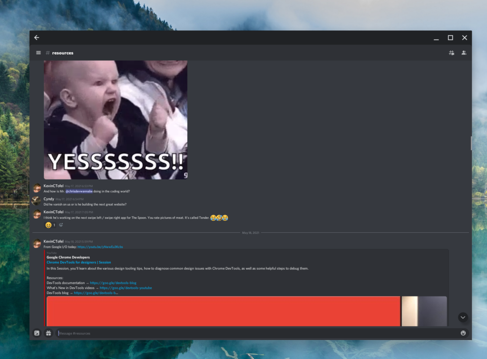
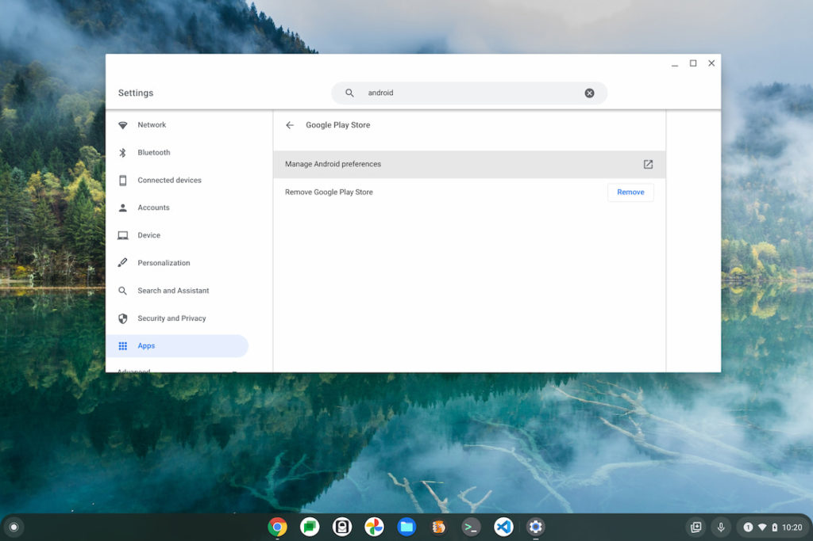
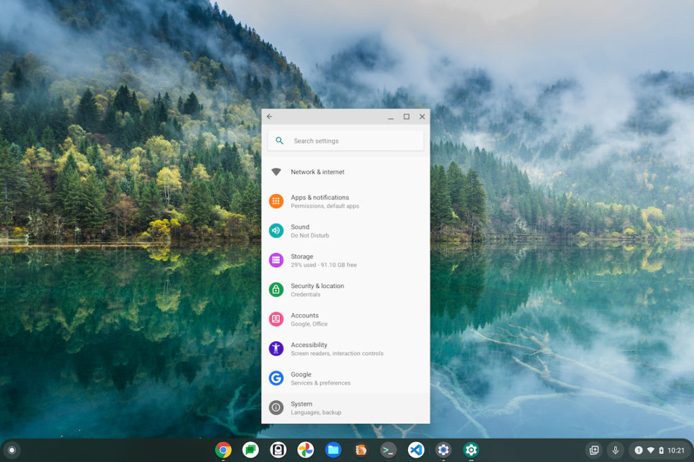
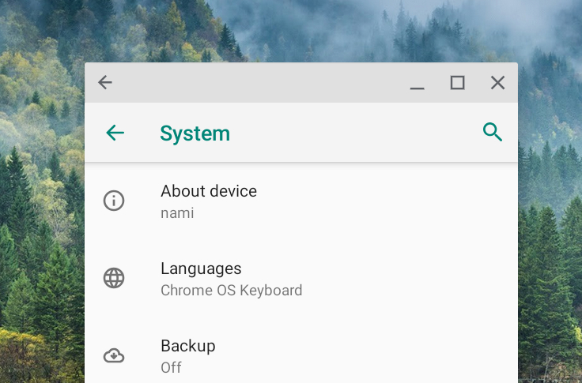
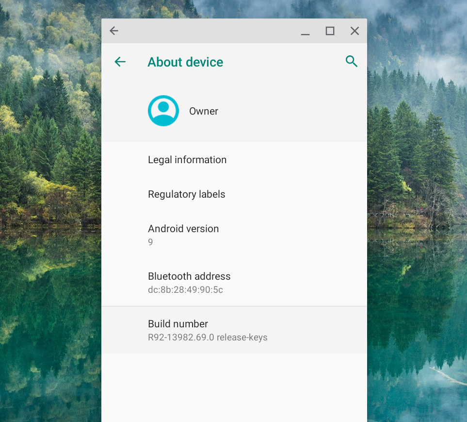
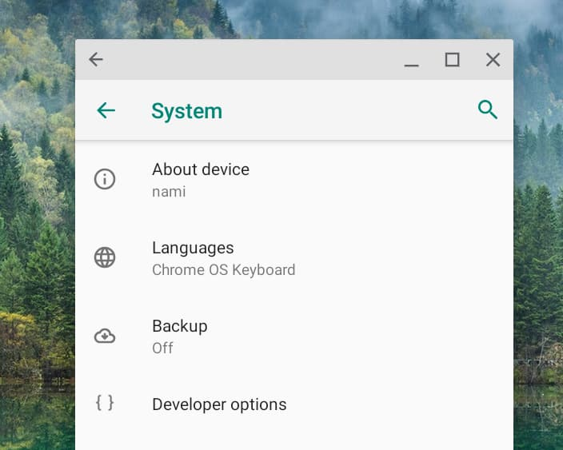
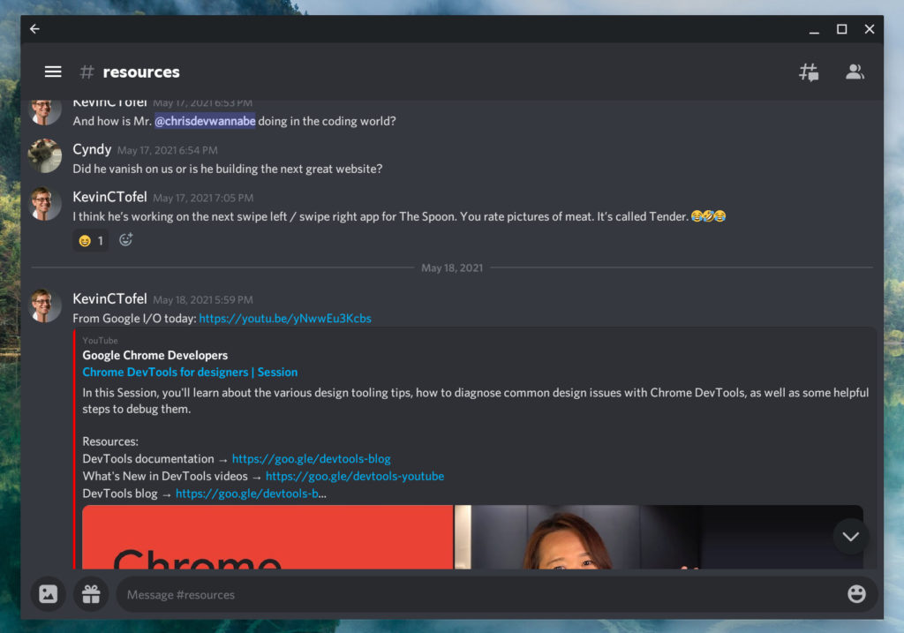

I've been a little frustrated using some of the [Android apps installed on my Chromebook](https://www.aboutchromebooks.com/tag/android-apps/) lately due to small font sizes. A few of them support in-app font size modification, presumably because the developer included such functionality. But some don't. Even when resizing the Android apps, not all of them have fonts or interface elements that are easily readable. Here's how to change the zoom levels in Android apps on a Chromebook for easier reading.

The main culprit for me has been the [Android version](https://play.google.com/store/apps/details?id=com.discord&hl=en_US&gl=US) of Discord since we're relying on it (and Slack) for school. So I'll be using that as an example.

Here's a version with really small text to show you a starting point of my frustration, although I made the text smaller than normal for this example.

Note that you won't have to follow the below process for each Android app. The one-time workaround for this problem will apply to all Android apps on a Chromebook. Once you follow these simple steps, you'll be change the zoom levels in Android apps, or zoom out, using the ctrl and + or - keys.

To enable zoom support, you'll need to enable "Developer options" in the virtual Android instance on your Chromebook.

**Don't panic**: Developer options for Android aren't as scary as [Developer Mode or the Dev Channel](https://www.aboutchromebooks.com/qa/whats-the-difference-between-developer-mode-and-the-dev-channel-on-a-chromebook/) in Chrome OS. You're not going to make your device insecure by enabling this. It's simply a set of extra features to help Android developers debug and test their apps.

First, you'll go into Settings on your Chromebook and search for "Android". The first search result should be "Android preferences". Choose that result and then click on the "Manage Android Preferences" option.

Doing so will open up what appears to be the standard settings of an Android device, although not every option is shown on Chromebooks.

Note too that it may open in a full screen. I've resized mine below to appear like a typical Android phone but the process is the same, regardless.

Scroll to the bottom of the list and choose the System option. That will open up another set of options

See the About Device menu option? It doesn't matter that the device name of your Chromebook may be different than mine.

I'm using my [Acer Chromebook Spin 13](https://www.aboutchromebooks.com/news/acer-chromebook-spin-13-with-16-gb-ram-should-you-buy-one/), which is built on the Nami baseboard. If you're using a different Chromebook, the baseboard for your device will appear here. You'll want to tap "About device" to see information about Android on your Chromebook, such as this:

See that last menu option titled "Build number"? You're going to want to tap it quickly and repeatedly. As you do, you'll start seeing a message saying you have a few more taps before you're a developer. (Oh, if it were only that easy to become a developer!).

Once you've tapped enough, you'll get a small congratulatory message.

Next, click the green back arrow on the About Device page. You should be retured to the System menu where you'll see a brand new option menu choice called "Developer options", as shown:

Click the Developer options menu button and you'll be greeted by dozens of nifty features. But don't mess around with them right now. Let's find the one that's going to help give relief to your eyes. Scroll down until you see the "Enable application zoom" setting and then enable it. You're done!

Now, when you go into an Android app with an interface that feels a little "small", you can zoom in or out just like you do with a web page in your browser. Click ctrl and + to zoom in, making most, if not all, elements larger, or click ctrl and - to reverse the process.

After enabling this feature and adjusting the zoom level in my Discord app for Android, here's how it looks on my Chromebook:

While this is a workaround to resize Android app interfaces, it may not work for every Android app.

Ideally, a way to control the font size independently of the interface would be a better solution. But for now, my four eyes are appreciating this method!
