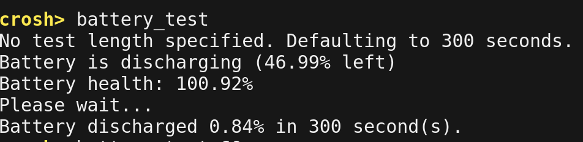
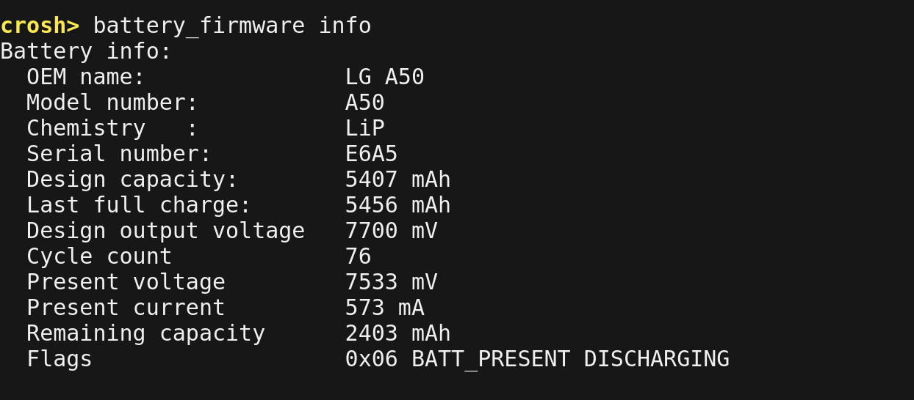

Checking the battery health of a Chromebook isn't just useful for a device you've had for a while. It's also handy -- a must, even, IMO -- before buying a used Chromebook. And it's actually quite easy to do if you know where to look for the information.

First is the battery health indicator, which is a command you run in a **crosh** terminal. To do this, press _ctrl + alt + t_ on your keyboard, which opens up **crosh**. Then type _battery\_test_ to see the health data: Essentially health of 100% indicates that the battery can accept the full charge of the battery capacity. As time goes on, this figure will slowly degrade. Looks like my Pixelbook battery is still capable of a full charge.

This command also runs a five minute battery discharge test. Note that you can specify the test to run in seconds by typing that number after the command. If you don't, it will run for 300 seconds.

The second data point I'd look for is the total number of battery cycles, the Chromebook has executed. A cycle is a full charge and you can expect anywhere from roughly 300 to 500 cycles on a typical battery. To find this out, stay in the crosh terminal and type _battery\_firmware info_. \* You'll see various bits of info here, including the battery cycle count. My Pixelbook has gone through 76 cycles, as shown:

If you're buying a used Chromebook, consider asking the seller to run these commands on the device and show you the results. Once the battery cycle count gets over 200 or 250, I'd be leery of the purchase unless you plan to use the Chromebook plugged in more often than not.

And as far as the battery health, just understand that the percentage is what the device will get on a charge as compared to the same device brand new. So if a Chromebook battery is showing 80 percent health and generally gets 10 hours of battery life as a new unit, you should expect around 8 hours of run time on a single charge at that point.

**\*Note**: If your device doesn't support the _battery\_firmware info_ command, an alternative is to type _chrome://system_ in your browser and look for the _power\_supply\_sysfs_ field; expand it to see the battery cycle count and additional information.
