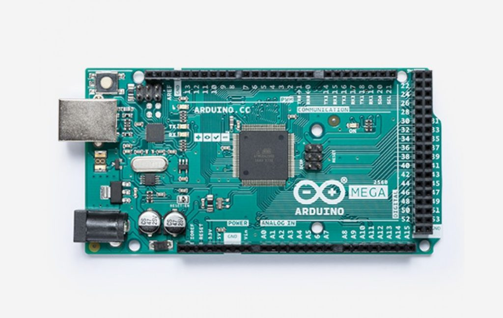
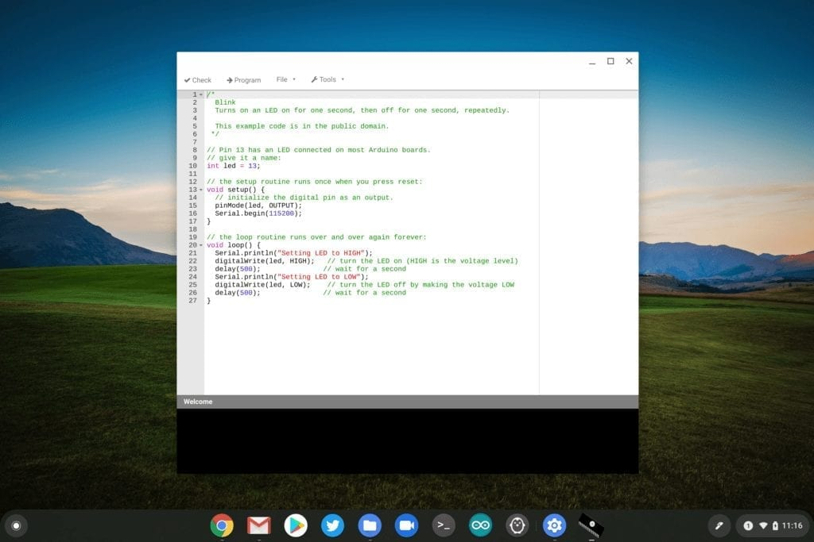

I've previously mentioned that [I use a Chromebook for CompSci classes](https://www.aboutchromebooks.com/news/how-to-code-on-a-chromebook-crostini-pixel-slate/) at my local community college. Thanks to [Project Crostini, which installs a full Debian Linux distro](https://www.aboutchromebooks.com/tag/project-crostini/), I can use the Linux versions of various developer tools. They work great on my Pixel Slate, but I did [recently purchase a higher-end Chromebook with 16 GB of RAM](https://www.aboutchromebooks.com/news/acer-chromebook-spin-13-with-16-gb-ram-should-you-buy-one/) to speed up the coding process.

Unfortunately one of my two classes this semester requires that we use an [Arduino microcontroller](https://www.arduino.cc/). This small device connects to a computer over USB to send my apps to the device. At some point, [this will work in Crostini](https://www.aboutchromebooks.com/news/project-crostini-usb-support-linux-chrome-os/), but as of today with the Stable Channel of Chrome OS 76, the only USB devices supported in Crostini are Android phones. Even using the flag to allow unsupported USB devices doesn't work with my Arduino.

So I set out to see what other options I have and turns out there are several. Some are free and some have a monthly charge, but all of them work directly with Chrome OS in the browser; no Linux needed!

Here's a very short demo of uploading a sketch - that's an Arduino program - to my device using one of these solutions.

https://www.youtube.com/watch?v=FuO8ANfFKFw&feature=youtu.be

Arduino Create

This [online Arduino development environment](https://create.arduino.cc/) (shown in the video) is the official web version of the downloadable Arduino IDE. You create your sketch in the browser and it's stored in the cloud. When you're ready to run your sketch, you click a button to have the server compile your code and then push it to your USB-connected device.

This service is free to try for one month but has some limitations in terms of server time allowed for compiling, the number of supported devices, no custom libraries, etc... For more features and fewer limitations, you can purchase a subscription for $6.99 a month. Committing to a yearly subscription saves you $12 annually.

Chromeduino 2

[Chromeduino 2 is a Chrome Web Extension](https://chrome.google.com/webstore/detail/chromeduino-2/llclpgogfbmiicabgcfbndeokekmggpm?hl=en) that also provides the Arduino IDE. However, since the extension itself can't compile sketches, you have to rely on an external Chromeduino server.

I only mention this because I don't know who runs the servers - I saw three available when using Chromeduino 2 - and while I wouldn't suspect anything nefarious, I generally don't trust servers run by people or companies I don't know.

However, the [code for Chromeduino 2 is publicly available for review and that includes the server code](https://github.com/spaceneedle/Chromeduino). I could use that on my own server and resolve any security concerns. In fact, I'm wondering if I can run a Chromeduino 2 server in my Chromebook's Linux container to have everything run locally. This would actually let me work on Arduino sketches completely offline. Hmmm....

Regardless, this is a free solution to consider.

Codebender

Last up is [Codebender](https://codebender.cc/), which is another online Arduino IDE for use in a browser. This option has a few interesting features. The main one that caught my attention is that you can embed Codebender in web pages to share your sketches with others so they can edit or send them to an Arduino board of their own:

<iframe style="height: 510px; width: 100%; margin: 10px 0 10px;" allowtransparency="true" src="https://codebender.cc/embed/sketch:925890" frameborder="0"></iframe>

However, this is the priciest of the bunch at $10 a month or $100 a year. For educators, there are [some bulk options that are relatively inexpensive if you want a whole class to program on Arduinos though](https://edu.codebender.cc/).

Once Linux on Chromebooks officially supports more USB devices, all of these options will be moot, of course. Until then, I can continue using a Chromebook in my Computer Architecture class, even if it costs me a few bucks a month. Happy coding!
