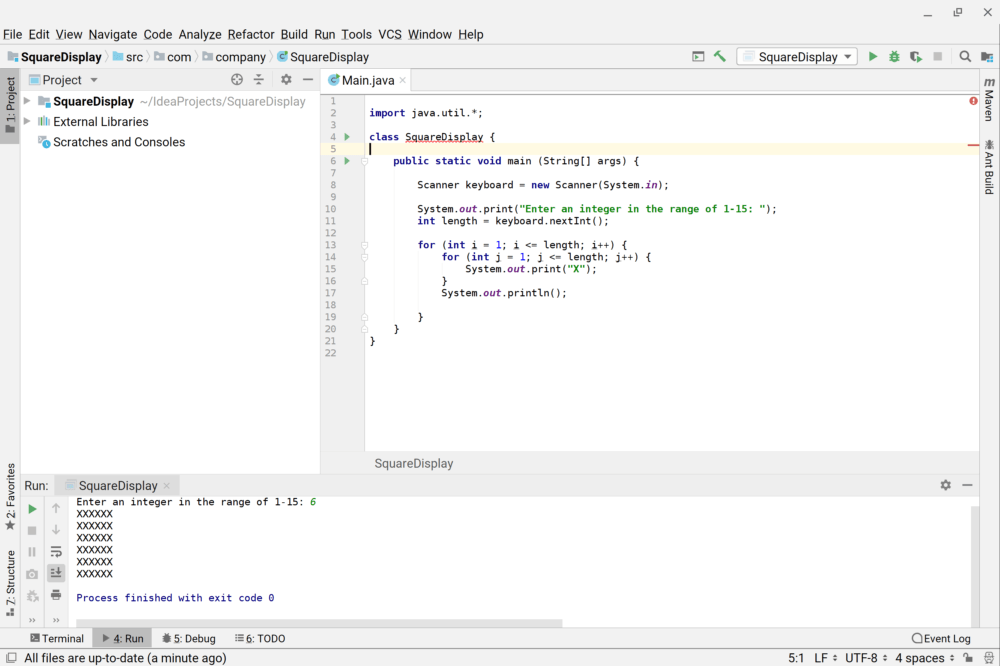
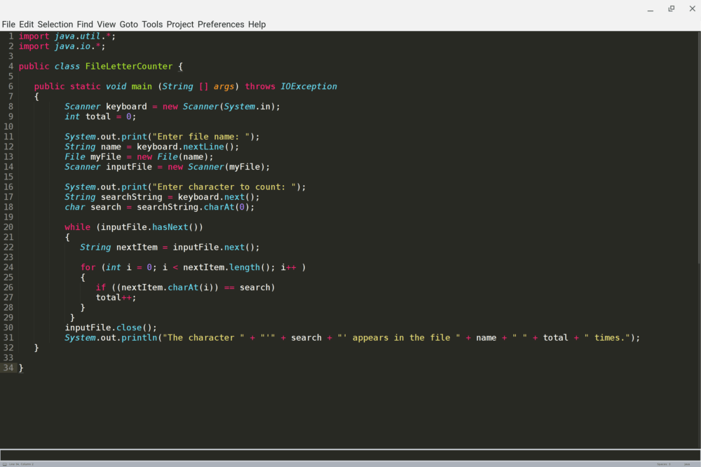
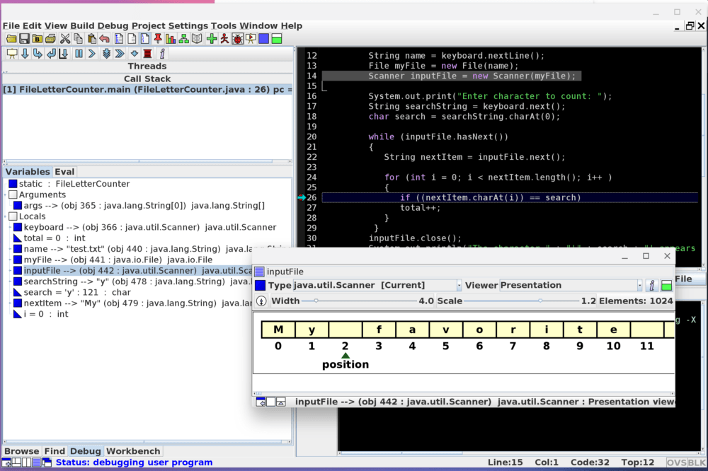
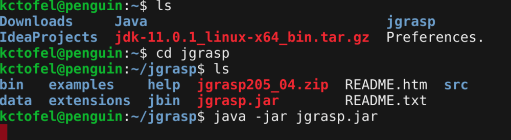

One of the most read posts on About Chromebooks is from last April when [I detailed how I was coding with my Pixelbook](https://www.aboutchromebooks.com/how-to/how-to-code-on-a-chromebook-using-python-and-a-raspberry-pi/). Technically, I wasn't coding _on_ the Pixelbook, because my solution was to remotely access a Raspberry Pi that had Python installed on my local network. Thanks to the addition of [Linux containers through Project Crostini in Chrome OS](https://www.aboutchromebooks.com/tag/project-crostini), I don't have to rely on -- or be limited to -- another computing device for my coding.

Note that my "coding" needs are rather meager: I'm not a full-time developer but I am enrolled in a Computer Science certificate program at my local community college. Depending on your coding needs, a Chromebook may or not work for you. And there are other options out there to make this work; I stayed away from the main one called Crouton for these reasons I specified last year:

> I should note that there are several ways to do this. I wanted a method that didn’t require using [Developer Mode](https://www.aboutchromebooks.com/qa/whats-the-difference-between-developer-mode-and-the-dev-channel-on-a-chromebook/) and [Crouton scripts](https://github.com/dnschneid/crouton) — which does slightly water down Chrome OS security — nor the cloud since most of those solutions can add up as you might pay for processing time. So for me the best option was something more localized, didn’t require any Chrome OS modifications and would have a set, low cost.

Last semester, I relied on a Microsoft Surface Pro for class; this semester, I'm all in on the Pixel Slate, thanks to Crostini, which runs the Debian distro of Linux in a secure container. It's seamless and appears native, alongside the Chrome browser and Android apps on my Pixel Slate, as shown above.

Since Crostini supports a full Linux command line environment and GUI apps, using my Pixel Slate for development is not very different from using a traditional PC with Linux installed. For example, to install [IntelliJ IDEA](https://www.jetbrains.com/help/idea/install-and-set-up-product.html#install-IntelliJ%20IDEA) or [Sublime Text](https://www.sublimetext.com/docs/3/linux_repositories.html), I use the same Linux installation instructions as any other Linux user.

\[caption id="attachment\_2749" align="aligncenter" width="1000"\] Coding and running Java in IntelliJ IDEA\[/caption\]

\[caption id="attachment\_2750" align="aligncenter" width="1000"\] Editing code in the Sublime Text editor\[/caption\]

In our first class, we also used a student-friendly IDE called [jGRASP](https://www.jgrasp.org/), which is an open source program. It has some of the best debugging tools, so I've also installed it on my Pixel Slate. Here I'm using the debugging tool to step through my code and can see the characters in an external text file I've read in:

Python is already installed by default, so there's nothing do to there. For Java, I also need the JDK, or [Java Developers Kit, which is available from Oracle](https://www.oracle.com/technetwork/java/javase/downloads/index.html), although [there's an open source version called OpenJDK also available](https://openjdk.java.net/install/index.html). Essentially, if there's a Linux tool available, you should be able to install it on your Crostini-supported Chrome OS device, and [that includes Git if you need version control](https://git-scm.com/downloads).

This isn't quite a perfect solution, however, since there are some features and functions not yet available in Crostini. If you're developing an app that relies heavily on graphics rendering, GPU acceleration isn't in Crostini. However, it's [likely coming soon based on recent developments by the Chromium team](https://www.aboutchromebooks.com/news/pixelbook-and-nami-chromebooks-the-first-to-get-linux-gpu-acceleration-in-project-crostini/). There's no [audio support in the Linux container](https://www.aboutchromebooks.com/news/microphone-camera-skype-video-chats-linux-for-chromebooks-project-crostini/) yet, and if you need to read or write files to a connected device, say over USB, [that's still in the works too](https://www.aboutchromebooks.com/news/chrome-os-73-dev-channel-adds-google-drive-play-files-mount-in-linux-usb-device-management-and-crostini-backup-flag/).

And there are instances where an installed Linux package doesn't create a shortcut in the Chrome OS launcher; for those, I simply open up the Terminal app and start the package from a command line.

\[caption id="attachment\_2752" align="aligncenter" width="1000"\] Starting jGRASP from the command line\[/caption\]

Typically, if you can download a Debian package from the web in Chrome OS, you can [install it from the native Files app](https://www.aboutchromebooks.com/news/chrome-os-72-dev-channel-preps-crostini-usb-support-easier-linux-package-installs-and-more/) and that generally gets you the shortcut.

One other nice feature that's built into Chrome OS and Crostini is the ability to share files and folders between the two platforms. When I need to download a Linux package, for example, I can simply do that in Chrome OS; [I have my Downloads folder mounted as a share in Linux](https://www.aboutchromebooks.com/news/project-crostini-chrome-os-files-share-with-linux/) so there's no need to move files around. And the [Dev Channel of Chrome OS 73 provides access to Google Drive as a Linux mount](https://www.aboutchromebooks.com/news/chrome-os-73-dev-channel-adds-google-drive-play-files-mount-in-linux-usb-device-management-and-crostini-backup-flag/) as well, which is a handy way to read and write files in the cloud.

Again, there are multiple ways to create code on a Chromebook and there's no "best" way since we all have different requirements. However, I get the "how do I code on a Chromebook" question on nearly a week basis through email and social networks, so it made sense to create "version 2" of my approach.
