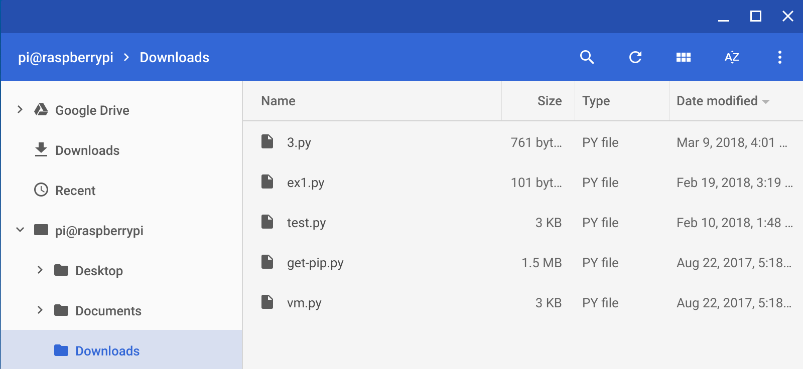
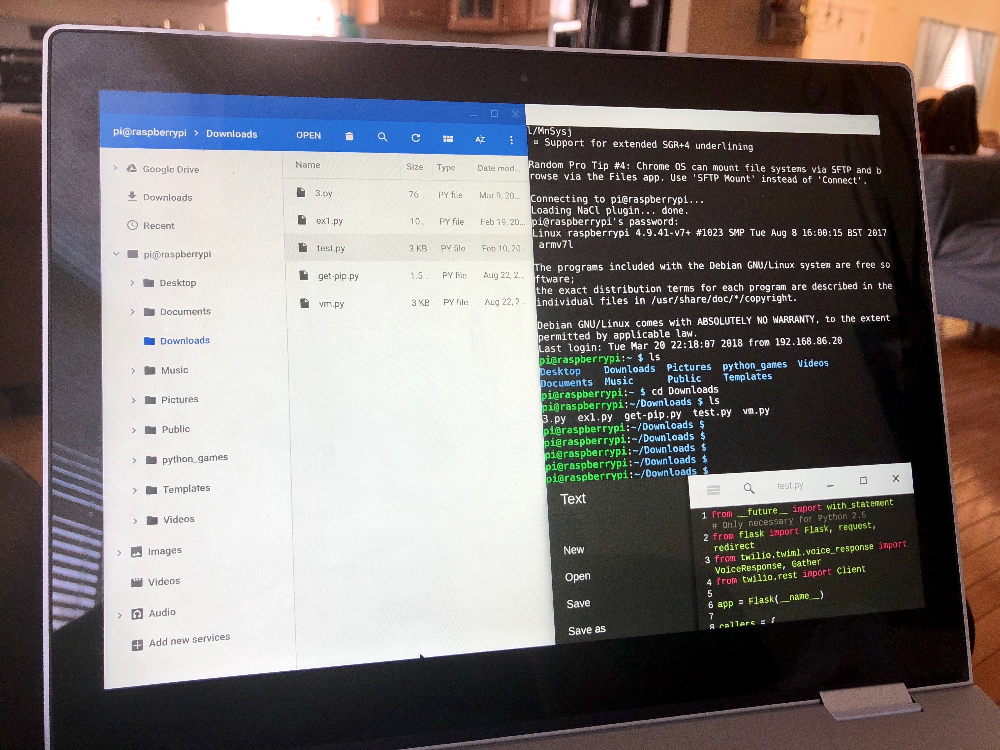

_**Update**: While the below method still works perfectly fine, I'm now [coding using Linux apps on my Pixel Slate](https://www.aboutchromebooks.com/news/how-to-code-on-a-chromebook-crostini-pixel-slate/). Support for Linux apps is fairly standard on all new Chromebooks, and many older ones, as of [Chrome OS 69](https://www.aboutchromebooks.com/news/chrome-os-69-stable-release-project-crostini-linux-apps/)._

One of the reasons I held back on going "all in" on a Chromebook was because coding on the devices has been challenge. But after doing some more research and trying out different methods, I found a way that works for me, which helped prompt me to buy a Pixelbook last month.

I should note that there are several ways to do this. I wanted a method that didn't require using [Developer Mode](https://aboutchromebooks.com/qa/whats-the-difference-between-developer-mode-and-the-dev-channel-on-a-chromebook/) and [Crouton scripts](https://github.com/dnschneid/crouton) -- which does slightly water down Chrome OS security -- nor the cloud since most of those solutions can add up as you might pay for processing time. So for me the best option was something more localized, didn't require any Chrome OS modifications and would have a set, low cost.

The answer was to use a Raspberry Pi, which you can get for around $35 or so. The added benefit here to me is that you can learn a lot by setting up, configuring and managing a Raspberry Pi.

Using the base Raspian build that's optimized for these low-cost computers, I was able to set up my Raspberry Pi on in about an hour. It's connected to my home network on a wired Ethernet connection for maximum throughput. And Python, my preferred coding language for now, is pre-installed.

I can use the [VNC Viewer app from the Chrome Web Store](https://chrome.google.com/webstore/detail/vnc%C2%AE-viewer-for-google-ch/iabmpiboiopbgfabjmgeedhcmjenhbla) to remotely access the Pi from my Pixelbook as if I were sitting down at the Pi, but I generally don't do that. Instead, I installed the [SSH, or Secure Shell, app from the Web Store](https://chrome.google.com/webstore/detail/secure-shell-app/pnhechapfaindjhompbnflcldabbghjo). I'll explain why I prefer this method in a minute.

Using SSH, I can create a secure network connection from my Pixelbook to the Raspberry Pi via a terminal window. I don't really need any graphical interface, so this works for me. If I do, VNC works for that. But one of the nice features of the SSH app is the ability to also create an SFTP mount, meaning I can connect the Chrome OS Files app _directly_ to the Raspberry Pi.

Above you can see the results of the mounted Pi in my Pixelbook Files app. This isn't just a visual benefit; it helps because now I can use a text editor on the Pixelbook to open, modify and save files as if they were on my Pixelbook. When I double-click one of the .py files, for example, they appear in my Pixelbook's text editor; I use [Text](https://chrome.google.com/webstore/detail/text/mmfbcljfglbokpmkimbfghdkjmjhdgbg) but [Carat](https://chrome.google.com/webstore/detail/caret/fljalecfjciodhpcledpamjachpmelml) is also a great choice. Both support offline use and syntax highlighting for a range of programming languages.

When coding, I simply make my changes and save as needed; the files are actually saved on the Raspberry Pi even though I'm modifying them directly on my Pixelbook. From there, I can jump into the SSH app and run my code to see the output or errors.

Again, there are many ways to do this and I've experimented with most of them, having tested [AWS Cloud9](https://aws.amazon.com/cloud9/) and [Google Cloud Services](https://cloud.google.com/appengine/) for remote coding. But this method meets my cost and security requirements while also appearing native on my laptop.

So far it's worked well as I've learned more about coding and even have a few useful projects working, such as [ambient notifications telling me how cryptocurrency prices are moving](https://staceyoniot.com/how-to-create-ambient-notifications-with-python-and-a-smart-bulb/): When they're in the plus, I have a smart bulb light up green and the brightness of the bulb indicates how much the value has increased. It turns red when prices are down.

Eventually, I suspect a native solution will be available for Chromebooks: [Project Crostini is expected to bring container technology to run full Linux apps](https://www.developer-tech.com/news/2018/feb/27/project-crostini-chrome-os-support-linux-apps/). If that happens -- and I expect we'll know by next month at Google I/O -- that could be the better way to do this. Until then, I'll use this hybrid solution to get my programming done on the Pixelbook.
