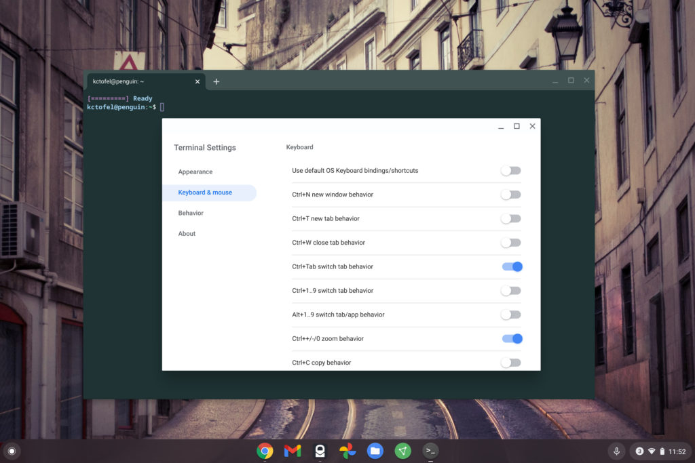

When previously reporting on the [customization options in the Linux Terminal app for Chrome OS](https://www.aboutchromebooks.com/news/how-to-preview-the-new-terminal-settings-early-in-chrome-os-81/) back in April, I thought the method would be a three-dot menu in the app itself. Since I haven't seen that menu appear, even in the [latest Chrome OS 87 Stable Channel update](https://www.aboutchromebooks.com/news/chrome-os-87-stable-channel-arrives-on-chromebooks-what-you-need-to-know/), I thought the feature hadn't been rolled out yet. So until now, I didn't know how to customize the Linux Terminal on a Chromebook.

Actually, this customization arrived back in Chrome OS 84. But Google changed the way to access Terminal settings from when the feature was in development, which is something I missed.

Luckily, [Chrome Unboxed caught this recent Chrome OS Show episode](https://chromeunboxed.com/chrome-os-developers-highlight-the-linux-terminal-in-new-promo-video/), which explains where to find the Settings option for the Terminal on Chromebooks.

As you'll see, you actually have to right-click on the Terminal icon in your Chrome OS dock to access the Settings. And from there, you get the new customization options.

https://youtu.be/wMvJgHl7084

From the main Settings menu, there are three sub-menus: Appearance, Keyboard & mouse, and Behavior.

Appearance is where you can choose pre-configured themes, change the background color of the Terminal, or use a background image. I'm not sure I'd be productive with the latter option, but maybe you would be. You can also pick a different font, font color and even modify the cursor here.

Keyboard & mouse options include a slew of custom keyboard shortcuts aimed at boosting Terminal productivity. These must be toggled on or off individually.

Lastly, are the Behavior options. Here is where you have a few choices on the overall Terminal app behavior, such as notification settings and closing the window when exiting the command line.

These are all welcome features, particularly for those who code or work on their Chromebook using Linux regularly. Shame on me for not noticing how to access the Settings!
