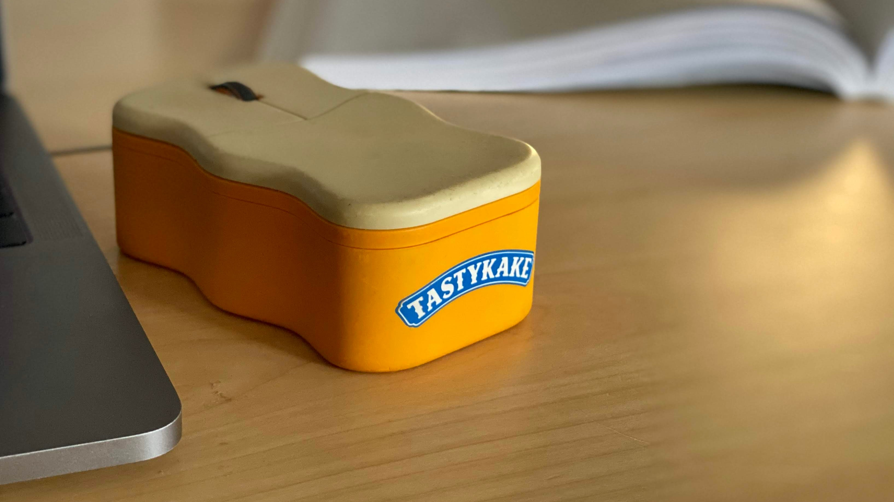

Admittedly, I rarely use a mouse with my Chromebooks. Instead, whether it's my Pixel Slate ([which is on sale early for Black Friday](https://www.aboutchromebooks.com/news/black-friday-2019-deal-pixel-slate-with-keyboard-and-pen-starting-at-449/)), [Acer Chromebook Spin 13](https://www.aboutchromebooks.com/news/acer-chromebook-spin-13-with-16-gb-ram-should-you-buy-one/) or the [Pixelbook Go](https://www.aboutchromebooks.com/news/pixelbook-go-review-a-premium-price-validated-by-a-premium-device/), I rely on the trackpad.

Over the weekend, however, a reader emailed me asking if it was possible to disable the trackpad on a Chromebook. He says:

> "When I'm doing 'serious' work, I use a mouse and touchscreen.  As a touch typist, the grazing the trackpad throw things off."

There's no Chrome OS setting to disable the trackpad, but [there is a way to do it in three simple steps](https://support.google.com/pixelslate/thread/711556?msgid=722886):

1. Go to _chrome://flags/#ash-debug-shortcuts_ in your browser and enable this setting if it's not already enabled.
2. Restart your browser when prompted.
3. Use the keyboard combination of Search + Shift + P to diable (or reenable) the trackpad.

That's it. I first tested this with my trusty old Tastykake mouse and the Pixel Slate running Chrome OS 79 Dev Channel. I also verified that this works on the Pixelbook Go running Chrome OS 78 Stable Channel, so it should work with just about any current Chromebook.

However, bear in mind that the enabled flag is _experimental_, meaning: Google could remove it at any time in the future. And if that happens, you'll likely lose the ability to disable your Chromebook trackpad. For now, it works, so break out that mouse if you want to. You don't have to worry about grazing that trackpad accidentally.
