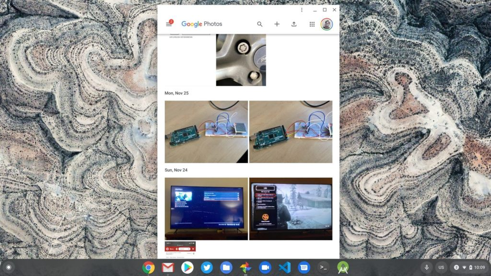
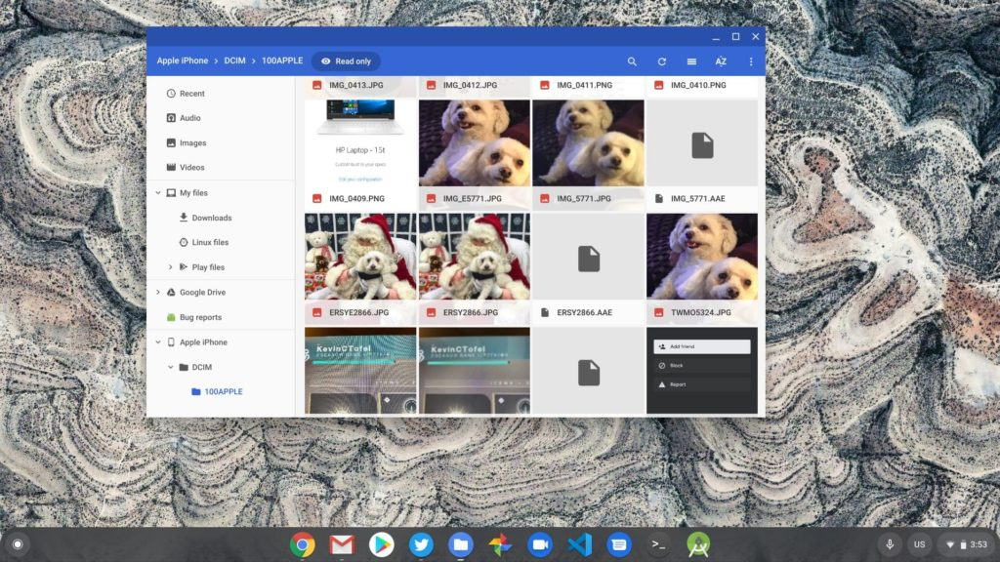

Over the US holiday weekend, I was asked on Twitter if you can [get photos from an iPhone on to a Chromebook](https://twitter.com/Elrancher0/status/1201233794893639680). Some folks may think this type of cross-platform photo sharing is a challenge, but as I've pointed out before, [you can be a happy iPhone owner that uses a Chromebook](https://www.aboutchromebooks.com/opinion/can-you-happily-use-a-chromebook-and-an-iphone-yup/).

Truth be told, it's actually quite easy to move photos from an iOS to a Chrome OS device and there are two simple ways to do it.

## Use Google Photos on your iPhone

The easiest method is to just install the [free Google Photos app for iOS on to an iPhone](https://apps.apple.com/us/app/google-photos/id962194608). I actually recommend this even for iPhone users who don't have a Chromebook for a few reasons.

Google provides free cloud storage for your images up to 16MP and 1080p for video, so you don't have to use or pay for extra iCloud storage. This also helps free up storage space on your iPhone because the app will occasionally ask if it can delete the local copies. And once you have your iPhone photos on Google's cloud, you can easily access them on a Chromebook, or any other device with a browser, for that matter.

Google Photos PWA

There's even a Google Photos Progressive Web App for Chrome OS and, of course, you can install and use the Google Photos Android app on your Chromebook to see the photos from your iPhone as well.

## Connect your iPhone to your Chromebook over USB

If you'd rather go "old-school" and use a USB to Lightning cable with your iPhone, that works too, even on iOS 14. Just physically connect your iPhone to the USB port on your Chromebook, provide permission on your iPhone when prompted and the Chrome OS Files app will then show the photo data from your iPhone.

You may need to drill down a folder or two to get at those iPhone photos, but once you see the images you want to transfer, it's a simple drag-and-drop process to the local storage of your Chromebook.

iPhone photos on a Chromebook over USB

Note that any time you attach an external drive with photos to a Chromebook, you'll likely see a prompt to automatically back up those photos to Google. You can choose to do that or not; it doesn't impact moving photos from your iPhone to a Chromebook.

_(This post was originally published in December of 2018 and was updated on December 24, 2020)_
