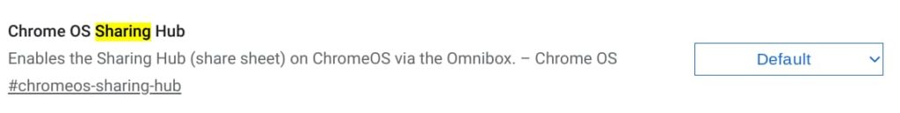
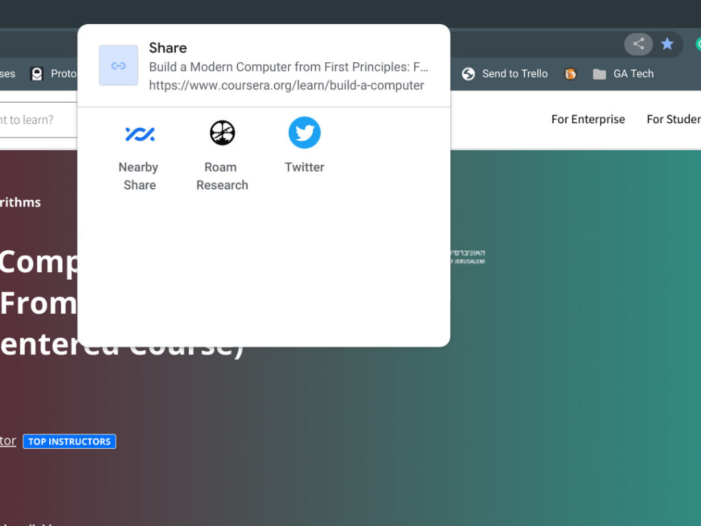
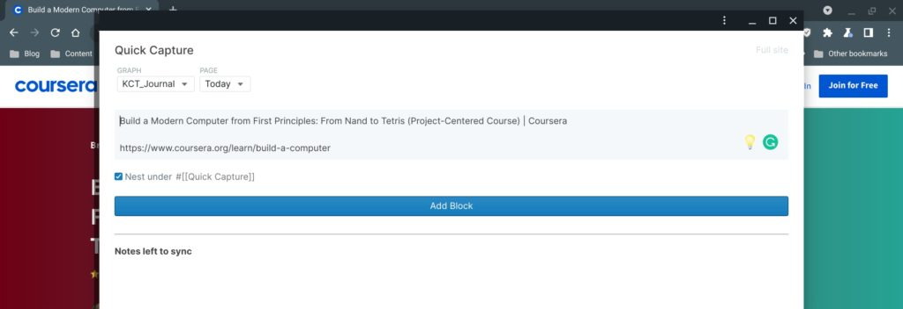
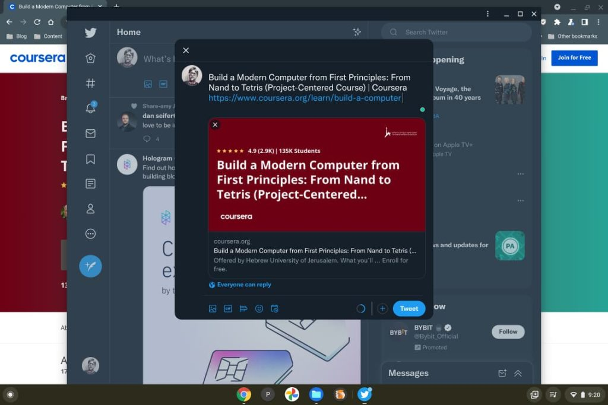

Although [Chrome OS 94 arrived a few weeks ago](https://www.aboutchromebooks.com/news/chrome-os-94-stable-channel-update-for-chromebooks-heres-what-you-need-to-know/), I'm still finding new or enhanced features in the platform. For example, the Chrome OS [Sharing Hub functionality for Chromebooks has been in the works since the beginning of this year](https://chromeunboxed.com/chrome-os-sharing-hub-could-bring-easier-sharing-to-chrome-and-pwas/). But the latest implementation is more refined and polished with support for PWAs in a share sheet. Here's how to use this feature to easily share web content to PWAs or nearby devices on a Chromebook.

Since the feature is experimental, you'll need to enable it on your Chromebook at `chrome://flags#chromeos-sharing-hub`

After enabling the flag, click the "Restart" button to shut down and restart your browser.

You should now see the near-ubiquitous sharing icon on the right side of the Omnibox, or address bar, of Chrome OS. It will be present all the time, regardless of what pages you browse to.

Once you're on a web page with content that you want to share either [to nearby devices](https://www.aboutchromebooks.com/news/chrome-os-87-dev-channel-brings-working-lacros-and-nearby-share-to-chromebooks/) or to any Progressive Web Apps (PWAs) installed on your Chromebook. Here's an example of a page after I clicked the sharing icon: I have options to send the link to my supported devices nearby, but also to a pair of PWAs I have installed.

I tested a share to each PWA and it worked like a charm:

Native sharing to the Roam Research PWA

Native sharing to the Twitter PWA

I couldn't be happier to see this feature moving forward, even if it still is experimental. Over the years, I've used a bunch of Chrome extensions to share content and I definitely prefer a solid, native function like the Chrome OS Sharing Hub.

While this feature flag for sharing applies specifically to Chrome OS and Chromebooks in this example, it will be in the Chrome browser for Windows, macOS, and Linux as well, if it's not already there. So even if you're not a full-time Chromebook user, it will be easier to share web content from any device that runs Chrome.
