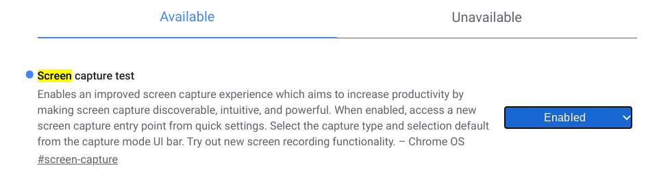

Among the many new, experimental features found in Chrome OS 88 is an updated screen recording feature. Using it, a video capture of your full, or partial, Chromebook display is saved as a .webm video file. But before you can use it, you have to enable the flag for it found at `chrome://flags#screen-capture` and restart your Chromebook.

Once you do this, you'll see a new Screen Capture button in your Quick Settings. I'm actually testing this on Chrome OS 89 and in that version, the tool tip when hovering over the button doesn't yet appear.

Don't worry though: The button still works.

To start a recording of your Chromebook screen, tap the button. You should see several screen capture controls appear at the bottom of your display. By default, these are set to a still image of your display, and you can choose to capture the entire display image, a configuration portion of the display or a window. These are like the old hardware key combinations to capture still images from the display.

If you switch the first control slider from the still camera icon to the video camera icon, however, you get the same options for a screen recording: Record the full screen, partial screen or a window.

I chose the partial screen for a brief demo video of some random web surfing below. Note that I converted the .webm file output to .mp4 for browser compatibility.

It's not often I need to capture a video from my Chromebook usage, but then again, perhaps that's because I couldn't do so natively in the past.

I could see using this feature for helping my peers in coding classes, for example, since [I code on my Chromebook for college courses](https://www.aboutchromebooks.com/news/can-you-learn-to-code-in-a-college-computer-science-program-with-a-chromebook/). And perhaps some Chrome OS tutorials here on the site would benefit from actual screen recordings. Especially useful might be some tutorials on using Linux or setting up Linux apps. Based on hearing my keyboard taps, the feature should also capture any audio narration as well.

Clearly, this feature is still a work in progress, else it wouldn't be experimental and officially be called "Screen recorder test" in the Chrome OS flats. So I wouldn't depend on it heavily at the moment. It seems to work fine for me at the moment. But you may not want to lean on it fully in this experimental state.
