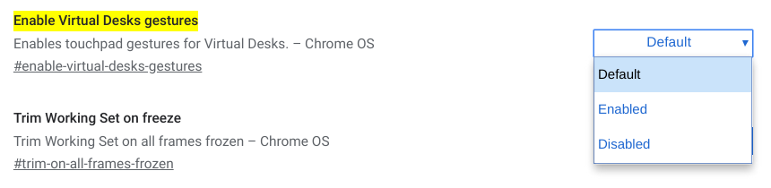

Although [you wouldn't know this from the release notes](https://www.aboutchromebooks.com/news/the-new-chrome-os-release-notes-on-chromebooks-are-already-old/), [Chrome OS 78 officially brought Virtual Desks to Chromebooks](https://www.aboutchromebooks.com/news/chrome-os-78-stable-channel-arrives-heres-what-you-need-to-know/) last week. In prior versions of the software, this feature was experimental and required a hidden setting to be enabled.

However, as noted by John, who commented on a prior post about Chrome OS 78, many people may not see the three- and four-finger swipe gestures for quick navigation between desks. [John asked how to enable them](https://www.aboutchromebooks.com/news/chrome-os-78-stable-channel-arrives-heres-what-you-need-to-know/#comment-39831) and it's actually quite easy.

Simply type _chrome://flags/#enable-virtual-desks-gestures_ in the browser of your Chromebook running Chrome OS 78 and select "Enabled" from the dropdown menu for this still-experimental feature. You'll need to then restart your browser for the new setting to take place.

After the quick browser restart, you'll have the ability to switch between open Virtual Desks with a three-finger swipe, either left or right depending on the desktop you want to use.

**_But wait._**

For a long time now, a three-finger swipe was used in Chrome OS to quickly move between open browser tabs. As it stands right now, that function has been relegated to a four-finger swipe in Chrome OS with this experimental flag turned on.

In fact, it's the complete opposite of the original plan: [Swiping through desktops was initially going to use the four-finger swipe](https://www.aboutchromebooks.com/news/virtual-desks-for-chromebooks-swipe-gesture-to-switch-desktops-chrome-os-76-77/).

Don't panic just yet though. [ChromeUnboxed notes that there's an open bug to reverse the three- and four-finger trackpad gestures in Chrome OS 79](https://chromeunboxed.com/chrome-os-virtual-desktop-gesture-3-finger-4-finger-swipe/).

We're looking at a good five or six weeks before that change lands in the Stable Channel, but at least the final implementation won't require Chromebook users to retrain their brains for tab-scrubbing with three-fingers.
