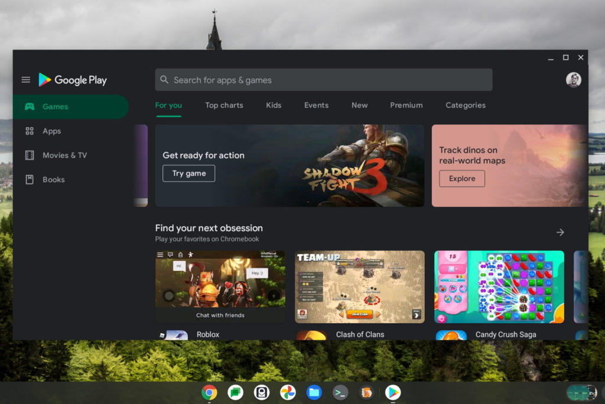
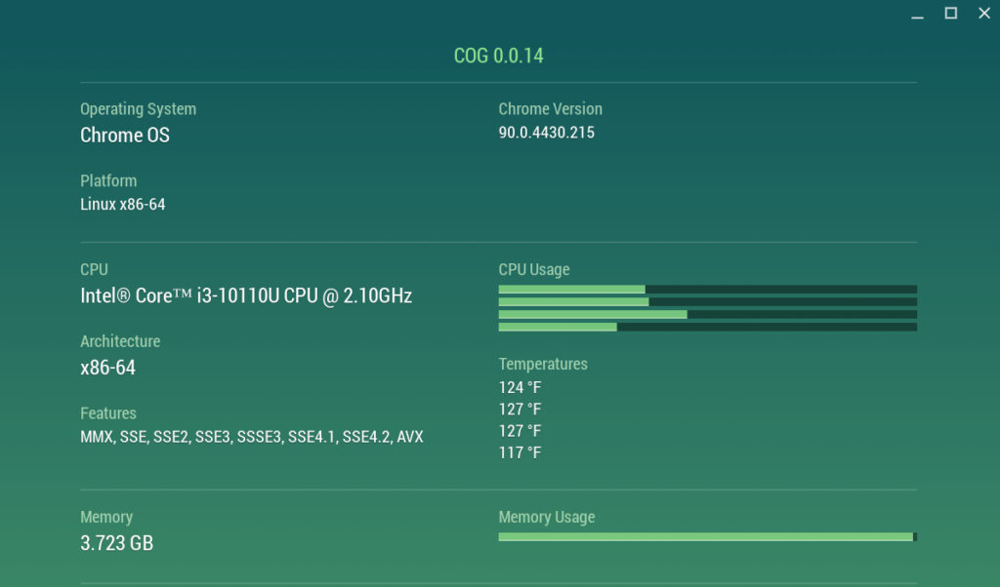

Yesterday, I noted that [some Chromebooks waiting for the Stable Channel version of Chrome OS 90 were getting the software update](https://www.aboutchromebooks.com/news/chrome-os-90-arrives-late-for-some-chromebooks-brings-android-11/). For those devices, specifically, those built on the "hatch" boards, users were observing many Android app issues. Since those Chromebooks are the first to get the Android 11 update, with a new runtime environment, I'm not surprised. And I saw the issues for myself this morning, but I was able to resolve them. Here's how to fix Android 11 issues on a Chromebook.

To be clear, even when apps are running properly in Android 11, I'm not convinced the approach is truly optimized. App responsiveness appears slower to me than before the update. My hope is that further optimizations in the future address this.

Before explaining what I did, here's a quick recap of the Android 11 issues folks have seen after their Chromebook was updated. For some, the Play Store wouldln't even load. For others, Android apps wouldn't launch or kept crashing. And in a few worst case solutions, Chromebooks seems to freeze up during or after the upgrade process.

I updated a "hatch" device, the Lenovo Flex 5 Chromebook with a 10th-generation Core i3 and 4 GB of memory this morning to Chrome OS 90. After the update was installed and the device rebooted, the fans went berserk and "things" were downloaded when I enabled the Google Play Store. I say "things" because the notification panel showed me download activity but the text descriptions were completely blank. Clearly, not a good sign or good user experience.

After a reboot, it took me three additional reboots before I could sign in to the Chromebook. That's very strange behavior. Once I was able to use the Chromebook, I did experience Android app crashes.

Based on what I reported yesterday, that **some Reddit users removed and re-enabled the Google Play Store, I attempted that**. And it worked for me. I'm now able to run apps in Android 11 on my Chromebook without any issues so far, aside from some general sluggishness.

I equate that behavior to two things.

First, Android 11 is using something called ARCVM as the runtime environment. This approach uses a software container to run the Android apps, much like the container used to run Linux apps. That adds some resource overhead, which could be related to the Android app performance I'm seeing.

Second, this Chromebook I'm using only has 4 GB of memory. And it's pretty much all used up with just the three Android apps I ran simultaneously when testing. I'm not even using the Chrome browser. Again, I expect some performance optimizations and I'm not suggesting that you'll need 8 GB of memory in a Chromebook to run Android apps going forward. Although more RAM is always helpful. ;)

There's one other thing that might help if you're still experiencing Android 11 app issues on your Chromebook with Chrome OS 90. [Resetting all of your flags at `chrome://flags` has reportedly helped as well](https://www.reddit.com/r/chromeos/comments/naxuwx/android_11/). I did not do that, for what it's worth.

If you have Chrome OS 90 with Android 11, let me know if you've seen any issues. As I said yesterday, I think the initial problems tend to be with Chromebooks that are migrating from Android 9 to Android 11. That's just my gut opinion based on what I've researched and experienced, of course.
