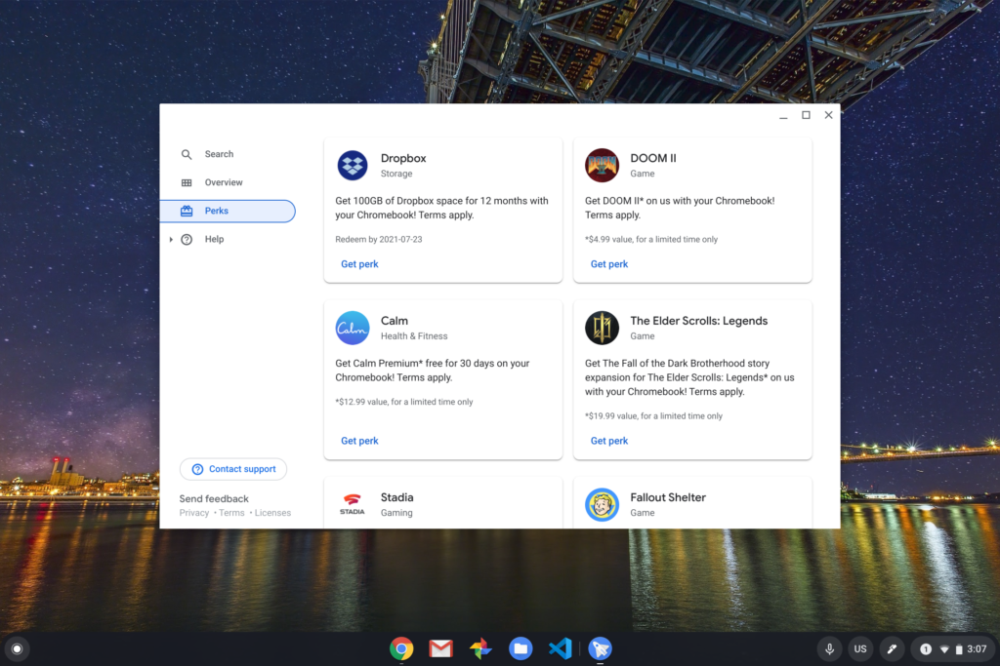
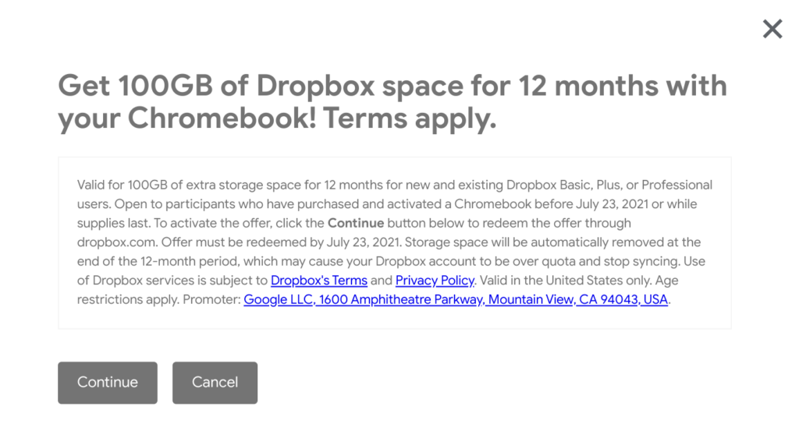
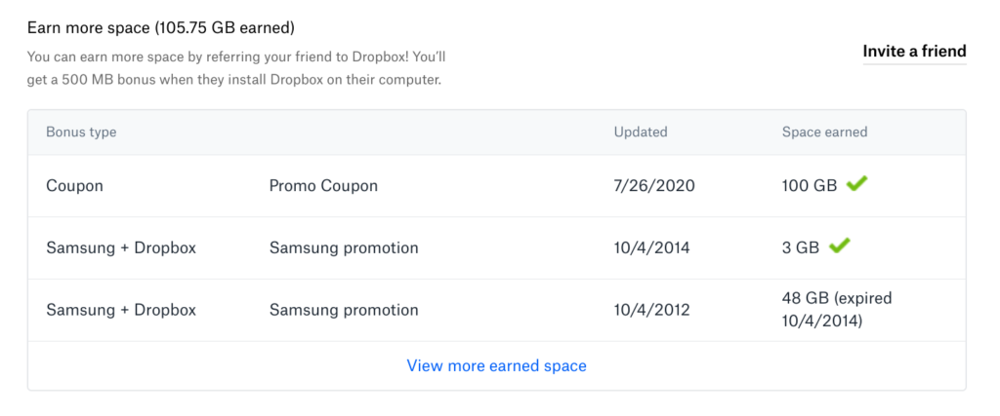
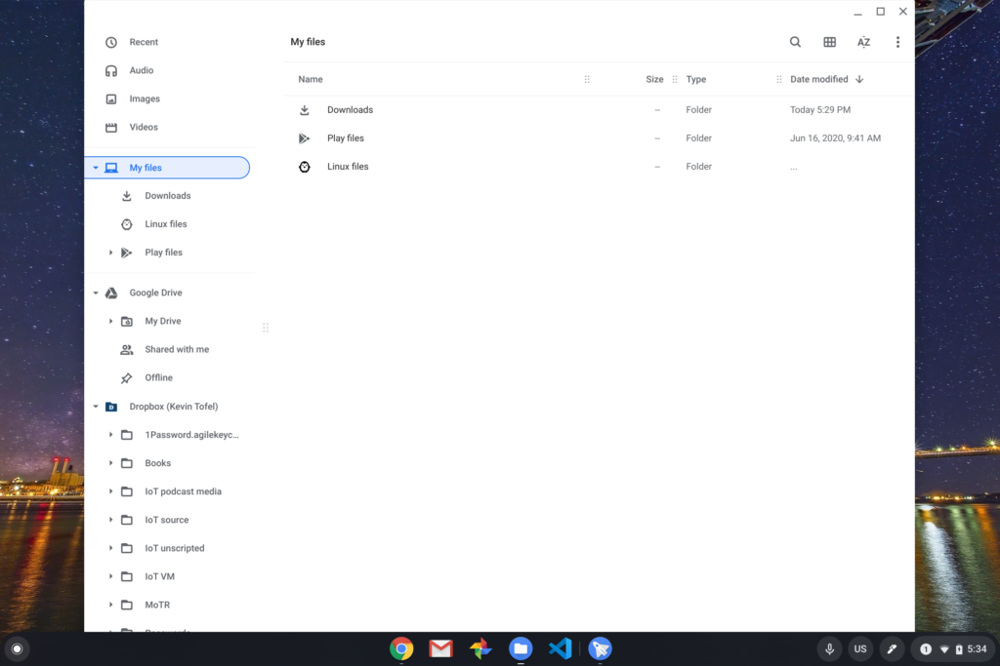

Although Google One is Google's cloud storage service, [100 GB of free Dropbox storage is now available as a perk for U.S. Chromebook owners](https://chromeunboxed.com/chromebook-perks-now-include-100gb-of-storage-from-dropbox/). I find this a bit odd but of course more storage is always a good thing if you trust the service provider. Having long been a Dropbox user, I am comfortable with it, so of course, I decided to take advantage of it.

You can always visit Google's Chromebook perks page, but there's a way to get the 100 GB upgrade directly from the Explore app on your Chrome OS device. Simply open your Launcher and search for either "Explore" or "perks" and the Explore app should appear.

Open it and scroll to the new Dropbox offer:

Click the "get perk" link and you'll see the terms: This offer is good for a year of storage for any U.S. Chromebook owners prior to July 23, 2021. You don't have to be recent Chromebook buyer to get this deal, which has been the case in the past for storage perks.

To get the deal, you'll need to sign in with Dropbox and once you do you should be directed to a promo code page with the code prefilled. Once you submit the code, you're good!

One other tip that might be helpful, at least until Chrome Web Apps are deprecated: The [File System for Dropbox app](https://chrome.google.com/webstore/detail/file-system-for-dropbox/hlffpaajmfllggclnjppbblobdhokjhe?utm_source=chrome-app-launcher-search), found in the Chrome Web Store, will integrate Dropbox into the Chrome OS files app.

You can always access Dropbox files through the web on your Chromebook, but if you want a native-like integration, this might be worth the look.
