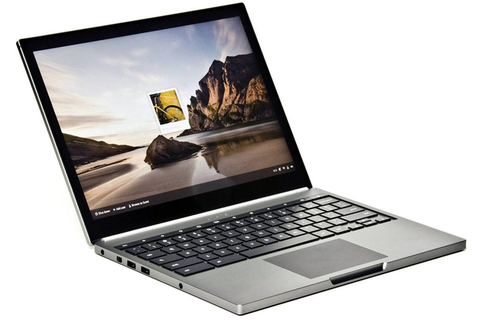
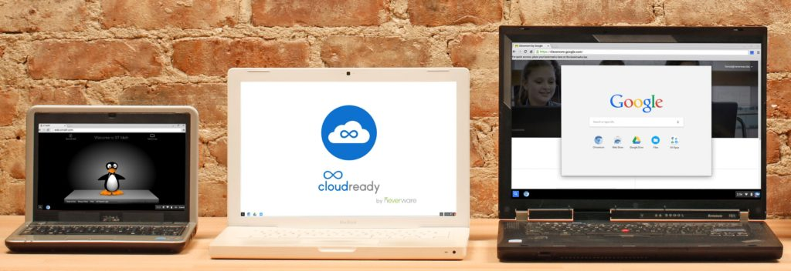

Having used Chromebooks since the very first model, the CR-48 back in 2010, I've seen my share of devices hit the Chrome OS auto-update expiration date. So have a number of readers from what I gather.

In fact, I just received a question about this situation from Dean:

> I recommended a Groupon to a friend, to purchase a Pixel 2 Chromebook for a very fair price. Much less than mine for sure. Well, it was refurbished and formerly a Verizon Chromebook initially. I was helping her become familiar with the new Chromebook updates, to which I found a message stating "_This device will no longer receive the latest software updates. Please consider upgrading."_  She has version 69.0.3497.120.   
>   
> Are there any options to bring her device up-to-date and secure?

The **_official_** answer is no, the Chromebook Pixel 2 can't get Chrome OS updates from Google at this point.

I have the same model, which my wife uses in the living room of our house. It too hasn't received a software update since Chrome OS 69, falling right in line with its [AUE or automatic update expiration policy, found here](https://support.google.com/chrome/a/answer/6220366?hl=en).

However, there **_is_** another option for Dean's friend, as well as anyone else that has a Chromebook that isn't receiving automatic updates from Google: Take a look at [CloudReady Home Edition from Neverware](https://www.neverware.com/freedownload).

CloudReady is an operating system built on Chromium OS but it isn't maintained by Google. Instead, Neverware builds and supports the images, mainly to allow people to get more mileage out of older macOS and Windows computers. There are more than 200 certified computers that will work with CloudReady.

You won't see Chromebooks on the list of certified devices. But that doesn't mean CloudReady won't work on an old Chromebook.

In fact, over at iFixit, there's a fantastic [step-by-step guide to installing CloudReady on the original Chromebook Pixel](https://www.ifixit.com/Guide/Install+CloudReady+Home+Edition+(and+Keep+Getting+Updates)/123869) from 2013. I suspect the same instructions will work with the Chromebook Pixel 2015 considering both models [have a physical write-protect screw](https://www.chromium.org/chromium-os/developer-information-for-chrome-os-devices/chromebook-pixel-2015#TOC-Firmware-Write-Protect) that needs to be removed as part of the process.

Keep in mind that to install CloudReady, you'll need to put your Chromebook in Developer Mode. Otherwise, the system software can't be overwritten. And I'd recommend [making a USB recovery stick from your Chromebook](https://www.aboutchromebooks.com/news/why-every-chromebook-owner-should-carry-a-usb-key-or-sd-card-with-them/) before taking the CloudReady plunge. That way, if not everything works the way you'd like, you can revert back to the old, but still outdated, official version of Chrome OS.

If CloudReady does work for you, your Chromebook will get Chrome OS updates, which are maintained by Neverware. You may not get every new feature and function provided by the official Chrome OS updates from Google, and the interface may look a little different, but at least you'll get security updates over time.

Have you tried CloudReady on an old Chromebook? Share your experiences in the comments; maybe you'll convince me to steal the Chromebook Pixel 2015 model from my wife and run through the install myself.
